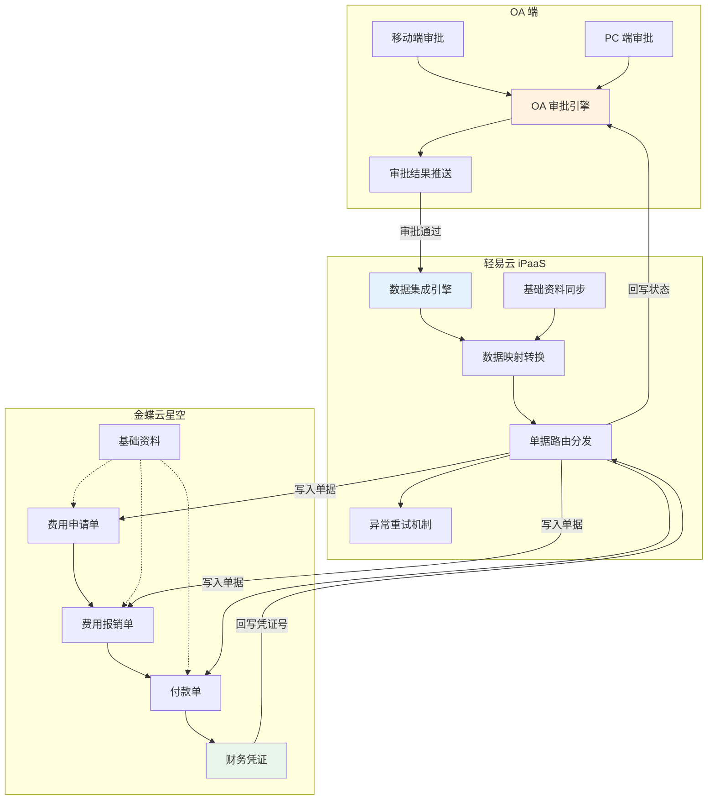
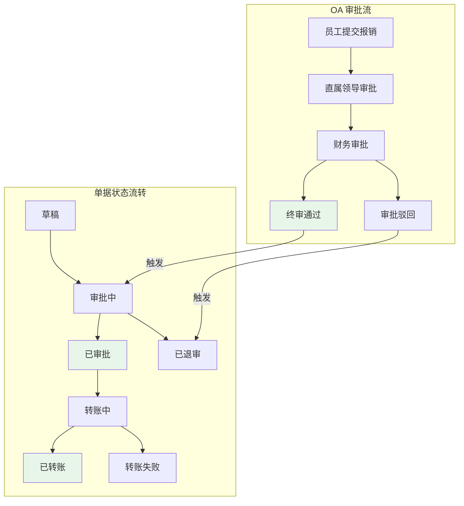
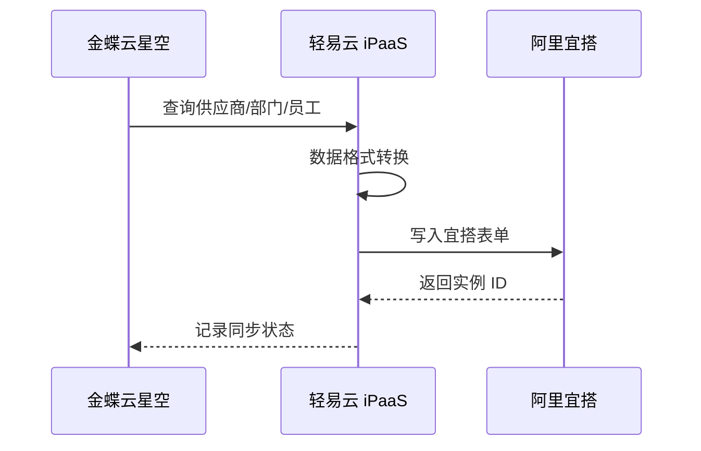
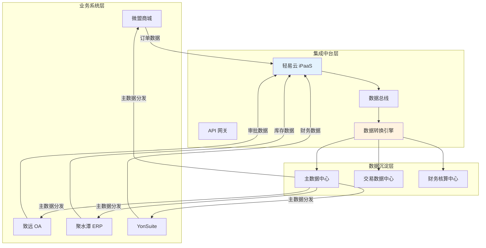

# OA 费控集成解决方案

本方案实现 OA 系统与金蝶云星空 ERP 的费控报销业务深度集成，涵盖泛微、致远、宜搭等主流 OA 平台。通过将 OA 审批流与 ERP 财务核算无缝衔接，实现费用申请、报销审批、付款记账的全流程自动化，解决传统模式下重复录入、数据不一致、审批效率低等痛点。

> [!TIP]
> 本方案适用于已使用金蝶云星空作为财务核心系统，同时采用 OA 系统进行费用审批的企业。支持泛微、致远、钉钉宜搭等多种 OA 平台，实施前请确认各系统的 API 访问权限。

## 方案架构



## 核心集成场景

### 场景一：OA 报销对接金蝶云星空

适用于使用泛微、致远、易快报、每刻等标准 OA 报销系统的企业。

#### 报销单据数据结构

标准报销表单包含四大核心模块：

| 模块 | 关键字段 | 对接说明 |
|-----|---------|---------|
| **单据头信息** | 报销类型、标题、提交人、报销人、日期、组织、报销部门、收款信息 | 映射金蝶单据头必填字段 |
| **费用明细** | 费用类型、金额、日期、发票、附件 | 映射金蝶分录行，支持多行明细 |
| **关联单据** | 原借款单号、关联借款金额 | 支持费用冲抵借款业务 |
| **支付信息** | 报销金额、支付金额、核销金额 | 生成金蝶付款单依据 |

#### 审批流程对接



> [!IMPORTANT]
> 单据状态（审批中、已取消、已退审、已审批、转账中、已转账、转账失败）直接影响记账逻辑，对接时需与财务部门确认各状态对应的业务处理规则。

### 场景二：宜搭自建费控应用对接金蝶

适用于使用阿里宜搭低代码平台自建费控应用的企业。

#### 整体业务架构

依托宜搭强大的低代码开发能力，构建资金费控系统全生命周期管理：


#### 主数据集成

主数据同步是费控集成的基础，确保宜搭表单与金蝶基础资料一致。

**集成流程：**



**金蝶供应商查询接口配置示例：**

```json
{
  "api": "executeBillQuery",
  "type": "QUERY",
  "method": "POST",
  "number": "FNumber",
  "id": "FSupplierId",
  "pagination": {
    "pageSize": 100
  },
  "request": [
    {
      "field": "FSupplierId",
      "label": "供应商 ID",
      "type": "string",
      "value": "FSupplierId"
    },
    {
      "field": "FNumber",
      "label": "编码",
      "type": "string",
      "value": "FNumber"
    },
    {
      "field": "FName",
      "label": "名称",
      "type": "string",
      "value": "FName"
    },
    {
      "field": "FCreateOrgId_FNumber",
      "label": "创建组织",
      "type": "string",
      "value": "FCreateOrgId.FNumber"
    }
  ],
  "otherRequest": [
    {
      "field": "FormId",
      "label": "业务对象表单 Id",
      "type": "string",
      "value": "BD_Supplier"
    },
    {
      "field": "FilterString",
      "label": "过滤条件",
      "type": "string",
      "value": "FAuditDate > '{{LAST_SYNC_TIME|datetime}}'"
    }
  ]
}
```

**宜搭表单写入接口配置示例：**

```json
{
  "api": "/v1.0/yida/forms/instances",
  "type": "EXECUTE",
  "method": "POST",
  "request": [
    {
      "label": "供应商名称",
      "field": "textField_ku6aw61g",
      "type": "string",
      "value": "{{FName}}"
    },
    {
      "label": "供应商编码",
      "field": "textField_ku6aw61h",
      "type": "string",
      "value": "{{FNumber}}"
    }
  ],
  "otherRequest": [
    {
      "field": "appType",
      "label": "应用 ID",
      "type": "string",
      "value": "YOUR_APP_ID"
    },
    {
      "field": "systemToken",
      "label": "应用秘钥",
      "type": "string",
      "value": "YOUR_SYSTEM_TOKEN"
    },
    {
      "field": "formUuid",
      "label": "表单 ID",
      "type": "string",
      "value": "FORM-XXXXXXXX"
    }
  ]
}
```

#### 费用报销业务集成

**宜搭费用申请单 → 金蝶费用申请单：**

| 宜搭表单字段 | 金蝶云星空字段 | 转换规则 |
|-------------|---------------|---------|
| 申请单号 | FBillNo | 直接映射 |
| 申请日期 | FDate | 日期格式转换 |
| 申请组织 | FOrgId | 基础资料编码映射 |
| 申请人 | FProposerID | 员工编码映射 |
| 费用项目 | FExpItemId | 基础资料编码映射 |
| 申请金额 | FApplyAmt | 数值直接映射 |
| 备注 | FNote | 文本直接映射 |

### 场景三：多系统综合集成方案

适用于同时部署微盟、致远 OA、聚水潭、YonSuite 等多套系统的企业，需要统一的数据中台进行系统间集成。

#### 多系统集成架构



#### 集成原则

> [!WARNING]
> 多系统集成需重点关注以下原则：
> 1. **明确系统定位**：每个系统的核心职责与数据归属必须清晰
> 2. **数据传递以结果为主**：避免传递中间过程数据，减少系统间耦合
> 3. **主数据统一规范**：物料、客户、供应商等主数据必须在单一系统维护

## 实施配置步骤

### 步骤一：基础资料对接

基础资料对接是费控集成的先决条件，必须在单据对接前完成。

| 基础资料类型 | 金蝶云星空表单 ID | 对接方向 | 说明 |
|-------------|------------------|---------|------|
| 部门 | BD_Department | 金蝶 → OA | 确保组织架构一致 |
| 员工 | BD_Empinfo | 金蝶 → OA | 人员信息同步 |
| 供应商 | BD_Supplier | 金蝶 → OA | 供应商档案 |
| 客户 | BD_MATERIAL | 金蝶 → OA | 客户档案 |
| 费用项目 | BD_ExpenseItem | 金蝶 → OA | 费用类型映射 |
| 组织 | ORG_Organizations | 金蝶 → OA | 多组织场景必需 |

> [!CAUTION]
> 在数据对接之前必须确保基础资料对接完成。例如一张付款单需要单据类型、收款单位、部门、组织、日期、往来单位等基础信息，在没有确认对接基础信息前，单据将无法成功写入。

### 步骤二：多组织确认

如企业使用金蝶多组织模式，需确认以下事项：

1. **对接组织选择**：确认使用哪个组织进行对接，避免数据传输至错误组织
2. **组织间结算**：如涉及跨组织业务，需配置组织间结算规则
3. **权限分配**：确保对接账号具有目标组织的操作权限

### 步骤三：单据对接配置

#### 1. 费用申请单对接

| 配置项 | 说明 |
|-------|------|
| 源系统查询接口 | 获取 OA 费用申请单详情 |
| 目标系统写入接口 | 金蝶费用申请单写入 |
| 触发时机 | OA 审批通过后自动触发 |
| 关键字段 | 单据类型、申请组织、申请部门、申请人、费用项目、申请金额 |

#### 2. 费用报销单对接

| 配置项 | 说明 |
|-------|------|
| 源系统查询接口 | 获取 OA 费用报销单详情 |
| 目标系统写入接口 | 金蝶费用报销单写入 |
| 触发时机 | OA 终审通过后自动触发 |
| 关键字段 | 报销组织、报销部门、报销人、费用项目、报销金额、关联申请单 |

#### 3. 付款单对接

| 配置项 | 说明 |
|-------|------|
| 源系统查询接口 | 获取审批通过的报销单 |
| 目标系统写入接口 | 金蝶付款单写入 |
| 触发时机 | 报销单审核通过后触发 |
| 关键字段 | 付款组织、结算组织、往来单位、结算方式、付款金额 |

### 步骤四：审批状态回写

配置金蝶单据状态回写 OA，实现闭环管理：

| 金蝶单据状态 | OA 回写状态 | 说明 |
|-------------|------------|------|
| 已审核 | 财务已确认 | 单据审核通过 |
| 已付款 | 已转账 | 付款单执行完成 |
| 审核不通过 | 财务驳回 | 需补充资料或修改 |

## 数据映射参考

### 费用报销单字段映射

| 金蝶云星空字段 | OA 表单字段 | 字段类型 | 说明 |
|--------------|------------|---------|------|
| FBillNo | 报销单号 | string | 系统生成或传值 |
| FDate | 报销日期 | date | 格式：YYYY-MM-DD |
| FExpOrgId | 报销组织 | string | 组织编码映射 |
| FProposerID | 报销人 | string | 员工编码映射 |
| FDeptId | 报销部门 | string | 部门编码映射 |
| FEntity_FExpItemId | 费用项目 | string | 费用项目编码 |
| FEntity_FTaxAmt | 含税金额 | decimal | 保留两位小数 |
| FEntity_FInvoiceType | 发票类型 | string | 枚举值映射 |
| FReceiveBank | 收款银行 | string | 开户行信息 |
| FReceiveAccount | 收款账号 | string | 银行账号 |
| FPayeeId | 收款人 | string | 员工或供应商 |

### 费用申请单字段映射

| 金蝶云星空字段 | OA 表单字段 | 字段类型 | 说明 |
|--------------|------------|---------|------|
| FBillNo | 申请单号 | string | 系统生成 |
| FDate | 申请日期 | date | 格式：YYYY-MM-DD |
| FOrgId | 申请组织 | string | 组织编码 |
| FProposerID | 申请人 | string | 员工编码 |
| FDeptId | 申请部门 | string | 部门编码 |
| FEntity_FExpItemId | 费用项目 | string | 费用项目编码 |
| FEntity_FApplyAmt | 申请金额 | decimal | 申请金额 |
| FNote | 备注 | string | 申请事由 |

## 常见问题

### Q1：报销单提交后金蝶提示基础资料不存在？

**排查步骤：**

1. 检查 OA 填写的部门、员工编码是否在金蝶存在
2. 确认基础资料同步方案是否正常运行
3. 检查编码映射规则是否正确（如大小写敏感）
4. 确认多组织场景下组织编码是否正确

### Q2：费用冲抵借款如何配置？

**解决方案：**

1. 在 OA 报销表单中增加「关联借款单」字段
2. 配置借款单查询接口，供用户选择未核销借款
3. 映射金蝶费用报销单的关联单据字段
4. 金蝶系统自动计算核销金额与应付金额

### Q3：多组织企业如何确保数据进入正确组织？

**建议：**

1. 在 OA 表单中增加「所属组织」选择字段
2. 配置组织编码与金蝶组织编码的映射关系
3. 在集成方案中增加组织字段的校验规则
4. 建议不同组织分别配置独立方案，避免数据交叉

### Q4：宜搭表单字段如何与金蝶字段对应？

**处理方法：**

1. 在宜搭表单设计时，字段命名建议与金蝶保持一致
2. 使用轻易云数据映射功能进行字段对应
3. 宜搭表单字段 ID（如 `textField_ku6aw61g`）需在映射中正确配置
4. 建议使用宜搭的「数据联动」功能，确保基础资料选择的一致性

### Q5：审批流程复杂，多级审批如何处理？

**处理建议：**

1. 在 OA 端配置完整的审批流程，轻易云仅监听终审结果
2. 如需传递中间审批意见，可在方案中配置审批历史查询
3. 建议在 OA 审批通过后再触发金蝶单据生成，避免草稿状态单据过多

## 最佳实践

### 1. 分阶段实施建议

| 阶段 | 实施内容 | 预期周期 | 注意事项 |
|-----|---------|---------|---------|
| 第一阶段 | 基础资料同步（部门、员工、供应商） | 2~3 天 | 确保编码规范统一 |
| 第二阶段 | 费用申请单试点 | 2~3 天 | 验证单据流转完整性 |
| 第三阶段 | 费用报销单推广 | 3~5 天 | 关注费用冲抵业务 |
| 第四阶段 | 付款单与财务凭证 | 3~5 天 | 与财务部门密切配合 |
| 第五阶段 | 全流程优化与监控 | 持续 | 建立异常处理机制 |

### 2. 数据一致性保障

- **定期对账**：每月进行 OA 与金蝶的费用数据对账
- **差异预警**：配置轻易云监控告警，及时发现同步失败
- **回滚机制**：金蝶单据审核失败后，回写 OA 提示重新提交

### 3. 性能优化建议

- **批量处理**：基础资料同步采用批量模式，建议批次大小 100~500
- **异步队列**：费用单据采用异步处理，避免高峰期系统压力
- **定时策略**：基础资料同步建议设置定时任务（如每小时一次）

### 4. 安全与权限

- **最小权限原则**：为集成账号分配仅必需的 API 权限
- **敏感信息加密**：数据库连接串、API 密钥等使用加密存储
- **操作日志审计**：启用轻易云操作日志，记录关键数据变更

## 方案价值总结

通过 OA 费控与金蝶云星空的深度集成，企业可实现：

| 价值维度 | 具体收益 |
|---------|---------|
| **效率提升** | 报销周期从 7~10 天缩短至 2~3 天，财务记账效率提升 80% |
| **体验优化** | 员工移动端提交报销，实时查看审批进度 |
| **数据准确** | 消除人工录入错误，财务数据准确率提升至 99%+ |
| **成本降低** | 减少财务人员重复录入工作，降低人力成本 30%+ |
| **合规管控** | 审批流程标准化，费用预算实时控制 |
| **业财一体** | 业务数据自动生成财务凭证，实现真正的业财融合 |

## 获取支持

- **方案咨询**：如需定制化方案设计，请联系轻易云解决方案顾问
- **技术支持**：访问 [FAQ](../faq) 或提交技术支持工单
- **方案模板**：前往[方案市场](https://dh-open.qliang.cloud/market/datahub)获取开箱即用模板
- **开发扩展**：如需自定义功能，请参考[开发者文档](../developer/guide)
