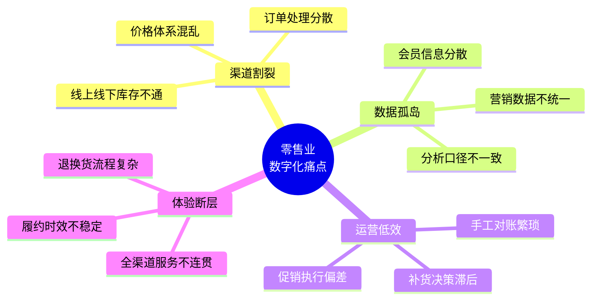
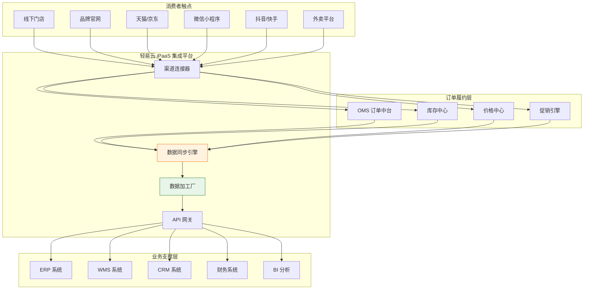
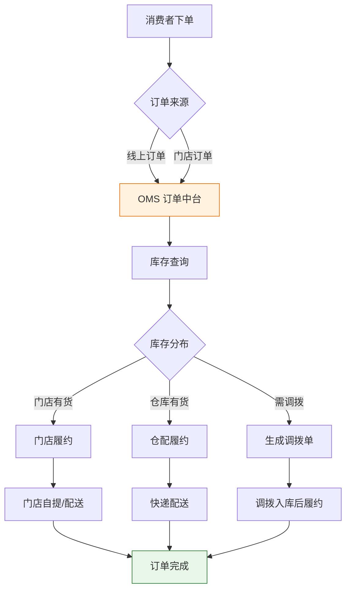
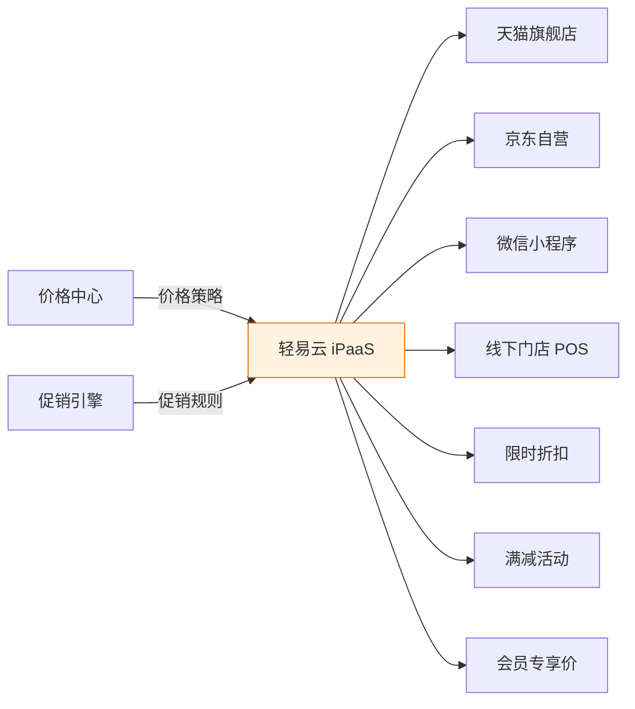
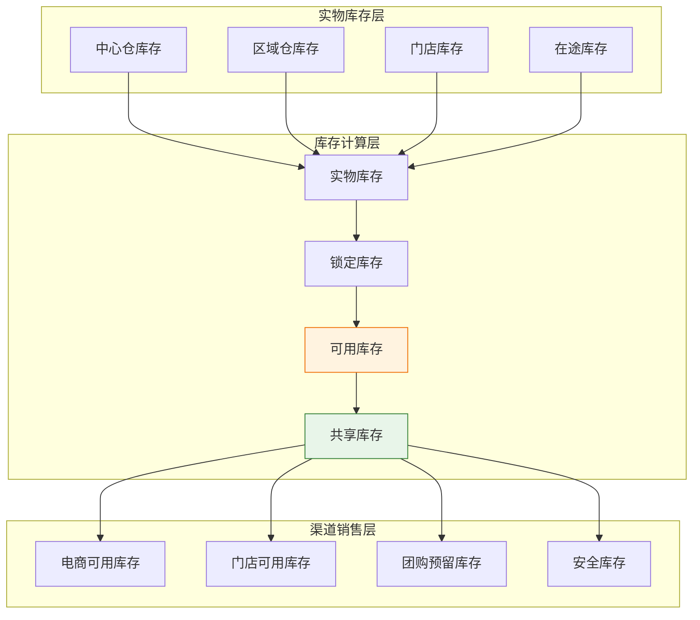
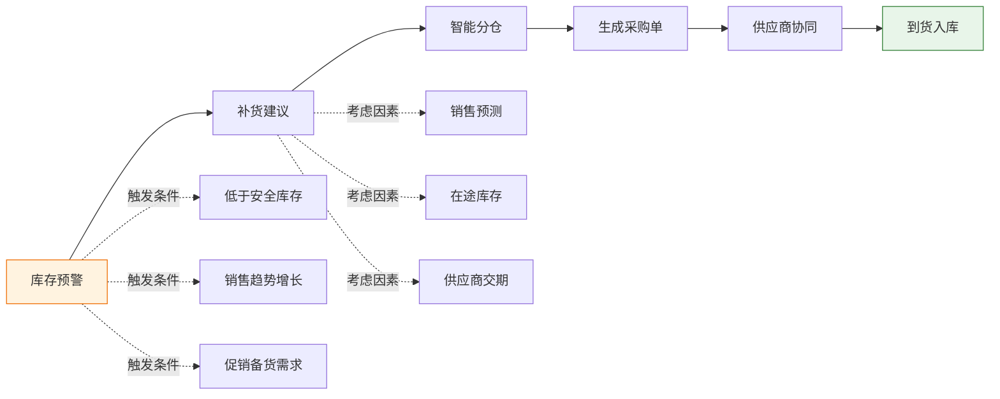
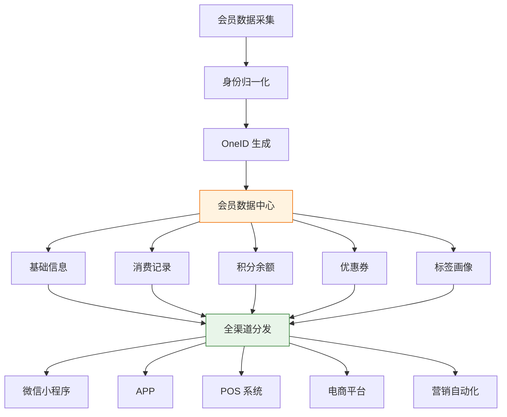
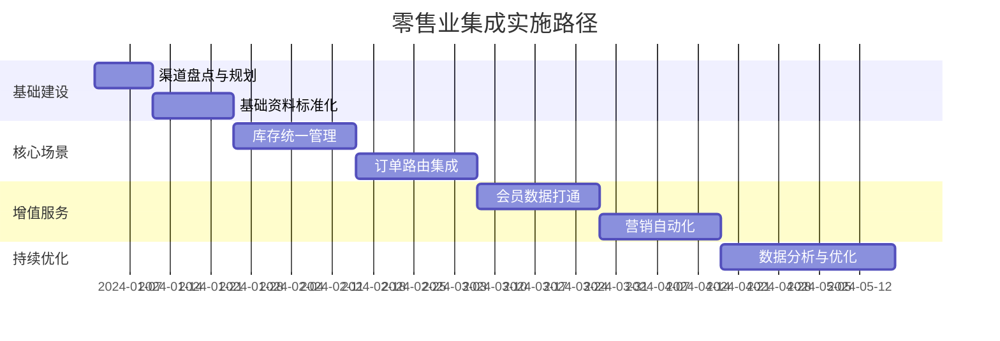
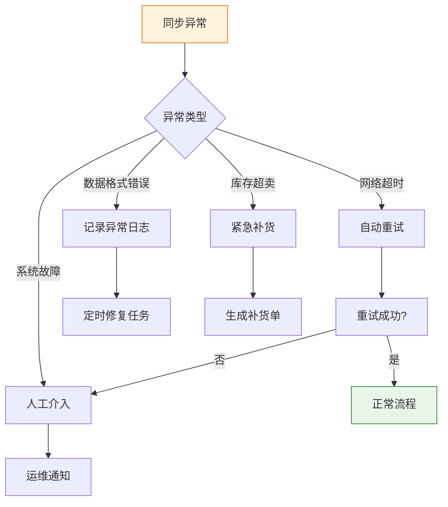

# 零售业集成解决方案

零售行业正处于数字化转型的关键阶段，线上线下融合（OMO）已成为行业发展的新常态。轻易云 iPaaS 针对零售业多业态、多渠道、多触点的业务特点，提供全渠道数据集成方案，帮助企业实现商品、库存、订单、会员等核心数据的统一管理，构建真正意义上的全渠道零售能力。

> [!TIP]
> 本方案适用于实体零售、电商零售、社交电商、直播带货等多种零售业态，特别适合拥有线上线下多元渠道的大型零售集团。实施前建议完成渠道盘点和数据标准化规划。

## 零售业集成场景概述

### 行业痛点分析

零售企业在数字化转型过程中面临诸多挑战：

| 痛点维度 | 具体表现 | 业务影响 |
|---------|---------|---------|
| **渠道割裂** | 线上线下库存独立，超卖缺货频发 | 客户体验差，销售机会流失 |
| **数据分散** | 会员数据分散在各渠道系统中 | 无法精准营销，复购率低 |
| **对账困难** | 多渠道订单财务对账依赖 Excel | 效率低，差错率高 |
| **决策滞后** | 销售数据 T+1 甚至 T+N 才能汇总 | 无法快速响应市场变化 |
| **履约低效** | 订单路由依赖人工判断 | 配送成本高，时效差 |

### 零售业集成架构

## 线上线下一体化

### 全渠道订单路由

实现多渠道订单的智能路由和统一履约：

### 核心集成场景

| 场景 | 数据流向 | 业务价值 |
|-----|---------|---------|
| **线上下单，门店自提** | 电商平台 → OMS → 门店 POS | 提升门店客流，降低配送成本 |
| **线上下单，门店配送** | 电商平台 → OMS → 门店 → 配送 | 利用门店库存，缩短配送时效 |
| **门店缺货，仓库直发** | 门店 POS → OMS → WMS | 避免销售损失，提升转化率 |
| **跨店调拨，就近履约** | OMS → 门店间调拨 | 优化库存分布，降低物流成本 |

> [!NOTE]
> 线上线下一体化需要打通电商平台、OMS、POS、WMS 等多个系统。轻易云提供预置的电商连接器（如聚水潭、旺店通）和 OMS 连接器，大幅缩短集成周期。

### 价格与促销同步

**价格同步策略**：

| 价格类型 | 同步频率 | 更新方式 |
|---------|---------|---------|
| 基础售价 | 实时 | 主动推送 |
| 促销价格 | 准实时 | 定时生效/失效 |
| 会员价格 | 实时 | 查询时计算 |
| 渠道专享价 | 实时 | 差异化推送 |

## 库存统一管理

### 全渠道库存可视化

构建全渠道库存统一视图，实现库存的精准管理和智能分配：

### 库存同步策略

| 库存类型 | 计算规则 | 同步优先级 |
|---------|---------|-----------|
| **实物库存** | 仓库/门店实际库存 | 最高 |
| **锁定库存** | 已下单未发货数量 | 高 |
| **可用库存** | 实物库存 - 锁定库存 | 高 |
| **共享库存** | 可用库存 - 渠道预留 | 中 |
| **虚拟库存** | 在途 + 采购在途 | 低 |

> [!IMPORTANT]
> 库存同步的准确性直接影响销售体验。建议采用"主动推送 + 定时补偿"的双重机制，确保各渠道库存数据的一致性。

### 智能补货方案

## 会员数据同步

### 全渠道会员统一

构建统一的会员数据中心，实现会员信息的全渠道共享：

### 会员数据同步场景

| 同步场景 | 数据内容 | 实时性要求 |
|---------|---------|-----------|
| **会员注册** | 手机号、姓名、生日等基础信息 | 实时 |
| **积分变动** | 积分增减、兑换、过期 | 实时 |
| **等级变更** | 会员等级升降级 | 实时 |
| **优惠券发放** | 券模板、有效期、使用规则 | 准实时 |
| **消费记录** | 订单金额、商品明细 | 准实时 |
| **标签更新** | 用户标签、画像数据 | T+1 |

### 会员通方案

轻易云支持与主流 CRM、会员中台系统的深度集成：

| 对接系统 | 集成内容 | 业务价值 |
|---------|---------|---------|
| **Salesforce** | 会员数据、营销自动化 | 全球化会员运营 |
| **纷享销客** | 会员 360°视图、销售跟进 | B2B 客户管理 |
| **神策数据** | 行为数据、用户画像 | 精细化运营 |
| **有赞** | 会员、积分、优惠券 | 社交电商运营 |
| **微盟** | 会员、营销、分销 | 私域流量运营 |

> [!TIP]
> 会员数据涉及隐私合规，建议实施前完成数据安全评估，确保符合《个人信息保护法》等相关法规要求。

## 实施建议

### 分阶段实施路径

### 最佳实践

**1. 库存分配策略**

| 渠道类型 | 库存分配比例 | 说明 |
|---------|-------------|------|
| 线下门店 | 30%~50% | 保障门店销售，支持即时体验 |
| 电商平台 | 40%~60% | 覆盖主流电商平台销售 |
| 团购/批发 | 10%~20% | 预留大客户采购需求 |
| 安全库存 | 5%~10% | 应对突发订单和退货 |

**2. 订单路由规则优先级**

1. **距离优先**：选择距离客户最近的履约点
2. **成本优先**：选择履约成本最低的方案
3. **库存优先**：选择库存充足的履约点
4. **时效优先**：选择能满足客户时效要求的方案

**3. 异常处理机制**

### 常见问题解答

**Q1：如何处理大促期间的流量高峰？**

A：轻易云 iPaaS 采用云原生架构，支持弹性伸缩。建议大促前进行压测，并根据历史数据预估峰值流量，提前扩容。同时启用熔断和降级机制，保障核心业务流程的稳定性。

**Q2：线上线下价格冲突如何解决？**

A：建议建立统一的价格中心，制定清晰的价格策略规则。轻易云支持按渠道、区域、会员等级等多维度设置差异化价格，同时保证价格策略的一致性执行。

**Q3：退换货涉及多系统如何协同？**

A：轻易云支持退换货流程的全链路打通。退货申请从任意渠道发起后，自动流转至 OMS 和 ERP 系统，触发库存回写、退款处理、财务对账等后续流程，实现退换货的一站式处理。

## 方案价值总结

| 价值维度 | 量化收益 | 业务影响 |
|---------|---------|---------|
| **库存优化** | 库存周转率提升 30%+ | 降低资金占用，减少滞销 |
| **销售增长** | 缺货率降低 50%+ | 提升转化率，减少销售损失 |
| **效率提升** | 对账效率提升 80%+ | 释放财务人力 |
| **体验升级** | 订单履约时效提升 40% | 提升客户满意度 |
| **精准营销** | 会员复购率提升 25% | 提升客户生命周期价值 |

---

## 相关资源

- [电商数据中台集成方案](./ecommerce-data-hub) - 电商业务数据中台建设
- [CRM 集成方案](./crm-integration) - 客户关系管理系统集成
- [国内电商标准方案](../standard-plans/domestic-ecommerce) - 电商对接标准方案
- [跨境电商解决方案](./crossborder-ecommerce) - 跨境业务集成方案
