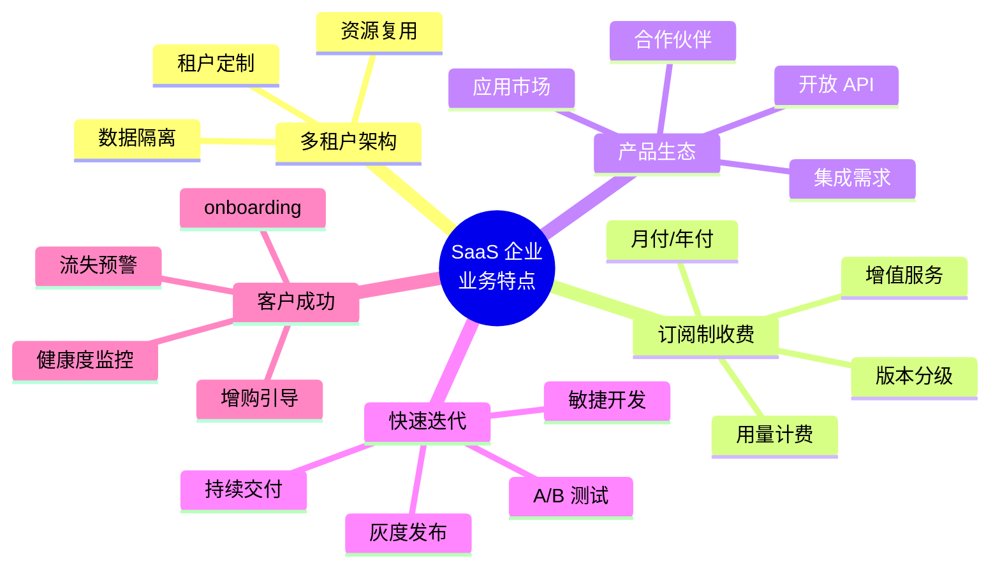
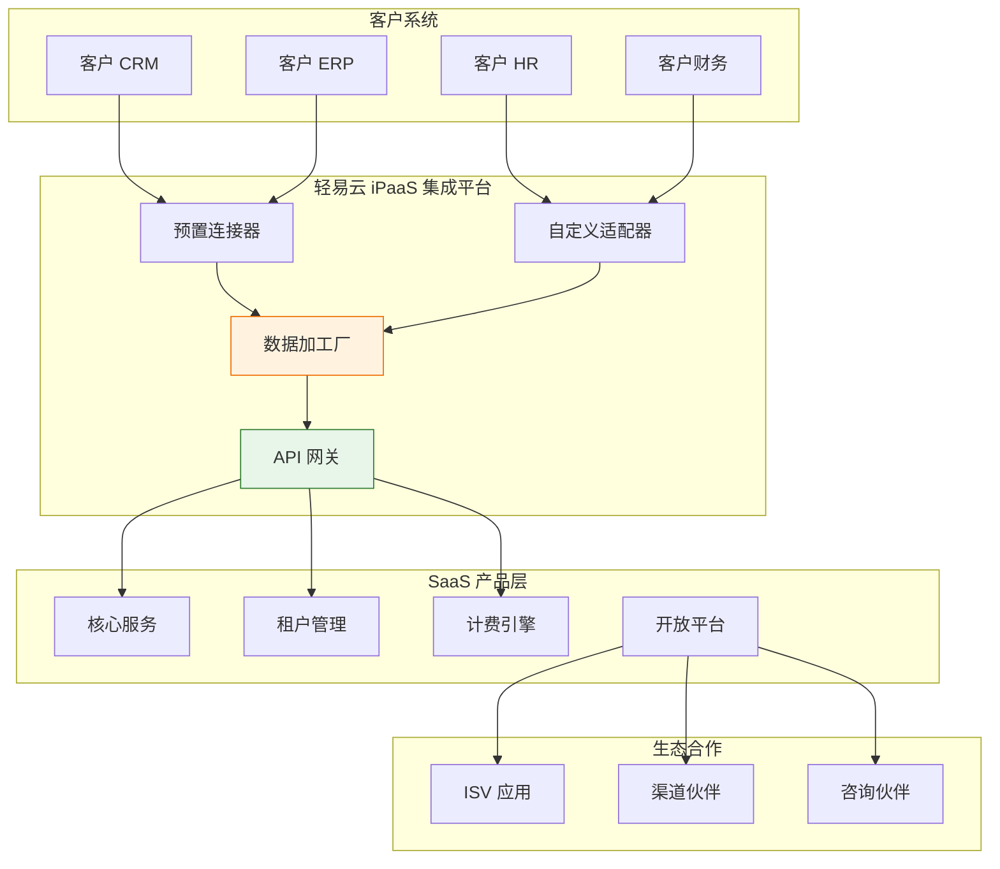
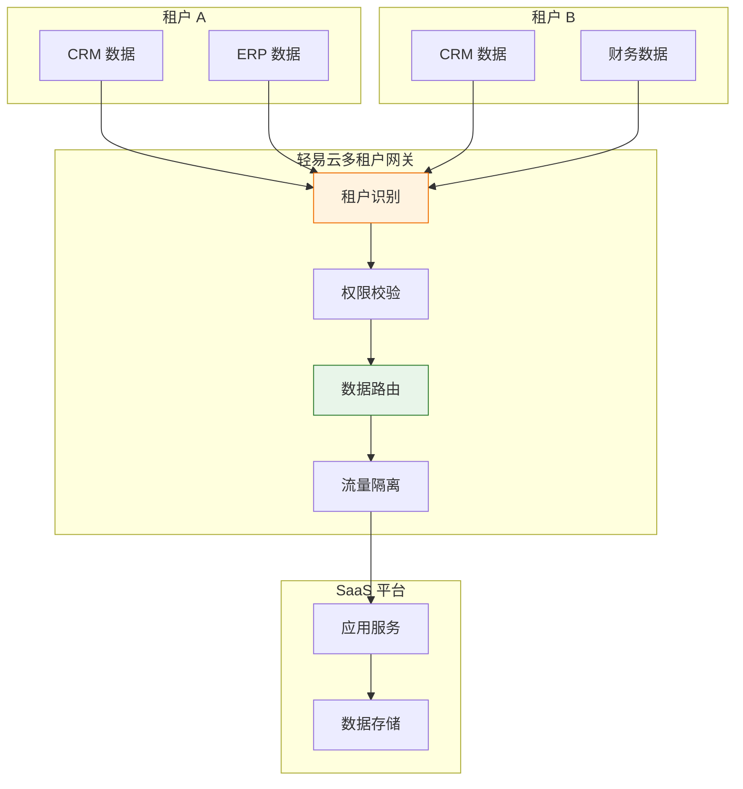
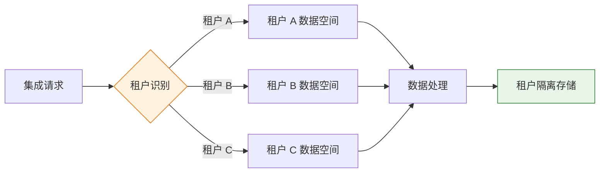
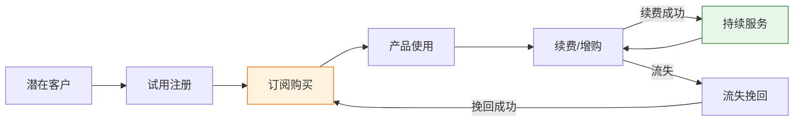
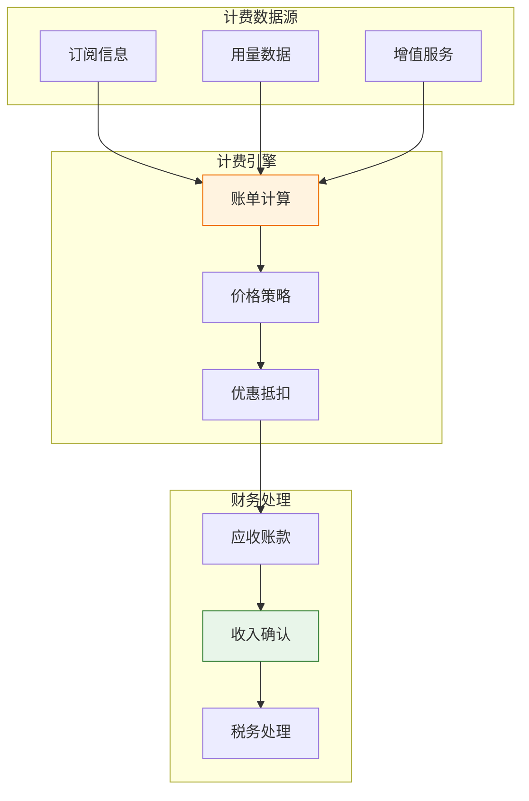
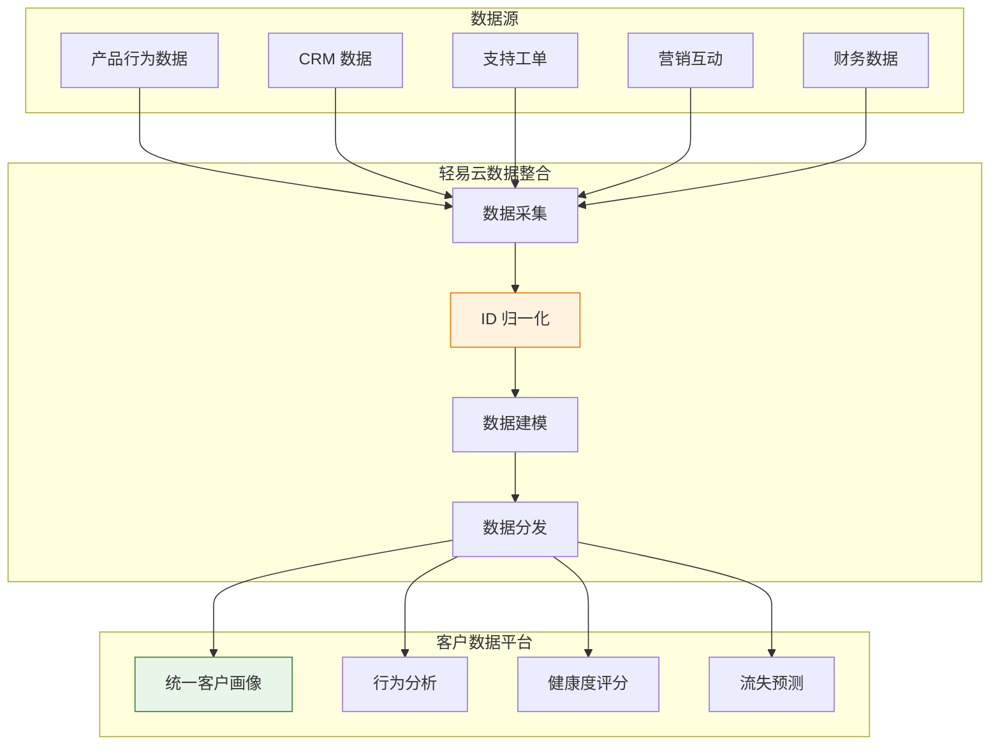
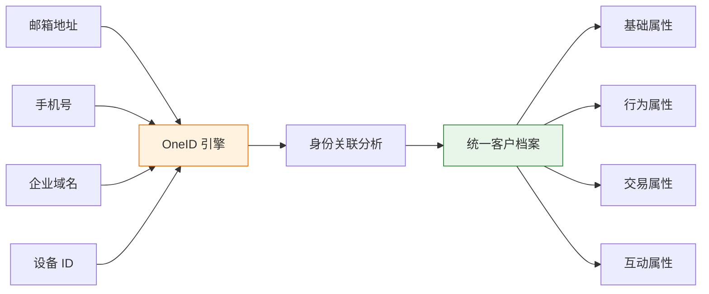
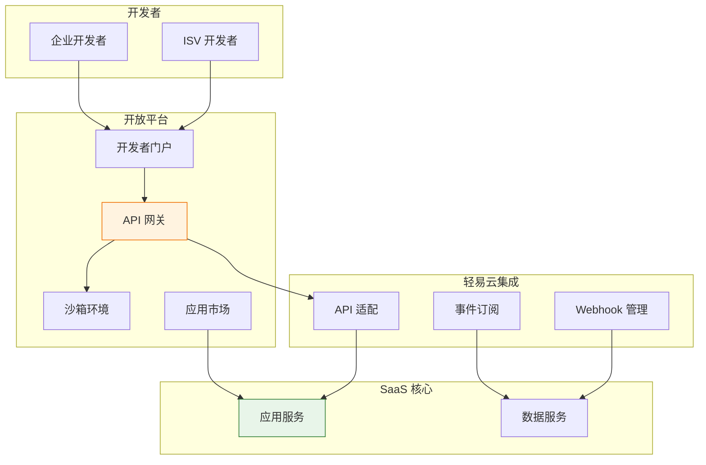
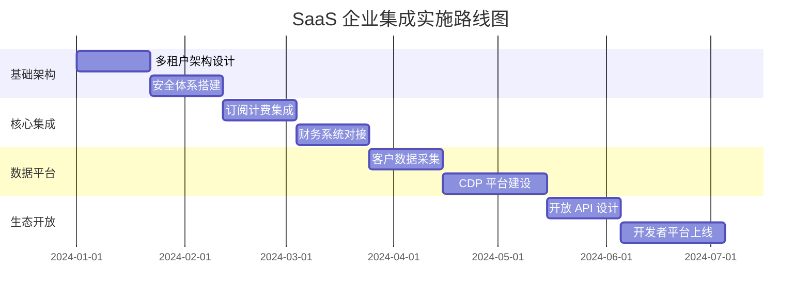

# SaaS 企业集成解决方案

SaaS（Software as a Service）企业作为云计算时代的重要业态，具有多租户、订阅制、快速迭代等特点。随着 SaaS 产品的复杂度提升和生态合作需求增加，SaaS 企业面临着与各类业务系统（CRM、财务、HR、营销等）集成的挑战。轻易云 iPaaS 针对 SaaS 企业的特点，提供灵活、安全、可扩展的 comprehensive 集成方案，帮助 SaaS 企业构建开放的产品生态。

> [!TIP]
> 本方案适用于各类 SaaS 企业，包括 CRM、ERP、HRM、营销自动化、客服系统等垂直领域 SaaS 厂商，以及提供 PaaS 平台能力的企业。实施前建议完成产品架构梳理和生态合作规划。

## SaaS 企业特点

### SaaS 业务模式分析



| SaaS 特点 | 具体表现 | 集成挑战 |
|---------|---------|---------|
| **多租户** | 单一实例服务多个客户 | 数据隔离与共享的平衡 |
| **订阅制** | 按时间/用量计费 | 订阅数据与财务系统同步 |
| **生态开放** | 需要与第三方系统集成 | 集成需求多样化 |
| **快速迭代** | 产品功能持续更新 | API 版本管理复杂 |
| **客户成功** | 关注客户生命周期价值 | 客户数据分散在各系统 |

### SaaS 企业集成架构



## 多租户数据隔离

### 多租户集成架构

SaaS 企业需要在数据隔离和集成便利之间找到平衡：



### 多租户集成策略

| 策略 | 适用场景 | 实现方式 |
|-----|---------|---------|
| **独立集成** | 大客户定制化集成 | 每个租户独立的集成方案 |
| **共享集成** | 标准化集成场景 | 多租户共享集成模板 |
| **混合模式** | 兼顾标准化和定制化 | 基础模板 + 租户配置 |

### 数据隔离方案



**数据隔离实现方式**：

| 层级 | 隔离方式 | 说明 |
|-----|---------|------|
| **数据库层** | 分库/分表/分 Schema | 物理隔离，安全性最高 |
| **应用层** | 租户 ID 过滤 | 逻辑隔离，资源利用率高 |
| **集成层** | 独立集成实例 | 按租户分配集成资源 |

> [!IMPORTANT]
> 多租户数据隔离是 SaaS 企业的核心安全要求。轻易云支持从网络层、应用层到数据层的全方位隔离机制，确保租户数据安全。

## 订阅管理集成

### 订阅生命周期管理



### 订阅管理集成场景

| 场景 | 数据源 | 目标系统 | 业务价值 |
|-----|-------|---------|---------|
| **订阅创建** | SaaS 平台 → CRM | 自动创建客户档案 |
| **付款同步** | 支付平台 → 财务系统 | 自动确认收入 |
| **发票开具** | 财务系统 → 发票平台 | 自动化发票管理 |
| **续费提醒** | CRM → 营销自动化 | 自动续费营销 |
| **流失预警** | 产品数据 → CRM | 客户健康度监控 |

### 计费与财务集成



**计费模式支持**：

| 计费模式 | 集成要点 | 常见场景 |
|---------|---------|---------|
| **固定订阅** | 按周期自动计费 | 标准版/专业版订阅 |
| **用量计费** | 实时采集用量数据 | API 调用、存储空间 |
| **阶梯计费** | 分段价格策略 | 用量越大单价越低 |
| **混合计费** | 基础费 + 用量费 | 复杂定价场景 |

> [!TIP]
> SaaS 企业的收入确认涉及复杂的会计准则（如 ASC 606）。轻易云支持与主流财务系统的集成，实现订阅收入的自动化确认和分摊。

## 客户数据平台

### CDP 架构与集成

构建统一的客户数据平台，整合多源客户数据：



### 客户数据集成场景

| 场景 | 数据流向 | 应用场景 |
|-----|---------|---------|
| **客户 360°视图** | 多系统 → CDP | 销售/CSM 客户全景 |
| **行为数据分析** | 产品 → 分析平台 | 功能使用分析 |
| **健康度评分** | CDP → CRM | 客户成功管理 |
| **流失预警** | CDP → 营销自动化 | 挽留营销 |
| **增购推荐** | CDP → 销售自动化 | 扩展销售 |

### OneID 客户归一化



## 开放平台的集成生态

### 开放平台架构



### 开放平台集成能力

| 能力 | 说明 | 开发者价值 |
|-----|------|-----------|
| **RESTful API** | 标准 HTTP API | 灵活的数据访问 |
| **Webhook** | 事件推送机制 | 实时数据同步 |
| **GraphQL** | 查询语言 | 按需获取数据 |
| **SDK** | 多语言 SDK | 快速开发集成 |
| **应用市场** | 应用发布平台 | 商业化分发渠道 |

### 主流 SaaS 集成生态

轻易云支持与主流 SaaS 平台的生态对接：

| SaaS 平台 | 集成方式 | 集成内容 |
|----------|---------|---------|
| **Salesforce** | REST API | CRM 数据、业务流程 |
| **HubSpot** | REST API | 营销自动化、客户数据 |
| **Slack** | Webhook | 消息通知、协作 |
| **钉钉** | Open API | 组织架构、审批流程 |
| **企业微信** | Open API | 通讯录、应用集成 |
| **飞书** | Open API | 协同办公、应用集成 |

## 实施建议

### 分阶段实施路线图



### 最佳实践

**1. API 版本管理**

```mermaid
flowchart LR
    A[API 版本策略] --> B[URL 版本]
    A --> C[Header 版本]
    A --> D[兼容策略]
    
    B --> E[/v1/customers]
    C --> F[Accept: v2]
    D --> G[弃用通知]
    
    style A fill:#fff3e0,stroke:#ef6c00
```

**API 版本管理要点**：

| 策略 | 说明 | 建议 |
|-----|------|------|
| **版本命名** | v1, v2, v3 | 语义化版本控制 |
| **兼容性** | 向后兼容 | 老版本至少保留 6 个月 |
| **弃用通知** | 提前通知开发者 | 至少提前 3 个月 |
| **文档维护** | 多版本文档并存 | 清晰的变更日志 |

**2. 限流与熔断**

| 保护机制 | 实现方式 | 触发条件 |
|---------|---------|---------|
| **限流** | Token Bucket | 超过 QPS 阈值 |
| **熔断** | Circuit Breaker | 错误率超过阈值 |
| **降级** | Fallback | 依赖服务异常 |
| **隔离** | Bulkhead | 资源池隔离 |

**3. 安全最佳实践**

| 安全领域 | 实施措施 |
|---------|---------|
| **认证** | OAuth 2.0 + PKCE |
| **授权** | RBAC 细粒度权限 |
| **加密** | TLS 1.3 传输加密 |
| **审计** | 全链路操作日志 |
| **监控** | 异常行为检测 |

### 常见问题解答

**Q1：如何处理多租户集成的性能问题？**

A：轻易云支持多租户资源的弹性伸缩和负载均衡。建议对高频集成场景进行缓存优化，对大数据量场景采用异步批处理。

**Q2：SaaS 产品的 API 如何设计才能易于集成？**

A：建议遵循 RESTful 设计规范，提供完善的开发者文档和 SDK。轻易云可以帮助 SaaS 企业快速构建标准化的 OpenAPI 体系。

**Q3：如何保障客户数据在集成过程中的安全性？**

A：轻易云提供端到端的数据加密、字段级脱敏、访问审计等安全机制。同时支持 SOC 2、ISO 27001 等合规认证。

## 方案价值总结

| 价值维度 | 量化收益 | 业务影响 |
|---------|---------|---------|
| **集成效率** | 集成开发效率提升 70% | 快速响应客户需求 |
| **客户留存** | 集成客户留存率提升 30% | 降低客户流失 |
| **收入增长** | 集成驱动收入增长 25% | 扩展收入来源 |
| **生态扩展** | 合作伙伴增长 50% | 扩大产品生态 |
| **数据洞察** | 客户 360°视图构建 | 数据驱动决策 |

---

## 相关资源

- [CRM 集成方案](./crm-integration) - 客户关系管理集成
- [标准 API 开发](../developer/api-overview) - API 开发最佳实践
- [开发者指南](../developer/guide) - 集成开发指南
