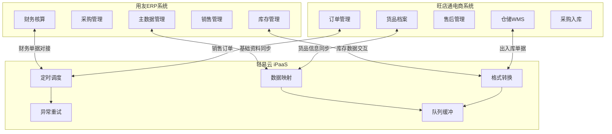

# 用友与旺店通数据集成解决方案

本文档介绍用友 ERP（YonSuite / U8 / U8+）与旺店通电商管理系统之间的数据集成方案。针对电商企业线上线下业务融合的需求，通过轻易云 iPaaS 平台实现基础资料同步、销售订单处理、采购入库管理、库存调拨等核心业务场景的数据互通，帮助企业打通财务核算与电商运营的壁垒，实现业财一体化。

## 方案概述

用友 ERP 作为国内领先的企业管理软件，承载企业财务核算、供应链管理等核心业务；旺店通专注于电商订单处理、仓储发货、售后管理等领域。两者的数据集成面临系统架构差异、数据标准不统一、业务流程交叉等挑战。

轻易云 iPaaS 集成平台提供可视化配置能力，无需编写代码即可建立稳定、高效的数据同步通道，支持高并发订单处理与实时库存同步，满足电商企业大促期间的性能需求。

## 适用场景

| 场景类型 | 业务描述 | 集成目标 |
|---------|---------|---------|
| **线上线下一体化** | 电商订单与线下销售统一管理 | 旺店通销售数据同步至用友生成财务凭证 |
| **多仓库存协同** | 电商仓与线下仓库存实时同步 | 实现库存共享与统一管控 |
| **业财一体化** | 电商业务数据自动生成财务单据 | 销售出库自动生成应收、采购入库自动生成应付 |
| **多渠道订单汇总** | 多平台订单汇集至统一处理 | 天猫、京东、拼多多等订单统一对接用友 |

> [!TIP]
> 本方案适用于日单量从千级到十万级的电商企业。对于日单量超过 10 万的高并发场景，建议启用异步队列与批量处理模式。

## 系统对接背景

### 用友 YonSuite API 说明

用友 YonSuite 提供完善的 Open API 接口，支持单据查询、创建、审核等操作。

**官方文档地址**：[https://open.diwork.com](https://open.diwork.com)

> [!IMPORTANT]
> 调用 YonSuite 接口时需注意以下事项：
> 1. **关联生单**：有关联关系的单据建议使用来源生单的保存接口，否则全局联查可能无法查到关联数据
> 2. **审核流程**：单据需要审核或确认时，需分别调用保存和审核/确认两个接口
> 3. **字段返回值**：列表查询时，涉及计算或反写的字段如果为空，返回参数中可能不包含该字段的 key
> 4. **限流策略**：每个接口都有单独的限流次数，大部分接口限制为每秒 2 次

### 用友 U8 / U8+ API 说明

用友 U8 / U8+ 提供 Web API 接口，支持基础数据与业务单据的对接。

**接口特点**：
- 支持基础资料（物料、客户、供应商）同步
- 支持业务单据（销售出库、采购入库、调拨单）的创建与查询
- 支持库存数据的实时获取

### 旺店通 ERP API 说明

旺店通提供企业版 Open API，支持电商业务全场景对接。

**官方文档地址**：[https://open.wangdian.cn](https://open.wangdian.cn)

> [!WARNING]
> 调用旺店通接口时需注意以下事项：
> 1. **批次号处理**：批号字段需要通过单独接口关联获取，不建议直接对接批号，可能导致负库存
> 2. **奇门接口**：调用奇门接口需要奇门资质
> 3. **税率传递**：奇门自定义接口不支持传税率，需使用标准接口

## 主数据集成

### 业务规划

1. **仓库映射**：两边对应的仓库编码保持一致，单据传递中根据仓库确认库存组织
2. **店铺映射**：维护店铺对应的客户以及销售组织的关系表
3. **基础资料**：供应商和物料对接，从用友同步至旺店通

### 对接方案

| 集成方案 | 同步频率 | 取数说明 | 备注 |
|---------|---------|---------|------|
| 物料同步 | 5 分钟 | 状态：启用 | 注意单位需在用友预先建立 |
| 供应商同步 | 5 分钟 | — | 供应商编码需保持一致 |
| 仓库查询 | 3 分钟 | — | 重要的依赖关系，用于关联库存组织 |
| 单位查询 | 3 分钟 | — | 通过名称关联用友编码 |

### 字段映射

#### 物料同步（用友 → 旺店通）

| 序号 | 源系统字段 | 源字段名 | 目标系统字段 | 目标字段名 | 说明 |
|-----|-----------|---------|-------------|-----------|------|
| 1 | — | 固定值 | `goods_list` | 货品节点 | 货品表主键 |
| 2 | `FNumber` | 编码 | `goods_list.goods_no` | 货品编号 | SPU 唯一编号 |
| 3 | `1` | 固定值 | `goods_list.goods_type` | 货品类别 | 1 = 销售商品 |
| 4 | `FName` | 名称 | `goods_list.goods_name` | 货品名称 | 货品全称 |
| 5 | `FName` | 名称 | `goods_list.short_name` | 货品简称 | 简称显示 |
| 6 | `FMaterialGroup_FName` | 物料分组 | `goods_list.class_name` | 分类 | 类别名称 |
| 7 | `FBaseUnitId_FName` | 基本单位 | `goods_list.unit_name` | 基本单位 | 计量单位 |

#### 供应商同步（用友 → 旺店通）

| 序号 | 源系统字段 | 源字段名 | 目标系统字段 | 目标字段名 | 说明 |
|-----|-----------|---------|-------------|-----------|------|
| 1 | `FNumber` | 编码 | `provider_no` | 供应商编号 | 唯一编码 |
| 2 | `FName` | 名称 | `provider_name` | 供应商名称 | 显示名称 |
| 3 | `1` | 固定值 | `min_purchase_num` | 最小采购量 | 默认 1 |
| 4 | `1` | 固定值 | `purchase_cycle_days` | 采购周期 | 默认 1 天 |

### 对接建议

> [!TIP]
> 1. **物料不要对接辅助单位**：用友中的辅助单位需要勾选启用后才可输入固定换算和浮动换算，传递时容易出错
> 2. **不对接批号保质期**：旺店通没有参数是否启用批次，而是在实际业务单据中填写即可启用，建议初期不对接批号
> 3. **辅助类数据精简**：辅助类数据尽量不要对接，会导致流程复杂、出错率高

## 销售业务集成

### 业务规划

1. **线上订单**：旺店通电商订单发货后，同步至用友生成销售出库单
2. **线下订单**：线下渠道销售在用友发起，同步至旺店通
3. **售后退货**：旺店通退货入库后，同步至用友生成销售退货单
4. **订单合并**：线上订单按店铺、仓库、日期进行按天汇总后传递

### 对接方案

| 集成方案 | 同步频率 | 取数说明 | 备注 |
|---------|---------|---------|------|
| 销售出库单对接（线上） | 每 2 小时 | 店铺不等于线下店铺 | 订单合并、下推销售出库单 |
| 销售出库单对接（线下） | 3 分钟 | 店铺等于线下店铺 | 生成销售订单后下推销售出库单 |
| 退换货生成销售退货 | 3 分钟 | 处理状态 ≥ 65 | 退货类型：退货、换货 |
| 退货入库对接（红字） | 7 分钟 | — | 交易类型：销售出库 |
| 客户退款 | 3 分钟 | 处理状态：待结算、已完成 | 类型：退款、退款不退货 |

### 线上销售出库字段映射（旺店通 → 用友）

| 序号 | 源系统字段 | 源字段名 | 目标系统字段 | 目标字段名 | 说明 |
|-----|-----------|---------|-------------|-----------|------|
| 1 | `XSCKD01_SYS` | 固定值 | `FBillTypeID` | 单据类型 | 销售出库单 |
| 2 | `order_no` | 出库单号 | `FBillNo` | 单据编号 | 外部单号 |
| 3 | `consign_time` | 发货时间 | `FDate` | 日期 | 业务日期 |
| 4 | `100` | 固定值 | `FStockOrgId` | 发货组织 | 默认组织 |
| 5 | `100` | 固定值 | `FSaleOrgId` | 销售组织 | 默认组织 |
| 6 | `shop_no` | 店铺编号 | `FCustomerID` | 客户 | 对应客户 |
| 7 | `logistics_no` | 物流单号 | `FCarriageNO` | 运输单号 | 快递单号 |
| 8 | `receiver_mobile` | 收件人电话 | `FLinkPhone` | 联系电话 | 联系方式 |
| 9 | `receiver_name` | 收件人 | `FLinkMan` | 收货人姓名 | 收货人 |
| 10 | `details_list` | 货品列表 | `FEntity` | 明细信息 | 商品明细 |
| 11 | `details_list.spec_code` | 规格码 | `FEntity.FMaterialID` | 物料编码 | SKU 编码 |
| 12 | `details_list.goods_count` | 数量 | `FEntity.FRealQty` | 实发数量 | 出库数量 |
| 13 | `details_list.price` | 价格 | `FEntity.FTaxPrice` | 含税单价 | 销售单价 |
| 14 | `13` | 固定值 | `FEntity.FEntryTaxRate` | 税率 | 13% |
| 15 | `warehouse_no` | 仓库编号 | `FEntity.FStockID` | 仓库 | 发货仓库 |

### 销售退货字段映射（旺店通 → 用友）

| 序号 | 源系统字段 | 源字段名 | 目标系统字段 | 目标字段名 | 说明 |
|-----|-----------|---------|-------------|-----------|------|
| 1 | `XSTHD01_SYS` | 固定值 | `FBillTypeID` | 单据类型 | 销售退货单 |
| 2 | `order_no` | 入库单号 | `FBillNo` | 单据编号 | 退货单号 |
| 3 | `100` | 固定值 | `FSaleOrgId` | 销售组织 | 默认组织 |
| 4 | `stockin_time` | 入库时间 | `FDate` | 日期 | 退货日期 |
| 5 | `100` | 固定值 | `FStockOrgId` | 库存组织 | 默认组织 |
| 6 | `shop_no` | 店铺编号 | `FRetcustId` | 退货客户 | 对应客户 |
| 7 | `refund_remark` | 退换备注 | `FHeadNote` | 备注 | 退货原因 |
| 8 | `details_list.spec_code` | 规格码 | `FEntity.FMaterialId` | 物料编码 | SKU 编码 |
| 9 | `details_list.goods_count` | 数量 | `FEntity.FRealQty` | 实退数量 | 退货数量 |
| 10 | `details_list.src_price` | 原价 | `FEntity.FTaxPrice` | 含税单价 | 退货单价 |

### 对接建议

> [!IMPORTANT]
> 1. **销售订单对接建议**：销售订单在技术上可以实现对接，但实际过程比较累赘，销售出库单对应的字段足够支持财务核算要求，建议直接对接销售出库单
> 2. **来源生单参数**：调用用友销售订单下推（销售出库来源生单）时，`bizFlow`、`bizFlow_version`、`bizFlow_name` 三个参数必须填写，可通过浏览器 F12 或查询详情接口查看具体值
> 3. **退货审核处理**：销售退货可能存在多次入库情况，用友无法自动调整状态为完成，需判断销售退货和累计入库数量一致时调用审核动作
> 4. **反写字段处理**：用友列表查询接口中，涉及计算或反写的字段如果值为空，返回参数中可能不包含该字段 key
> 5. **订单合并建议**：旺店通销售出库单对接到用友时，电商企业一定要合并订单，特别是日单量庞大的企业
> 6. **批号不建议对接**：对接批号会导致很多数据出库出现负库存，因为批号很难和采购的对应上

## 采购业务集成

### 业务规划

1. **采购订单**：统一在用友中发起采购订单
2. **采购入库**：旺店通根据实际入库情况回传至用友的入库单，并关联回采购订单
3. **采购退货**：旺店通采购退货同步至用友生成采购退料单

### 对接方案

| 集成方案 | 同步频率 | 取数说明 | 备注 |
|---------|---------|---------|------|
| 采购订单 → 采购单 | 3 分钟（8-22 点） | — | 关联仓库查询与供应商同步方案 |
| 采购订单（红字）→ 采购退料单 | 3 分钟（8-22 点） | — | 关联仓库查询与供应商同步方案 |
| 采购入库单 → 采购入库单（下推） | 5 分钟（8-22 点） | 状态：已完成 | 关联采购订单方案 |
| 采购退货单 → 采购入库单（下推） | 5 分钟（8-22 点） | 出库单状态：已完成 | 关联采购订单（红字）方案 |

### 采购入库字段映射（旺店通 → 用友 YonSuite）

| 序号 | 源系统字段 | 源字段名 | 目标系统字段 | 目标字段名 | 说明 |
|-----|-----------|---------|-------------|-----------|------|
| 1 | `RKD01_SYS` | 固定值 | `FBillTypeID` | 单据类型 | 标准采购入库 |
| 2 | `CG` | 固定值 | `FBusinessType` | 业务类型 | 采购业务 |
| 3 | `order_no` | 入库单号 | `FBillNo` | 单据编号 | 外部单号 |
| 4 | `check_time` | 审核时间 | `FDate` | 入库日期 | 业务日期 |
| 5 | `101` | 固定值 | `FStockOrgId` | 收料组织 | 默认组织 |
| 6 | `101` | 固定值 | `FPurchaseOrgId` | 采购组织 | 默认组织 |
| 7 | `provider_no` | 供应商编号 | `FSupplierId` | 供应商 | 对应供应商 |
| 8 | `details_list` | 明细 | `FInStockEntry` | 明细信息 | 商品明细 |
| 9 | `details_list.spec_no` | 规格码 | `FInStockEntry.FMaterialId` | 物料编码 | SKU 编码 |
| 10 | `details_list.right_num` | 正品数 | `FInStockEntry.FRealQty` | 实收数量 | 入库数量 |
| 11 | `details_list.right_price` | 正品价 | `FInStockEntry.FTaxPrice` | 含税单价 | 采购单价 |
| 12 | `13` | 固定值 | `FInStockEntry.FEntryTaxRate` | 税率 | 13% |
| 13 | `warehouse_no` | 仓库编号 | `FInStockEntry.FStockId` | 仓库 | 入库仓库 |

### 对接建议

> [!TIP]
> 1. **常规流程成熟**：电商 ERP 与财务 ERP 的采购对接流程比较成熟，上线后问题较少
> 2. **多入库验证**：注意多验证一个订单多个入库的情况
> 3. **单仓库限制**：旺店通不允许一个采购订单入多个仓库，建议在用友中做校验规则，限制一张采购订单只能有一个仓库

## 调拨业务集成

### 业务规划

1. **组织间调拨**：统一在用友中发起，因为用友有组织间定价
2. **组织内调拨**：在旺店通 OMS 发起，生成用友的转仓单（转仓单只能是组织内调拨）

### 对接方案

| 集成方案 | 同步频率 | 取数说明 | 备注 |
|---------|---------|---------|------|
| 调拨单对接转库（组织内） | 3 分钟（6-23 点） | 状态：调拨完成 | 外部单号区分调拨 |
| 其他出库单同步（转库） | 8 分钟 | 类型：不等于报废和盘亏 | 对转库自动生成其他出库单进行审核 |
| 调拨单同步（跨组织） | 3 分钟（6-23 点） | 状态：已审核 | 外部单号必须包含 DBDD 开头 |
| 调拨出库对接调出单 | 5 分钟（6-23 点） | 类型：调拨出库，状态：已完成 | 调入组织关联调拨单得出 |
| 调拨入库对接调入单 | 5 分钟（6-23 点） | 类型：调拨入库，状态：已完成 | 调出组织关联调拨单得出 |

### 调拨单字段映射（旺店通 → 用友）

| 序号 | 源系统字段 | 源字段名 | 目标系统字段 | 目标字段名 | 说明 |
|-----|-----------|---------|-------------|-----------|------|
| 1 | `transfer_no` | 调拨单号 | `FBillNo` | 单据编号 | 外部单号 |
| 2 | `ZJDB01_SYS` | 固定值 | `FBillTypeID` | 单据类型 | 标准直接调拨 |
| 3 | `NORMAL` | 固定值 | `FBizType` | 业务类型 | 标准业务 |
| 4 | `GENERAL` | 固定值 | `FTransferDirect` | 调拨方向 | 普通调拨 |
| 5 | `InnerOrgTransfer` | 固定值 | `FTransferBizType` | 调拨类型 | 组织内调拨 |
| 6 | `100` | 固定值 | `FStockOutOrgId` | 调出库存组织 | 默认组织 |
| 7 | `100` | 固定值 | `FStockOrgId` | 调入库存组织 | 默认组织 |
| 8 | `created` | 创建时间 | `FDate` | 日期 | 业务日期 |
| 9 | `remark` | 备注 | `FNote` | 备注 | 调拨备注 |
| 10 | `details_list` | 明细 | `FBillEntry` | 明细信息 | 商品明细 |
| 11 | `details_list.spec_no` | 规格码 | `FBillEntry.FMaterialId` | 物料编码 | SKU 编码 |
| 12 | `details_list.num` | 数量 | `FBillEntry.FQty` | 调拨数量 | 调拨数 |
| 13 | `from_warehouse_no` | 源仓库 | `FBillEntry.FSrcStockId` | 调出仓库 | 调出仓库 |
| 14 | `to_warehouse_no` | 目标仓库 | `FBillEntry.FDestStockId` | 调入仓库 | 调入仓库 |

### 对接建议

> [!WARNING]
> 1. **调拨发起方选择**：组织间调拨建议在 YonSuite 发起，因为 OMS 没有组织间定价以及对应的控制；组织内调拨（转库）可在 WMS 发起
> 2. **来源生单关联**：调拨单回传时没有来源生单接口，回传时需要关联查询获得源单数据进行创建，关联关系为：调拨单 → 调出 → 调入
> 3. **跨期问题**：确保不存在跨期情况，即调拨出和调拨入不在同一会计期间，否则会产生库存差异

## 生产业务集成

### 业务规划

1. **生产开单**：旺店通里面的生产开单类似于组装拆卸业务
2. **成本核算**：需要解决成本问题，建议使用形态转换单进行处理

### 对接方案

| 集成方案 | 同步频率 | 取数说明 | 备注 |
|---------|---------|---------|------|
| 形态转换单 | 5 分钟 | 类型：生产入库 | 生成形态转换单并自动生成其他出入库 |

### 对接建议

> [!CAUTION]
> 1. **跨期检查**：对接时需确定不存在跨期情况，即转仓时调拨出是前一天、调拨入是后一天会导致库存差异
> 2. **成本同步**：形态转换单生成时会同时生成其他出入库单，确保成本数据正确传递

## 用友 U8 / U8+ 对接说明

用友 U8 / U8+ 与旺店通/聚水潭的对接方案与 YonSuite 类似，主要差异在于 API 接口与字段命名。以下是关键差异点：

### 接口差异对比

| 对比项 | YonSuite | U8 / U8+ |
|-------|---------|---------|
| **接口协议** | RESTful JSON | Web Service / REST |
| **认证方式** | AppKey + AppSecret | 用户名 + 密码 |
| **单据创建** | `batchSave` | `Add` / `Save` |
| **单据查询** | `executeBillQuery` | `Get` / `Query` |

### 聚水潭对接方案

对于使用聚水潭作为电商 ERP 的企业，对接方案与旺店通类似：

| 业务场景 | 聚水潭接口 | 用友接口 |
|---------|-----------|---------|
| 商品同步 | `sku.query` | 创建物料 |
| 销售出库 | `orders.out` | 创建销售出库单 |
| 销售退货 | `refund.query` | 创建销售退货单 |
| 采购入库 | `purchase.in` | 创建采购入库单 |
| 采购退货 | `purchase.return` | 创建采购退料单 |
| 调拨单 | `allocate.query` | 创建直接调拨单 |

## 实施建议

### 数据初始化

1. **基础资料先行**：优先完成物料/货品、供应商、客户等基础资料的同步与映射
2. **库存期初对接**：确保两套系统期初库存数据一致后再启用实时同步
3. **仓库映射配置**：建立用友仓库与旺店通仓库的对应关系表

### 定时策略配置

| 数据类型 | 建议同步频率 | 说明 |
|---------|------------|------|
| 基础资料 | 每 15 分钟 | 新增变更实时同步 |
| 销售订单 | 实时/每 5 分钟 | 优先保证及时性 |
| 出入库单据 | 每 10 分钟 | 平衡性能与时效 |
| 库存校准 | 每日凌晨 2 点 | 避开业务高峰期 |

### 异常处理机制

> [!WARNING]
> 同步失败时，系统会记录错误日志并触发告警。建议配置以下异常处理机制：

1. **网络超时**：自动重试 3 次，间隔 5 分钟
2. **数据校验失败**：记录至异常数据表，人工介入处理
3. **重复推送**：利用外部单号去重，避免重复生成单据
4. **限流处理**：当触发接口限流时，自动退避重试

### 大促期间保障

针对 618、双 11 等大促场景：

1. **提前扩容**：提前扩充进程数量，提升并发处理能力
2. **队列监控**：启用监控告警，实时关注队列堆积情况
3. **定时策略调整**：可适当缩短同步间隔，确保订单及时处理
4. **降级预案**：准备降级方案，优先保障核心单据同步

## 常见问题

### Q1：两套系统的物料编码不一致如何处理？

建议在旺店通货品档案的商家编码（`spec_no`）字段维护用友物料编码，建立映射关系。也可在轻易云数据映射中配置编码转换表。

### Q2：多仓库场景如何配置？

在数据映射中配置仓库编码转换表，将用友仓库编码映射为旺店通仓库编号。建议保持两边仓库编码一致，简化映射配置。

### Q3：调拨单方向如何对应？

注意用友与旺店通的调拨方向定义可能相反，需根据实际业务验证调入/调出仓库的映射关系。建议在上线前进行充分测试。

### Q4：如何处理大量历史订单同步？

对于上线前的历史订单，建议：
1. 区分已完成订单与未完成订单
2. 已完成订单可只做查询展示，不做反向同步
3. 未完成订单按正常流程同步并标记状态

### Q5：销售退货多次入库如何处理？

用友无法自动在多次入库后调整状态为完成，会一直处于收货中。建议在方案中添加判断逻辑：当销售退货数量等于累计入库数量时，自动调用审核接口完成单据。

### Q6：如何验证对接数据的准确性？

建议建立数据对账机制：
1. **日对账**：每日对比两边系统的单据数量与金额
2. **异常告警**：设置差异阈值，超过阈值自动告警
3. **月度盘点**：月末进行完整的数据核对，确保一致性

## 总结

用友与旺店通的集成方案通过轻易云 iPaaS 平台实现了企业 ERP 与电商系统的无缝对接。无论是用友 YonSuite 还是 U8 / U8+，均可通过可视化配置快速落地，满足企业线上线下一体化运营的需求。

根据企业实际业务特点选择合适的集成模式：
- **以财务核算为主**：建议在用友发起核心业务单据
- **以电商运营为主**：建议在旺店通发起订单，同步至用友生成财务单据

遵循本文档的实施建议，可有效降低集成风险，确保数据同步的准确性与及时性。
