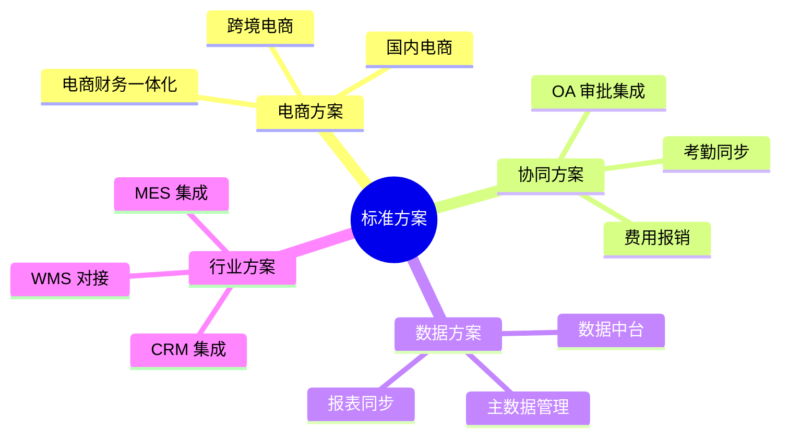

# 标准集成方案

轻易云 iPaaS 提供开箱即用的标准集成方案，帮助企业快速实现常见业务场景的集成。

## 方案分类

## 目录

- [方案概览](./standard-plans/README)
- [跨境电商方案](./standard-plans/cross-border)
- [国内电商方案](./standard-plans/domestic-ecommerce)
- [电商&财务 ERP 方案](./standard-plans/ecommerce-erp)
- [OA 协同方案](./standard-plans/oa-standard)
- [CRM 集成方案](./standard-plans/crm-standard)
- [MES 集成方案](./standard-plans/mes-standard)
- [WMS 对接标准方案](./standard-plans/wms-standard)
- [ERP 对接方案](./standard-plans/erp-integration)
- [WMS 集成方案](./standard-plans/wms-integration)
- [iPaaS Lite 方案](./standard-plans/ipaas-lite)
- [Lite 集成方案包](./standard-plans/lite-plans)
