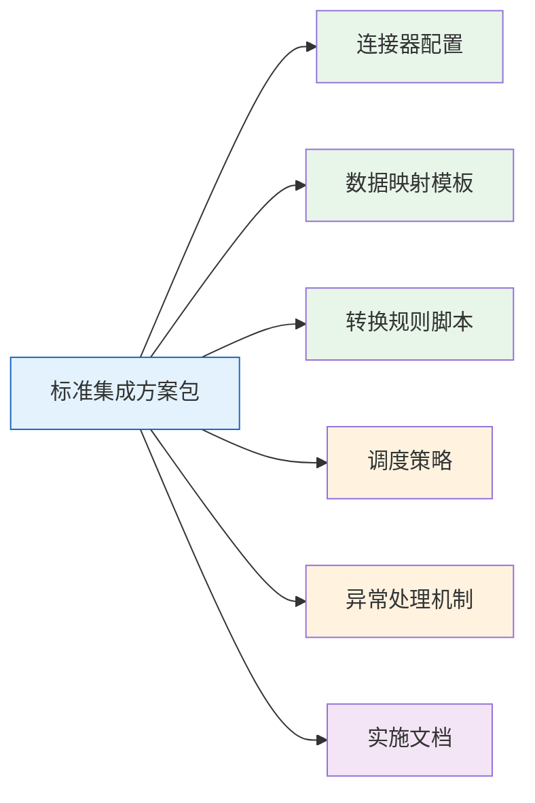
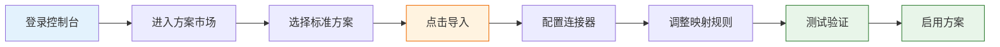

# 标准集成方案

轻易云 iPaaS 标准集成方案包是一系列开箱即用的完整配置模板，涵盖主流业务系统的数据集成场景。每个方案包都经过大量生产环境验证，包含预置的连接器配置、数据映射规则、转换逻辑和调度策略，帮助企业快速实现系统间的数据打通，显著缩短项目实施周期。

## 什么是标准集成方案包

标准集成方案包是轻易云团队基于多年企业系统集成实践经验，提炼出的标准化、可复用的集成解决方案。方案包将复杂的系统集成工作抽象为可配置化的模板，用户无需从零开始搭建集成流程，只需根据自身业务场景选择合适的方案，完成简单的参数配置即可投入使用。

### 核心特点

| 特点 | 说明 |
| ---- | ---- |
| **开箱即用** | 预置完整的连接器、映射规则、转换脚本，导入即可使用 |
| **经过验证** | 每个方案均来自真实项目落地，经过生产环境检验 |
| **灵活定制** | 支持在标准方案基础上进行二次开发和个性化调整 |
| **持续更新** | 随着平台迭代和客户需求持续优化升级 |
| **专业支持** | 提供详细的实施文档和技术支持服务 |

### 方案包组成

每个标准集成方案包通常包含以下内容：

- **连接器配置**：源系统和目标系统的连接参数模板
- **数据映射模板**：字段映射关系、主键策略、关联规则
- **转换规则脚本**：数据类型转换、值格式化、业务逻辑处理
- **调度策略**：同步频率、定时任务、触发条件
- **异常处理机制**：错误重试、告警通知、数据补偿
- **实施文档**：部署步骤、注意事项、常见问题

## 适用场景分类

轻易云标准集成方案覆盖企业数字化转型中的主流业务场景，按应用领域划分为以下七大类：

### 跨境电商方案

面向亚马逊、TikTok Shop、速卖通、Shopee、Temu 等跨境电商平台与 ERP 系统的数据集成需求，实现订单、库存、财务数据的自动同步。

**典型场景**：
- 领星 ERP 与金蝶云星空/云星辰的全流程对接
- 亚马逊 FBA 订单与 ERP 销售订单同步
- 跨境电商平台账单与财务应收应付对接
- 海外仓库存与 ERP 库存实时同步

**覆盖平台**：亚马逊、TikTok Shop、速卖通、Shopee、Ozon、Temu、SHEIN 等

### 国内电商方案

针对淘宝、天猫、京东、拼多多等国内电商平台，以及旺店通、聚水潭、万里牛等电商 ERP 与财务/仓储系统的集成场景。

**典型场景**：
- 旺店通企业版与金蝶云星空业财一体化
- 聚水潭与金蝶云星辰全流程对接
- 电商平台订单与 WMS 仓储系统同步
- 电商对账数据自动核验

**覆盖平台**：旺店通、聚水潭、万里牛、管易云、快麦、班牛等

### OA 协同方案

实现钉钉、飞书、企业微信等协同办公平台与 ERP、HR、费控系统的审批流程集成，以及泛微、蓝凌、致远等专业 OA 系统的数据对接。

**典型场景**：
- 钉钉/飞书审批与金蝶费用报销单集成
- OA 系统与 ERP 采购申请对接
- 考勤数据与 HR 系统同步
- 组织架构双向同步

**覆盖平台**：钉钉、飞书、企业微信、泛微、蓝凌、致远、氚云、简道云等

### CRM 集成方案

连接销售管理与客户运营系统，实现客户主数据、销售订单、回款信息的跨系统流转，支持 B2B 和 B2C 多种业务模式。

**典型场景**：
- 小满 OKKI 与金蝶云星空客户订单集成
- 纷享销客与 ERP 销售数据同步
- Salesforce/HubSpot 与国内 ERP 对接
- CRM 客户主数据与财务系统同步

**覆盖平台**：小满 OKKI、纷享销客、销售易、Moka、北森、Salesforce、HubSpot 等

### MES 集成方案

面向制造业生产车间，打通 ERP 与制造执行系统（MES）的数据通道，实现生产订单、工艺路线、物料消耗、质量数据的实时交互。

**典型场景**：
- 金蝶云星空与 MES 系统的生产订单下发
- 设备数据采集与 ERP 产量汇报
- 质量检验数据双向同步
- 物料拉动与仓储系统联动

**覆盖平台**：各类主流 MES 系统，支持通过 RESTful API、数据库、MQTT 等多种方式对接

### WMS 集成方案

针对仓储物流场景，实现 ERP 与仓储管理系统（WMS）、物流平台的数据互通，支持多仓、多货主、多渠道的复杂业务场景。

**典型场景**：
- 旺店通 WMS 与畅捷通 T+库存同步
- 销售出库单与物流平台对接
- 库存调拨与多仓协同
- 退货入库与售后系统联动

**覆盖平台**：旺店通 WMS、聚水潭 WMS、快递鸟、菜鸟物流等

### iPaaS Lite 方案

轻量级数据同步方案，适用于数据量较小、业务逻辑相对简单的场景，提供低成本、快速部署的集成能力。

**典型场景**：
- 基础资料单向同步（物料、客户、供应商）
- 简单的单据推送（订单、入库单）
- 定时数据备份与归档
- 跨系统数据查询与报表

**适用对象**：小微企业、初创公司、单一业务场景

## 方案列表

| 方案 | 适用场景 | 复杂度 | 状态 |
|------|----------|--------|------|
| [跨境电商方案](./cross-border) | 跨境电商平台-ERP-海外仓集成 | 高 | 已发布 |
| [国内电商方案](./domestic-ecommerce) | 淘宝/京东/拼多多-ERP-WMS 集成 | 中 | 已发布 |
| [OA 协同方案](./oa-standard) | 钉钉/飞书-ERP/HR 审批流集成 | 中 | 已发布 |
| [CRM 集成方案](./crm-standard) | CRM-ERP-财务系统客户主数据同步 | 中 | 已发布 |
| [ERP 对接方案](./erp-integration) | 多 ERP 间基础资料与单据同步 | 高 | 已发布 |
| [MES 集成方案](./mes-standard) | ERP-MES-设备数据采集集成 | 高 | 已发布 |
| [WMS 集成方案](./wms-integration) | ERP-WMS-物流平台集成 | 中 | 已发布 |
| [iPaaS Lite 方案](./ipaas-lite) | 轻量级数据同步场景 | 低 | 已发布 |

## 如何申请与导入

### 申请流程

1. **方案咨询**
   - 访问轻易云官网 [www.qeasy.cloud](https://www.qeasy.cloud) 了解方案详情
   - 联系集成顾问（电话：19301379948）进行需求沟通
   - 或提交在线咨询表单，获取专业方案建议

2. **试用申请**
   - 注册轻易云 iPaaS 平台账号
   - 进入「方案市场」浏览可用方案
   - 选择目标方案提交试用申请

3. **方案开通**
   - 顾问确认试用资格
   - 开通方案访问权限
   - 提供实施指导文档

### 导入使用

标准方案的导入和配置流程如下：

**详细步骤**：

1. **登录控制台**
   - 访问 [pro.qliang.cloud](https://pro.qliang.cloud) 登录轻易云 iPaaS 控制台

2. **进入方案市场**
   - 顶部导航选择「方案市场」-「标准方案」
   - 浏览或搜索目标方案

3. **导入方案**
   - 点击方案卡片进入详情页
   - 阅读方案说明和前置条件
   - 点击「导入到我的空间」

4. **配置连接器**
   - 配置源系统连接参数（API 密钥、数据库连接等）
   - 配置目标系统连接参数
   - 测试连接确保连通性

5. **调整映射规则**
   - 根据实际业务调整字段映射
   - 配置主键策略和关联规则
   - 设置数据过滤条件

6. **测试验证**
   - 执行单条数据测试
   - 验证数据转换结果
   - 检查目标系统数据准确性

7. **启用方案**
   - 配置调度策略（定时/实时）
   - 设置告警通知
   - 启用方案开始自动同步

> [!TIP]
> 标准方案提供 **30 天免费试用期**，试用期间可完整体验方案功能，满意后再决定是否购买正式授权。

## 技术支持

在使用标准集成方案过程中，如遇问题可通过以下渠道获取支持：

| 渠道 | 联系方式 | 响应时效 |
| ---- | -------- | -------- |
| 在线客服 | 控制台右下角客服窗口 | 工作日 9:00-18:00 |
| 技术热线 | 19301379948 | 工作日 9:00-21:00 |
| 工单系统 | 控制台「帮助与支持」-「提交工单」 | 2 小时内响应 |
| 社区论坛 | [bbs.qeasy.cloud](https://bbs.qeasy.cloud) | 24 小时内 |
| 邮件支持 | support@qeasy.cloud | 24 小时内 |

## 方案定制

当标准方案无法完全满足业务需求时，轻易云提供专业的方案定制服务：

1. **需求分析**：深入了解业务场景和痛点
2. **方案设计**：制定定制化集成架构
3. **开发实施**：专业团队完成方案开发
4. **测试上线**：全面测试确保稳定运行
5. **运维支持**：持续运维和优化服务

联系集成顾问获取定制方案报价和实施计划。

## 相关资源

- [快速开始](../quick-start/first-integration) - 5 分钟上手轻易云 iPaaS
- [连接器配置指南](../guide/configure-connector) - 详细连接器配置说明
- [数据映射文档](../guide/data-mapping) - 数据映射规则配置
- [API 参考](../api-reference) - 开放接口文档
- [常见问题](../faq) - 使用过程中的常见问题解答
