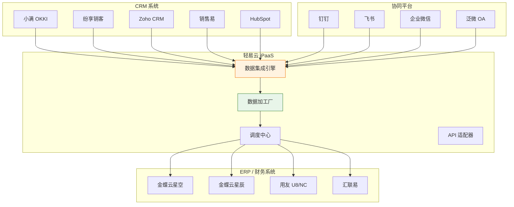
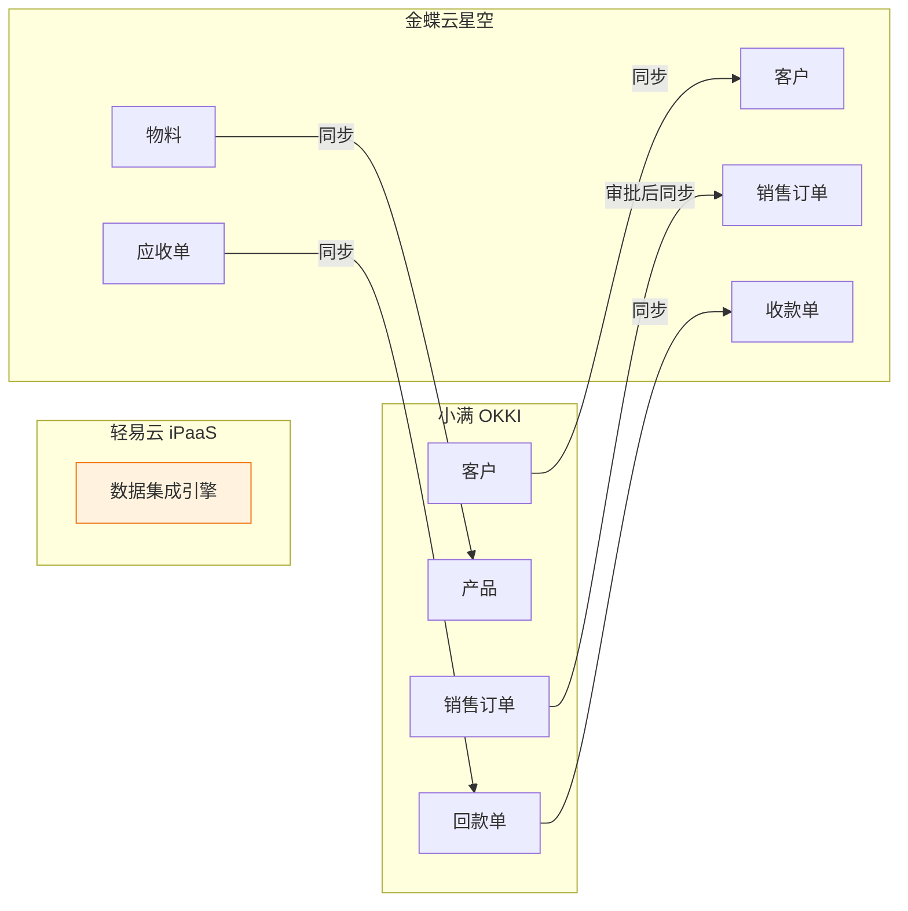
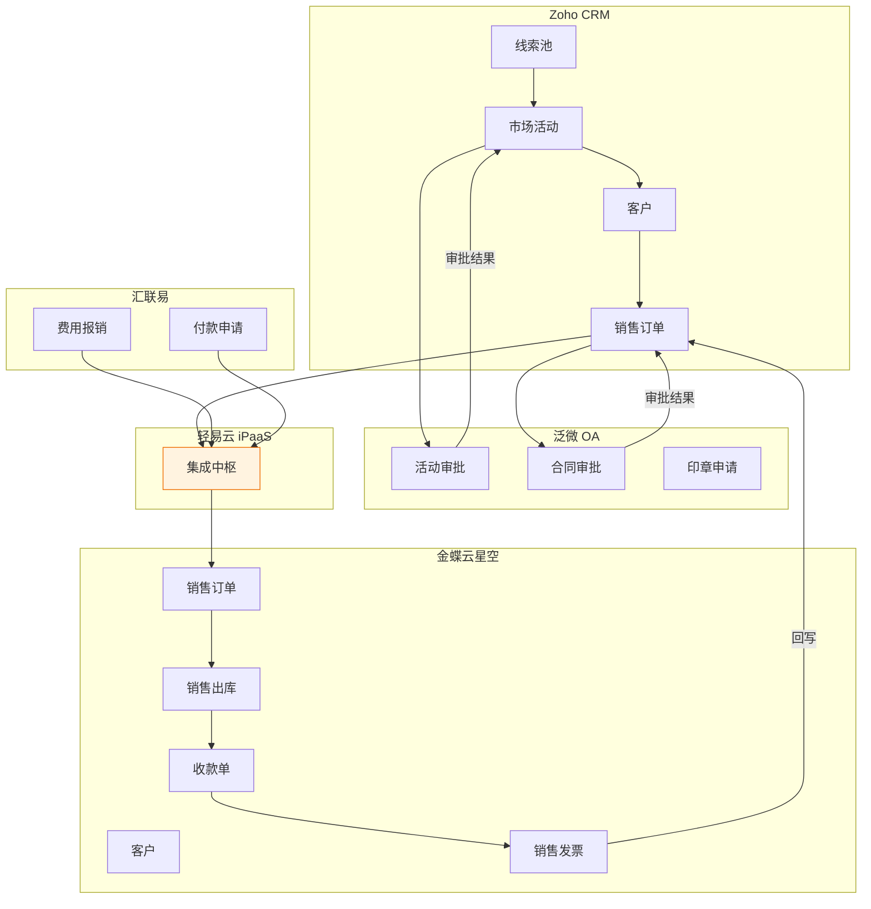
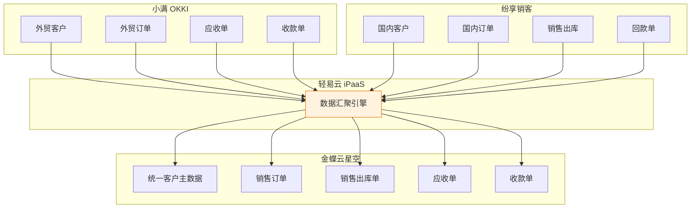
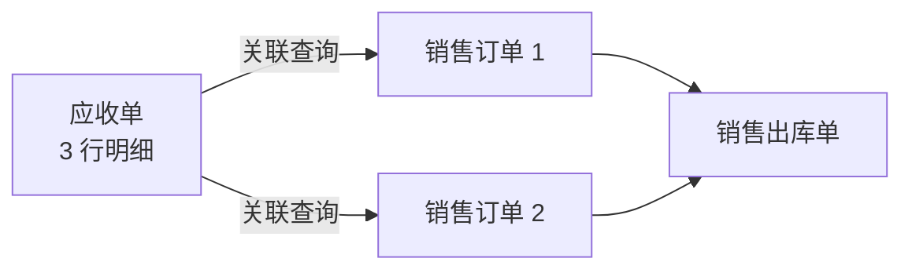
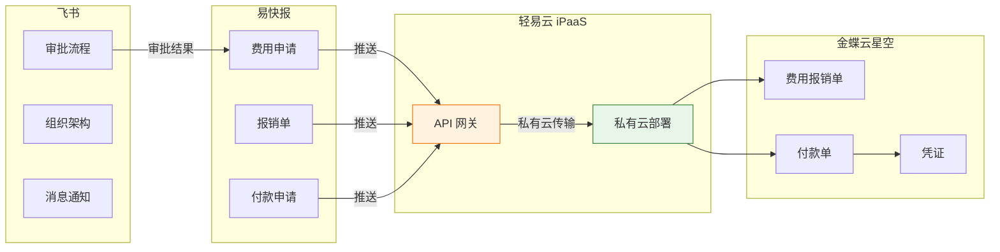

# CRM 集成标准方案

CRM 集成标准方案是轻易云 iPaaS 针对企业客户关系管理场景打造的标准集成方案包，实现小满 OKKI、纷享销客、Zoho、销售易等主流 CRM 系统与金蝶云星空、用友等 ERP 系统的数据无缝对接，打通客户主数据、销售订单、回款信息等核心业务流程，帮助企业实现销售与财务数据的自动流转。

---

## 方案概述

### 适用场景

本方案主要适用于以下 CRM 集成业务场景：

- **小满 OKKI 与金蝶云星空/云星辰的客户订单集成**
- **纷享销客与 ERP 销售数据双向同步**
- **Zoho CRM 与国内 ERP 系统的跨平台对接**
- **多 CRM 系统与单 ERP 系统的数据汇聚**
- **CRM 客户主数据与财务系统主数据同步**
- **销售订单、回款单跨系统自动流转**

### 方案架构



### 核心能力

| 能力 | 说明 |
| ---- | ---- |
| **多 CRM 支持** | 支持小满、纷享销客、Zoho、销售易等主流 CRM 系统 |
| **全业务覆盖** | 客户主数据、销售订单、回款单、出库单全流程对接 |
| **多系统集成** | 支持 CRM + OA + ERP 多系统复杂场景 |
| **审批流打通** | 销售订单审批状态自动同步，支持多级审批 |
| **附件同步** | 产品图片、合同附件等文件自动传输 |
| **实时触发** | 支持事件驱动，数据变更实时同步 |

---

## 连接器配置

### 小满 OKKI 连接器参数

配置小满 OKKI 连接器需要以下参数：

| 参数 | 类型 | 必填 | 说明 |
| ---- | ---- | ---- | ---- |
| `app_key` | string | ✅ | 应用标识，从小满开放平台获取 |
| `app_secret` | string | ✅ | 应用密钥，从小满开放平台获取 |
| `access_token` | string | ✅ | 访问令牌，通过 OAuth 授权获取 |

> [!IMPORTANT]
> **App Key** 和 **App Secret** 需要从小满开放平台获取。登录小满后台 → 开放平台 → 应用管理，创建应用后即可获取。

### 纷享销客连接器参数

| 参数 | 类型 | 必填 | 说明 |
| ---- | ---- | ---- | ---- |
| `app_id` | string | ✅ | 应用 ID |
| `app_secret` | string | ✅ | 应用密钥 |
| `username` | string | ✅ | 企业账号 |
| `password` | string | ✅ | 登录密码 |

### Zoho CRM 连接器参数

| 参数 | 类型 | 必填 | 说明 |
| ---- | ---- | ---- | ---- |
| `client_id` | string | ✅ | OAuth 客户端 ID |
| `client_secret` | string | ✅ | OAuth 客户端密钥 |
| `refresh_token` | string | ✅ | 刷新令牌 |
| `domain` | string | ✅ | 域名后缀（com/cn/com.cn） |

### 金蝶连接器配置

根据对接的金蝶产品版本，选择对应的连接器类型：

| 金蝶产品 | 连接器类型 | 配置要点 |
| -------- | ---------- | -------- |
| 金蝶云星空 | `kingdee-cloud-galaxy` | 需配置数据中心 ID、应用密钥 |
| 金蝶云星辰 | `kingdee-cloud-star` | 需配置应用 ID、应用密钥 |
| 金蝶云苍穹 | `kingdee-cloud-cosmos` | 需配置租户编码、应用凭证 |

> [!TIP]
> 详细的连接器配置步骤请参考 [连接器配置指南](../guide/configure-connector)。

---

## 业务场景方案

### 场景一：小满 OKKI + 金蝶云星空

#### 方案背景

适用于外贸型企业，通过小满 OKKI 管理客户关系和销售订单，通过金蝶云星空进行财务核算和库存管理。

#### 集成架构



#### 数据流向

| 数据类型 | 源系统 | 目标系统 | 触发条件 | 同步方式 |
| -------- | ------ | -------- | -------- | -------- |
| 物料 | 金蝶云星空 | 小满 OKKI | 新增、修改 | 定时同步 |
| 客户 | 小满 OKKI | 金蝶云星空 | 成交客户、私海客户 | 定时同步 |
| 销售订单 | 小满 OKKI | 金蝶云星空 | 审批通过 | 定时同步 |
| 销售变更单 | 金蝶云星空 | 小满 OKKI | 订单变更 | 定时同步 |
| 回款单 | 小满 OKKI | 金蝶云星空 | 新增 | 定时同步 |

#### 审批流程配置

销售订单从 CRM 同步至 ERP 前，需完成内部审批：

```text
小满销售订单创建
    ↓
销售总监审批
    ↓
总经理审批
    ↓
轻易云抓取订单
    ↓
推送至金蝶云星空（已审核状态）
```

> [!NOTE]
> 销售变更单回传时，会覆盖小满系统中的原订单数据，确保两边数据一致性。

#### 附件同步配置

产品图片等附件可通过以下参数配置同步：

| 参数名 | 说明 | 示例值 |
|--------|------|--------|
| `DownloadAttachment` | 是否下载附件 | `true` |
| `AttachmentFields` | 附件字段名 | `FImageFileServer` |

---

### 场景二：金蝶云星空 + Zoho + 泛微 + 汇联易

#### 方案背景

适用于医疗器械、精密制造等行业，需要打通 CRM、OA、费控和 ERP 多个系统，实现从市场活动到销售订单的全流程管理。

#### 多系统集成架构



#### 业务场景详解

**场景 2.1：线索与市场活动联动**

```text
建立线索池（潜在客户/现有客户/意向客户）
    ↓
发起市场活动
    ↓
自动同步、附件对接（省时准确）
    ↓
市场审批（判断预算合理性、线索可用性）
    ↓
审批结果自动同步 → 定时通知 → 回写审批状态 → 回写审批意见
```

**场景 2.2：销售订单全流程跟踪**

| ERP 单据 | 操作类型 | 同步方式 | 说明 |
| -------- | -------- | -------- | ---- |
| 销售订单 | 新增、删除 | 定时对接 | 从 CRM 同步至 ERP |
| 销售出库单 | 新增、删除 | 定时对接 | 仓库发货后同步 |
| 销售退货单 | 新增、删除 | 定时对接 | 售后退货处理 |
| 收款单 | 新增、删除 | 定时对接 | 财务收款确认 |
| 销售发票 | 新增、关闭、作废 | 定时对接 | 开票信息同步 |
| 审批结果 | - | 实时对接 | 审批状态回写 |

**场景 2.3：合同审批一站式查询**

支持多种合同类型的审批流程集成：

- 销售合同
- 销售授权
- 特殊合同评审
- 外销发货签到款
- 印章申请

---

### 场景三：小满 OKKI + 纷享销客 + 金蝶云星空

#### 方案背景

适用于大型集团企业，不同事业部使用不同 CRM 系统（如外贸用小满、国内用纷享销客），需要统一汇聚到 ERP 系统进行财务核算。

#### 三系统对接架构



#### 数据同步矩阵

| 系统模块 | 小满 OKKI | 纷享销客 | 金蝶云星空 | 同步方式 |
| -------- | --------- | -------- | ---------- | -------- |
| **基础资料** | ✅ | ✅ | ✅ | 新增、修改同步 |
| **销售订单** | ✅ | ✅ | ✅ | 新增、修改同步 |
| **应收单** | ✅ | - | ✅ | 新增、修改同步 |
| **收款单** | ✅ | - | ✅ | 新增、修改同步 |
| **销售出库单** | - | ✅ | ✅ | 新增、修改同步 |
| **回款单** | - | ✅ | ✅ | 新增、修改同步 |

#### 多对一关联处理

**应用场景**：一张应收单包含多行明细，对应多张销售订单

**技术实现**：



- 编写关联查询函数
- 明细行匹配销售订单
- 关联销售出库单数据

---

### 场景四：易快报 + 飞书 + 金蝶云星空

#### 方案背景

适用于新能源、高科技等快速成长型企业，通过飞书进行协同办公，易快报进行费用管理，金蝶云星空进行财务核算，实现费用申请到财务入账的全流程自动化。

#### 集成架构



#### 安全传输方案

> [!IMPORTANT]
> **私有化部署保障数据安全**
> 
> 通过 API 接口传输至私有化云服务器，再通过 API 接口传输至目标平台：
> 
> **源平台 → 私有云服务器 → 目标平台**

#### 链式实时触发机制

流程步骤：

1. 生产请求队列
2. 抓取源平台数据
3. 云服务器数据存储
4. 目标平台写入数据

**性能指标**：传输过程控制在 **5 秒钟以内**

---

## 数据映射规范

### 客户主数据映射

| 小满字段 | 纷享销客字段 | Zoho 字段 | 金蝶字段 | 说明 |
| -------- | ------------ | --------- | -------- | ---- |
| `customer_id` | `AccountId` | `ACCOUNTID` | `FNumber` | 客户编码 |
| `customer_name` | `Name` | `Account Name` | `FName` | 客户名称 |
| `contact_name` | `Contact` | `Contact` | `FContact` | 联系人 |
| `phone` | `Phone` | `Phone` | `FTel` | 电话 |
| `email` | `Email` | `Email` | `FEmail` | 邮箱 |
| `address` | `BillingAddress` | `Address` | `FAddress` | 地址 |

### 销售订单映射

| 小满字段 | 金蝶字段 | 说明 |
| -------- | -------- | ---- |
| `order_id` | `FBillNo` | 订单编号 |
| `customer_id` | `FCustomerID` | 客户编码 |
| `order_date` | `FDate` | 订单日期 |
| `amount` | `FAmount` | 订单金额 |
| `currency` | `FCurrencyID` | 币别 |
| `status` | `FStatus` | 订单状态 |

> [!NOTE]
> 多币种场景下，建议同时保留原币金额和本位币金额，汇率可取平台提供的结算汇率或配置固定汇率。

---

## 实施 Checklist

实施本方案前，请确认以下准备工作已完成：

### 系统准备

- [ ] 已开通 CRM 开放平台应用，获取 App ID 和 App Secret
- [ ] 已确定对接的 ERP 版本并完成连接器配置
- [ ] 已完成 CRM 与 ERP 的基础数据整理（客户、物料编码映射）
- [ ] 已确认币种、汇率处理方案
- [ ] 已明确各业务模块的对接流程

### 配置检查

- [ ] 已配置定时调度策略和补漏机制
- [ ] 已配置数据映射规则和字段转换
- [ ] 已设置主键策略和关联规则
- [ ] 已配置异常告警通知

### 测试验证

- [ ] 已完成单条数据测试
- [ ] 已验证数据转换结果
- [ ] 已检查目标系统数据准确性
- [ ] 已完成业务流程端到端测试

---

## 常见问题

### Q: 销售订单同步后出现重复？

A: 多渠道订单存在单号重复情况，需在方案配置中使用「单号 + 客户 ID」或「单号 + 渠道标识」作为联合主键。

### Q: 如何处理多币种结算？

A: 建议在数据映射中保留原币金额，同时通过汇率转换生成本位币金额。汇率可取平台提供的结算汇率或配置固定汇率。

### Q: 客户数据如何保持一致性？

A: 建议建立客户编码映射表，在轻易云数据加工厂中进行主数据清洗和匹配，确保同一客户在不同系统中使用统一编码。

### Q: 审批流程如何与 ERP 对接？

A: CRM 中的审批结果可通过字段映射同步至 ERP，建议在 CRM 中完成审批后再触发同步，或在 ERP 中根据审批状态自动完成审核。

### Q: 附件同步失败如何处理？

A: 检查 `DownloadAttachment` 参数是否设置为 `true`，并确认附件字段名配置正确。大文件附件建议配置异步下载策略。

---

## 最佳实践

### 数据治理建议

1. **建立主数据标准**
   - 统一客户编码规则
   - 规范物料分类体系
   - 制定币种和汇率管理规范

2. **设计异常处理机制**
   - 配置数据校验规则
   - 设置异常数据预警
   - 建立数据修复流程

3. **实施分阶段上线**
   - 第一阶段：基础资料同步
   - 第二阶段：销售订单对接
   - 第三阶段：财务数据回传

### 性能优化建议

| 场景 | 优化方案 |
| ---- | -------- |
| 大数据量同步 | 配置分页查询和批量写入 |
| 高频实时同步 | 使用事件驱动代替定时轮询 |
| 跨时区业务 | 统一使用北京时间进行数据同步 |
| 多系统并发 | 配置合理的调度间隔和重试策略 |

---

## 相关资源

- [小满连接器获取指南](https://bbs.qeasy.cloud/d/13296-ling-xing-lian-jie-qi-huo-qu)
- [纷享销客连接器配置](../connectors/saas/fenxiangxiaoke)
- [金蝶云星空连接器配置](../connectors/erp/kingdee-cloud-galaxy)
- [数据加工厂配置](../advanced/data-transformation)
- [连接器配置指南](../guide/configure-connector)
- [数据映射配置](../guide/data-mapping)
