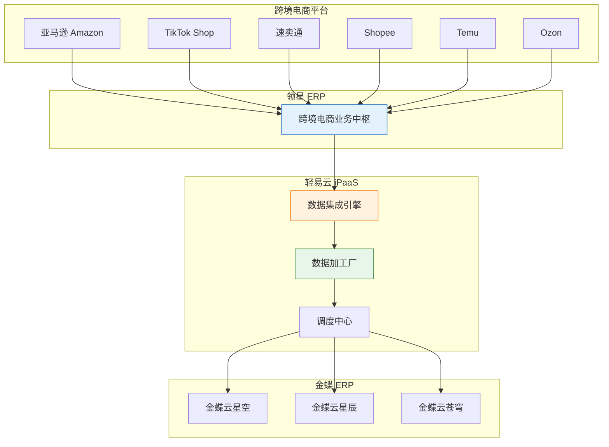
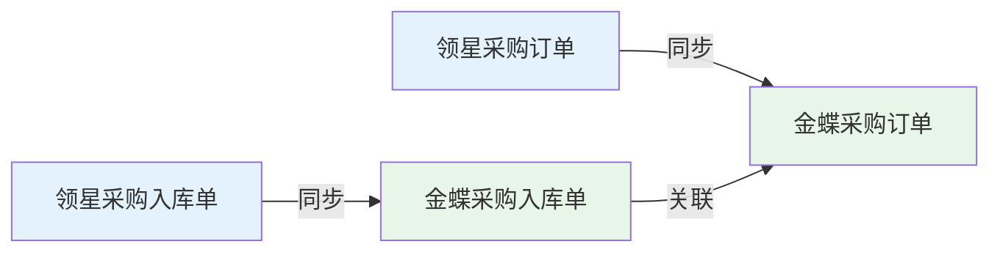
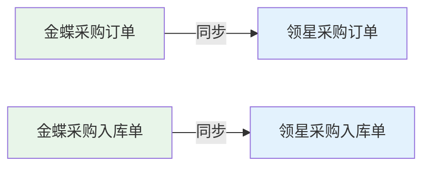

# 跨境电商对接方案

跨境电商对接方案是轻易云 iPaaS 针对跨境电商行业打造的标准集成方案包，实现领星 ERP 等跨境电商管理系统与金蝶系列 ERP 的全流程数据对接，涵盖主数据、采购、销售、库存、财务等核心业务场景，帮助企业打通业务与财务数据孤岛，提升运营效率。

---

## 方案概述

### 适用场景

本方案主要适用于以下跨境电商业务场景：

- **领星 ERP 与金蝶云星空/云星辰/云苍穹的全流程对接**
- **亚马逊 FBA 订单与 ERP 销售订单自动同步**
- **跨境电商平台账单与财务应收应付对接**
- **海外仓库存与 ERP 库存实时同步**
- **多平台（TikTok Shop、速卖通、Shopee、Temu 等）订单统一管理**

### 方案架构



### 核心能力

| 能力 | 说明 |
| ---- | ---- |
| **多平台整合** | 支持亚马逊、TikTok、速卖通、Shopee、Temu 等 30+ 跨境电商平台 |
| **全业务覆盖** | 主数据、采购、销售、库存、财务全流程对接 |
| **多币种支持** | 自动处理多币种结算与汇率转换 |
| **多时区适配** | 支持全球各时区的业务时间处理 |
| **海外仓适配** | FBA 仓、第三方海外仓、自建海外仓全支持 |
| **业财一体化** | 实现业务数据与财务数据的自动联动 |

---

## 连接器配置

### 领星连接器参数

配置领星 ERP 连接器需要以下参数：

| 参数 | 类型 | 必填 | 说明 |
| ---- | ---- | ---- | ---- |
| `host` | string | ✅ | API 主机地址，默认固定值 |
| `app_id` | string | ✅ | 应用标识，从领星开放平台获取 |
| `app_secret` | string | ✅ | 应用密钥，从领星开放平台获取 |
| `access_token` | string | ✅ | 访问令牌，默认固定值 |

> [!IMPORTANT]
> **App ID** 和 **App Secret** 需要从领星开放平台获取。登录领星后台 → 开放平台 → 应用管理，创建应用后即可获取。

### IP 白名单配置

轻易云平台访问领星 API 的固定出口 IP 地址如下，请在领星开放平台中添加白名单：

```text
116.63.136.29
122.9.139.68
```

### 金蝶连接器配置

根据对接的金蝶产品版本，选择对应的连接器类型：

| 金蝶产品 | 连接器类型 | 配置要点 |
| -------- | ---------- | -------- |
| 金蝶云星空 | `kingdee-cloud-galaxy` | 需配置数据中心 ID、应用密钥 |
| 金蝶云星辰 | `kingdee-cloud-star` | 需配置应用 ID、应用密钥 |
| 金蝶云苍穹 | `kingdee-cloud-cosmos` | 需配置租户编码、应用凭证 |

> [!TIP]
> 详细的连接器配置步骤请参考 [连接器配置指南](../guide/configure-connector)。

---

## 主数据对接

### 供应商对接

支持供应商、物流商的双向数据同步。

**同步方向**：领星 ↔ 金蝶

**关键字段映射**：

| 领星字段 | 金蝶字段 | 说明 |
| -------- | -------- | ---- |
| `supplier_id` | `FNumber` | 供应商编码 |
| `supplier_name` | `FName` | 供应商名称 |
| `supplier_type` | `F_VIP_SupplierType` | 供应商类型 |

### 物料对接

支持物料档案的查询与写入操作。

**查询接口**：

- 适配器：`\Adapter\LingXing\LXProductQueryAdapter`
- 查询方式：支持表头表体联合查询
- 过滤条件：按创建时间或更新时间进行增量查询

**写入接口**：

- 除常规字段外，必须提供供应商 ID
- 支持修改操作，需提供物料 ID

> [!NOTE]
> 物料写入时，原平台需在物料上维护对应的供应商信息，否则会导致写入失败。

### 店铺对接

**同步方向**：领星 → 金蝶（单向）

领星店铺信息同步至 ERP 生成客户档案。

**查询接口**：

- 适配器：`\Adapter\LingXing\LXQueryAdapter`
- 特性：仅支持分页过滤，无其他查询参数，不加过滤相当于全量查询

**店铺类型说明**：

| 类型 | 说明 |
| ---- | ---- |
| 单一平台店铺 | 仅布局单一电商平台（如仅亚马逊） |
| 多平台店铺 | 卖家同时布局亚马逊、Shopee、速卖通等多个平台的组合模式 |

> [!WARNING]
> 店铺查询接口返回的数据只有 ID 和名称，没有店铺编码。同步客户信息时，建议以领星店铺 ID 作为金蝶客户编码，或单独建立映射关系。

### 仓库对接

**领星仓库类型**：

| 仓库类型 | 说明 |
| -------- | ---- |
| 本地仓 | 卖家自主管控的境内仓库 |
| 海外仓 | 包含自建海外仓和第三方海外仓，为方便海外直接发货所建立的仓库 |
| 亚马逊仓（FBA 仓） | 根据卖家授权的店铺自动生成对应的 FBA 仓，专门用于亚马逊业务 |
| AWD 仓 | 亚马逊分销网络仓，专门对应亚马逊美国站卖家用于补货或多渠道销售 |

---

## 采购流程对接

### 方案一：领星管理入库（推荐）



**流程说明**：

1. 在领星中创建采购订单，审核后自动同步至金蝶生成采购订单
2. 货物到达后在领星中完成入库操作，生成采购入库单
3. 采购入库单同步至金蝶，自动关联上游采购订单

### 方案二：金蝶管理入库



**流程说明**：

1. 在金蝶中完成采购流程，生成采购订单并同步至领星
2. 在金蝶中完成入库操作，生成采购入库单并同步至领星

> [!CAUTION]
> **采购订单变更接口不建议对接**：领星采购订单变更接口无法提供原采购订单单号，且变更可在任何阶段发起（包括入库后），导致金蝶单据无法确定，影响后续流程。

---

## 销售流程对接

### 销售业务类型

| 业务类型 | 说明 |
| -------- | ---- |
| 亚马逊销售 | 对接亚马逊平台全类型订单，包括 FBA 订单、FBM 自发货订单、多渠道配送（MCF）订单 |
| 多渠道销售 | 包含手工单据、亚马逊不同站点间代卖的订单 |
| 多平台销售 | 覆盖 TikTok Shop、速卖通、Ozon、Temu 等 30+ 平台订单 |

### 售后单据类型

| 单据类型 | 来源 | 包含类型 |
| -------- | ---- | -------- |
| 售后订单 | 领星销售-售后订单 | 退款、退货、换货 |
| 售后工单 | 领星客服-售后工单 | 退货退款、仅退货、仅退款、退货补发、补发 |

### 接口特性与注意事项

1. **店铺映射配置**
   - 亚马逊店铺无法获取仓库信息，必须配置**店铺对应仓库映射**
   - 多组织场景必须配置**店铺对应组织**映射
   - 亚马逊店铺会自动生成店铺仓，需根据实际业务配置一对一映射或集中映射到虚拟仓

2. **主键策略**
   - 亚马逊订单、多渠道订单存在单号重复情况（一个订单多店铺发货）
   - 配置方案时需使用**单号 + 店铺 ID** 作为联合主键

3. **特殊适配器**
   - 亚马逊多渠道订单使用独立适配器：`\Adapter\LingXing\LXOrderListQueryAdapter`

4. **数据补漏机制**
   - 亚马逊订单接口存在单据数量刷新情况
   - 建议配置补漏策略：每月 6 号抓取上月 1 号至月底的全量数据
   - 接口默认一次请求 1000 条，需手工调整默认请求条数

> [!TIP]
> **定时延迟抓取配置**：通过请求调度者参数，配置 SQL 语句动态计算抓取时间范围。
>
> ```sql
> -- 每月 1 号
> _function DATE_FORMAT(DATE_SUB(DATE_SUB(CURDATE(), INTERVAL DAY(CURDATE()) - 1 DAY), INTERVAL 1 MONTH),'%Y-%m-%d')
>
> -- 每月月底
> _function DATE_FORMAT(LAST_DAY(DATE_SUB(CURDATE(), INTERVAL 1 MONTH)),'%Y-%m-%d')
> ```

---

## 库存调拨对接

### 海外仓备货单

货物从国内仓发往第三方或自建海外仓的前置备货业务。

**状态映射**：

| 领星状态 | 状态值 | 对应金蝶操作 |
| -------- | ------ | ------------ |
| 待收货 | 50 | 发货 |
| 已完成 | 60 | 收货 |

> [!NOTE]
> 两个对接流程使用相同接口，仅获取单据的状态不同。

### 调拨单

领星本地仓库间的库存调配业务，接口结构与金蝶直接调拨单基本相似。

### FBA 发货单

货物从本地仓或自有仓发货给亚马逊仓库的业务场景。

> [!WARNING]
> - FBA 发货只有发出时间，发货后创建货件相当于装箱发往海外
> - 海外收货信息需要通过其他接口查询
> - 到货接收明细接口存在多收、少收情况，不建议关联生成，建议使用其他出入库单进行同步

### 平台仓发货单

针对各电商平台专属仓库的订单履约业务：

- 亚马逊 FBA 仓
- TikTok FBT 仓
- Temu 平台仓
- 其他平台仓

---

## 库存业务对接

### 领星调整单

针对当前库存进行调整，类似盘点业务，主要用于残次品换包装后重新作为合格品售卖的库存转换场景。

> [!IMPORTANT]
> 该接口返回的数据包含正负数：
> - 正数对应入库操作
> - 负数对应出库操作
>
> 配置方案时需根据数据正负进行过滤，拆分对应 ERP 不同的单据。

### 库存出入库单据

**出库单据类型**：

| 类型代码 | 类型名称 |
| -------- | -------- |
| 11 | 其他出库 |
| 12 | FBA 出库 |
| 14 | 退货出库 |
| 15 | 调拨出库 |
| 16 | WFS 出库 |
| 17 | Temu 出库 |

**入库单据类型**：

| 类型代码 | 类型名称 |
| -------- | -------- |
| 1 | 其他入库 |
| 2 | 采购入库 |
| 3 | 调拨入库 |
| 4 | 赠品入库 |
| 26 | 退货入库 |
| 27 | 移除入库 |

### FBA 成本计价流水

接口返回所有亚马逊店铺的出入库信息，可按单据类型对应金蝶的出库、入库单。

> [!WARNING]
> 1. 接口返回数量存在正负数，需单独处理
> 2. 流水数据没有业务单号，仅通过内码 ID 保证唯一性
> 3. 数据会定时刷新，建议每月 6 号之后同步上月数据

---

## 平台费用对接

### 利润报表 - 店铺

**数据来源**：亚马逊应收结算报告

**单据说明**：亚马逊非自然月的结算账单按自然月拆分，生成规范化的应收数据统计报表。

**对接特性**：

1. 接口不提供单号信息，同步时需注意重复问题
2. 建议按月份过滤传递，跨月传递数据会更稳定
3. 返回结构需通过数据加工厂进行转换处理
4. 需根据客户需求按费用类型（领星标准费用、自定义费用）分别对接

### 结算报告 - 结算汇总

**单据说明**：亚马逊账单信息，主要对应收款的业务类型。

**对接特性**：

1. 接口不提供单号信息
2. 建议按月份过滤传递
3. 接口信息有限，需单独补充：店铺对应收款账号、费用类型、费用承担部门、结算方式、收款用途等

### 单据对应关系

| 领星单据 | ERP 单据 | 用途 |
| -------- | -------- | ---- |
| 利润报表 - 店铺 | 应收单 | 记录平台应收款项 |
| 结算报告 - 结算汇总 | 收款单 | 记录实际收款情况 |

### 同步策略

- **定时策略**：每月 6 号获取领星上月整月数据
- **数据推送**：按接口获取到的明细进行推送
- **费用分离**：系统标准费用、自定义费用需分开对接

> [!TIP]
> **费用类型拆解方案**：通过数据加工厂将费用类型拆解为可配置化的数据格式。
>
> 参考配置路径：数据加工厂 → 费用类型拆解 → 配置费用映射规则 → 生成应收单明细

---

## 通用配置建议

### 多币种处理

跨境电商业务涉及多币种结算，建议在数据映射中配置以下处理：

| 场景 | 处理方式 |
| ---- | -------- |
| 原币金额 | 直接传递平台原始币种金额 |
| 本位币金额 | 通过汇率转换计算 |
| 汇率来源 | 可取领星提供的结算汇率或配置固定汇率 |

### 时区处理

领星系统时间默认为北京时间（UTC+8），如涉及海外业务时间，建议：

- 统一使用北京时间进行数据同步
- 在报表展示时根据用户时区进行转换
- 定时任务配置时明确时区设置

### 物流跟踪

跨境物流场景建议配置以下跟踪信息：

| 信息类型 | 说明 |
| -------- | ---- |
| 物流单号 | 头程物流、尾程物流单号 |
| 货件编号 | FBA 货件 ID |
| 跟踪状态 | 在途、已签收、异常等 |
| 预计到达时间 | 用于库存预测 |

---

## 接口清单

### 常用 API 接口

| 业务模块 | API 地址 | 适配器 |
| -------- | -------- | ------ |
| 物料查询 | `/api/v1/product/query` | `\Adapter\LingXing\LXProductQueryAdapter` |
| 店铺查询 | `/api/v1/shop/query` | `\Adapter\LingXing\LXQueryAdapter` |
| 亚马逊订单查询 | `/api/v1/order/amazon` | `\Adapter\LingXing\LXOrderQueryAdapter` |
| 亚马逊多渠道订单 | `/api/v1/order/multichannel` | `\Adapter\LingXing\LXOrderListQueryAdapter` |
| 采购订单查询 | `/api/v1/purchase/order/query` | `\Adapter\LingXing\LXPurchaseOrderAdapter` |
| 采购入库查询 | `/api/v1/purchase/inbound/query` | `\Adapter\LingXing\LXPurchaseInboundAdapter` |
| 库存查询 | `/api/v1/inventory/query` | `\Adapter\LingXing\LXInventoryAdapter` |
| 利润报表查询 | `/api/v1/finance/profit/query` | `\Adapter\LingXing\LXProfitReportAdapter` |

> [!NOTE]
> 更多 API 接口详情请参考领星开放平台官方文档。

---

## 实施 checklist

实施本方案前，请确认以下准备工作已完成：

- [ ] 已开通领星开放平台应用，获取 App ID 和 App Secret
- [ ] 已在领星开放平台添加轻易云 IP 白名单
- [ ] 已确定对接的金蝶 ERP 版本并完成连接器配置
- [ ] 已完成店铺与仓库、组织的映射关系整理
- [ ] 已确认币种、汇率处理方案
- [ ] 已明确各业务模块的对接流程（领星管入库 vs 金蝶管入库）
- [ ] 已配置定时调度策略和补漏机制

---

## 常见问题

### Q: 亚马逊订单同步后出现重复？

A: 亚马逊多渠道订单存在单号重复情况，需在方案配置中使用「单号 + 店铺 ID」作为联合主键。

### Q: 领星数据为何会有延迟？

A: 领星部分接口数据存在刷新机制（如亚马逊订单接口），建议配置补漏策略：每月 6 号抓取上月全量数据。

### Q: 如何处理多币种结算？

A: 建议在数据映射中保留原币金额，同时通过汇率转换生成本位币金额，汇率可取领星结算汇率或配置固定汇率。

### Q: 采购订单变更如何同步？

A: 领星采购订单变更接口存在设计限制，不建议对接。如需变更，建议在源头系统作废后重新创建。

### Q: 平台费用如何准确对接？

A: 建议通过数据加工厂对费用类型进行拆解，将标准费用和自定义费用分开处理，生成不同的应收单明细。

---

## 相关资源

- [领星连接器获取指南](https://bbs.qeasy.cloud/d/13296-ling-xing-lian-jie-qi-huo-qu)
- [解析器使用指南](https://bbs.qeasy.cloud/d/12942-jie-xi-qi-shi-yong-zhi-nan)
- [数据加工厂配置](../advanced/data-transformation)
- [连接器配置指南](../guide/configure-connector)
- [数据映射配置](../guide/data-mapping)
