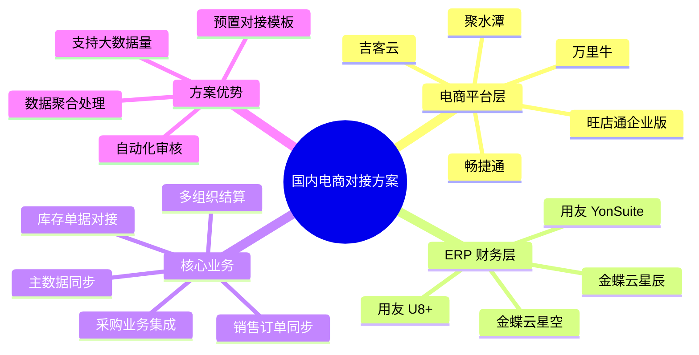
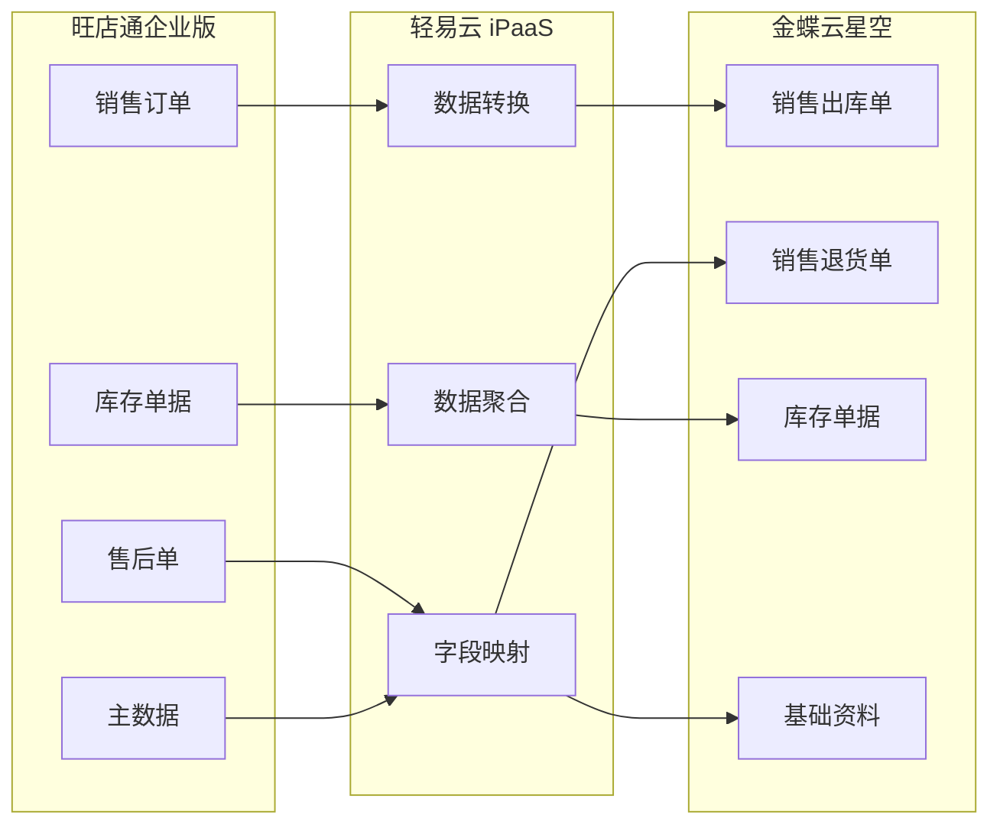
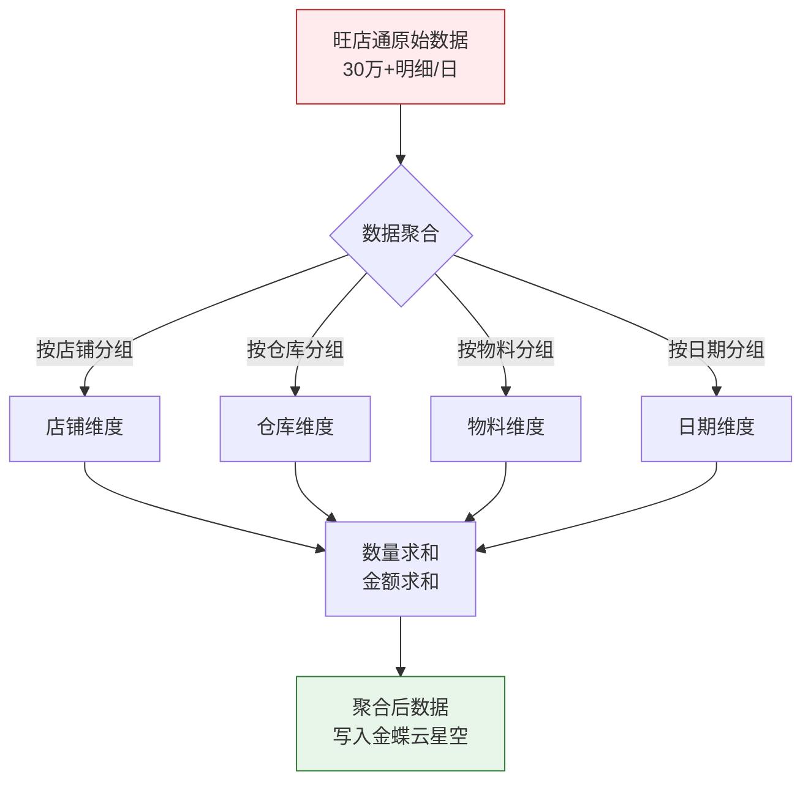
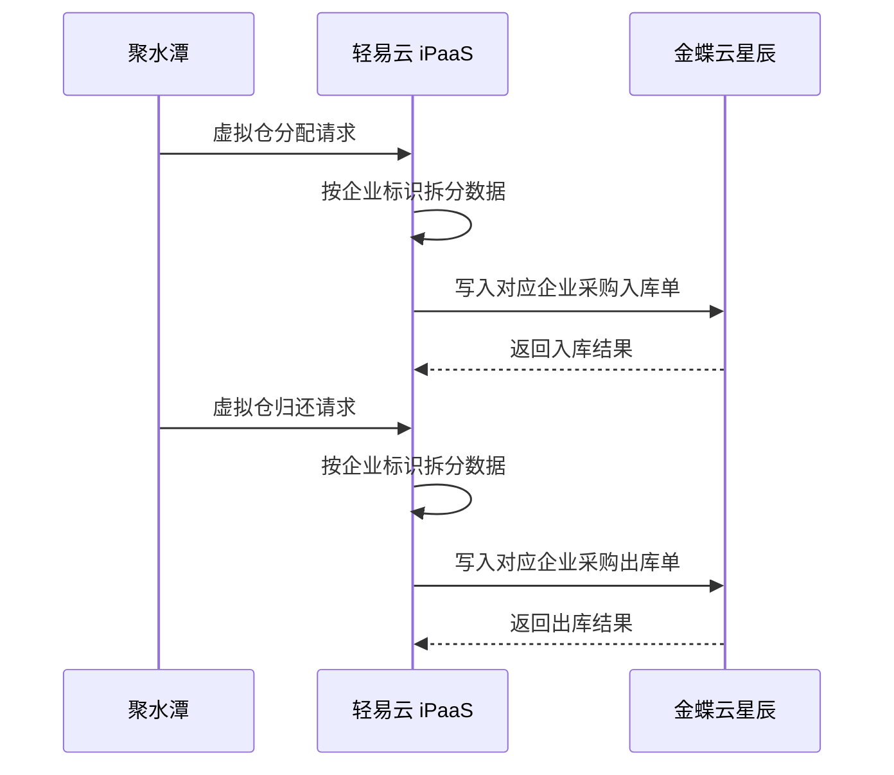
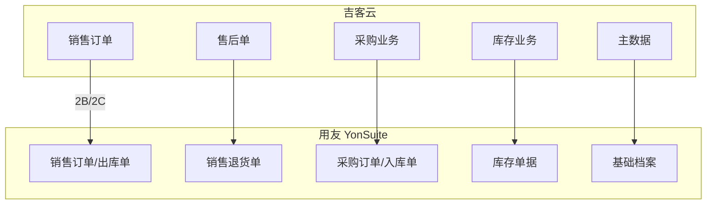
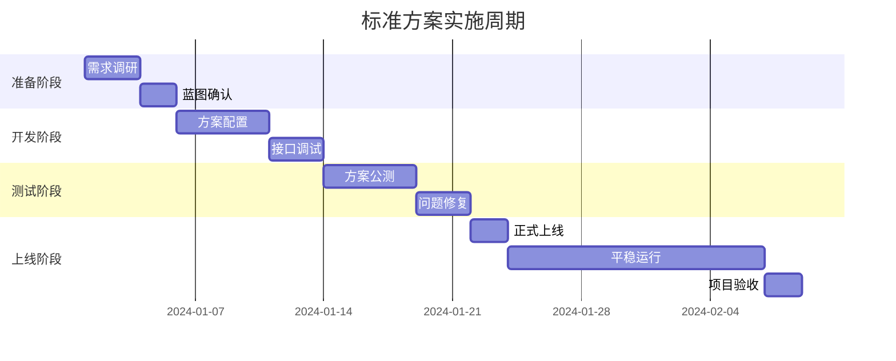

# 国内电商对接标准方案

本文档介绍轻易云 iPaaS 平台国内电商对接标准方案包，涵盖旺店通、聚水潭、吉客云等主流电商 ERP 与金蝶、用友等财务 ERP 的系统集成方案，帮助企业实现电商业务数据与财务系统的自动化对接。

## 方案概述

国内电商对接标准方案包是轻易云针对中国电商企业常见业务场景设计的预置集成模板，覆盖从订单处理、库存管理到财务核算的完整业务流程。



### 方案清单

| 方案名称 | 源系统 | 目标系统 | 适用行业 | 复杂程度 |
|---------|--------|---------|---------|---------|
| 旺店通 & 金蝶云星空 | 旺店通企业版 | 金蝶云星空 | 化妆品、日用品 | 中 |
| 聚水潭 & 金蝶云星辰 | 聚水潭 | 金蝶云星辰 | 服装纺织 | 低 |
| 吉客云 & 用友 YonSuite | 吉客云 | 用友 YonSuite | 电子外设 | 中 |
| 畅捷通 & 聚水潭 | 聚水潭 | 畅捷通 T+ | 不锈钢制造 | 低 |

## 旺店通 & 金蝶云星空对接方案

### 方案简介

本方案适用于使用旺店通进行电商订单管理、金蝶云星空进行财务核算的企业，解决多组织代发业务、大数据量销售单据同步等核心痛点。

> [!TIP]
> 该方案已在化妆品、日用品、食品等多个行业成功落地，支持日处理 30 万+ 明细数据。

### 对接范围



### 基础资料同步

| 旺店通 | 金蝶云星空 | 同步方式 | 说明 |
|-------|-----------|---------|------|
| 物料 | 商品 | 定时同步 | 商品资料双向同步 |
| 仓库 | 仓库 | 定时同步 | 仓库编码需保持一致 |
| 店铺 | 客户 | 定时同步 | 店铺映射为客户档案 |
| 供应商 | 供应商 | 定时同步 | 供应商资料同步 |

### 库存单据对接

**金蝶云星空 → 旺店通（线下到线上）**：

| 单据类型 | 处理逻辑 |
|---------|---------|
| 分步式调入单 | 按仓库类别区分接口 |
| 分步式调出单 | 按仓库类别区分接口 |
| 其他入库单 | 定时同步 |
| 其他出库单 | 定时同步 |
| 组装拆卸单 | 按类型和子品、成品明细拆分 |
| 采购入库单 | 聚合明细行数据 |
| 采购退料单 | 异常通知 |

**旺店通 → 金蝶云星空（线上到线下）**：

| 旺店通单据 | 金蝶云星空单据 | 处理逻辑 |
|-----------|---------------|---------|
| 发货单 | 销售出库单 | 凌晨定时抓取、汇总当日数据，按店铺/仓库/物料编码聚合 |
| 退换单 | 销售退货单 | 标准化同步 |
| 其他入库单 | 其他入库单 | 定时同步 |
| 其他出库单 | 其他出库单 | 定时同步 |
| 委外入库单 | 委外入库单 | 定时同步 |
| 委外出库单 | 委外出库单 | 定时同步 |

### 销售数据聚合处理

针对电商大数据量场景，方案提供数据聚合能力，将海量明细数据按维度汇总后写入金蝶，降低系统承载压力。

**原始数据统计示例**：

| 维度 | 数值 |
|-----|------|
| 明细行数 | 8,594,455 行 |
| 单据数量 | 5,097 张 |
| 聚合后明细 | 173,027 行 |

**聚合逻辑**：

| 维度 | 处理方式 |
|-----|---------|
| 店铺 | 分组（GROUP BY） |
| 仓库 | 分组（GROUP BY） |
| 物料编码 | 分组（GROUP BY） |
| 日期 | 分组（GROUP BY） |
| 数量 | 求和（SUM） |
| 金额 | 求和（SUM） |



### 多组织代发业务方案

对于多组织架构企业，支持组织间结算的自动化处理。

**典型组织架构**：

```text
主公司（创信永）
├── 分公司 A（润百肌）
├── 分公司 B（辉凡）
└── 其他子公司
```

**业务逻辑**：

- 组织间结算采用**一采一销**模式
- 调整为实际的组织内部客户、内部供应商进行采销业务
- 主公司统一处理销售业务

**单据流转逻辑**：

| 业务场景 | 销售方 | 采购方 | 生成单据 |
|---------|-------|-------|---------|
| 主公司直接销售 | 主公司 → B 端客户 | - | 销售出库单（主公司→客户）<br>采购入库单（主公司→供应商） |
| 子公司代发 | 子公司 → B 端客户 | 主公司 → 子公司（内部供应商） | 销售出库单（子公司→客户）<br>采购入库单（子公司→主公司）<br>销售出库单（主公司→子公司）<br>采购入库单（主公司→供应商） |

> [!IMPORTANT]
> 多组织代发方案需确保仓库标记为代发仓，系统通过仓库属性自动识别组织间结算单据。

### 实施周期参考

| 阶段 | 时间节点 | 工作内容 |
|-----|---------|---------|
| 需求调研 | D1 ~ D3 | 确定客户对接需求，拟定对接流程 |
| 蓝图确认 | D4 ~ D5 | 确定对接蓝图，作为项目指导性文件 |
| 方案上线 | D6 ~ D12 | 完成方案公测联调，启动方案自动运行 |
| 平稳运行 | D13 ~ D26 | 平稳运行两周，无改动需求 |
| 项目验收 | D27 ~ D30 | 完成验收，转入运维阶段 |

## 聚水潭 & 金蝶云星辰对接方案

### 方案简介

本方案适用于中小型电商企业，解决聚水潭电商 ERP 与金蝶云星辰财务系统的数据同步问题，特别适合多企业共用聚水潭系统的场景。

### 对接映射关系

| 聚水潭（源系统） | 金蝶云星辰（目标系统） | 同步方式 |
|-----------------|---------------------|---------|
| 商品信息 | 商品 | 自动同步 |
| 采购入库单 | 采购入库单 | 虚拟仓分配接口 |
| 采购出库单 | 采购出库单 | 虚拟仓归还接口 |
| 销售出库单 | 销售出库单 | 自动同步 |
| 售后单 | 销售退货单 | 自动同步 |
| 其他入库单 | 其他入库单 | 库存收发 |
| 其他出库单 | 其他出库单 | 库存收发 |

### 虚拟仓对接机制

针对多企业共用聚水潭系统的场景，采用虚拟仓分配/归还接口替代标准采购出入库接口。

**问题背景**：
- 聚水潭支持一对多企业使用模式
- 采购数据默认只入到主仓，无法区分归属企业

**解决方案**：



> [!NOTE]
> 虚拟仓接口为聚水潭特殊接口，对接前期需关注接口稳定性，建议配置重试机制。

### 平台特性适配

**多企业数据隔离**：

通过配置聚水潭各自公司对应的店铺进行数据获取，同步到金蝶中对应的公司主体。

**优势**：
- 避免获取冗余数据
- 保证数据百分百获取
- 自动区分不同企业数据

## 吉客云 & 用友 YonSuite 对接方案

### 方案简介

本方案面向游戏外设、电子产品等行业，实现吉客云电商 ERP 与用友 YonSuite 云端 ERP 的深度集成，支持 2B/2C 双模式业务。

### 业务规模适配

| 指标 | 参考值 | 说明 |
|-----|-------|------|
| 线上平台 | 50+ 家 | 支持多平台店铺 |
| 线下客户 | 600+ 家 | B2B 客户管理 |
| 日单量 | 5000+ 单 | 高并发处理 |
| 物料数量 | 4000+ | 支持多规格物料 |

### 对接范围



### 销售业务对接

**B2B 销售单创建流程**：


**B2C 销售单创建流程**：


**售后单处理**：

| 吉客云单据 | YonSuite 单据 | 处理逻辑 |
|-----------|--------------|---------|
| 销售退货单 | 销售出库单红字 | 关联原销售单 |

### 采购与库存业务

| 业务类型 | YonSuite 单据处理 | 说明 |
|---------|------------------|------|
| 采购入库 | 采购入库单蓝字/红字 | 入库单创建/出库单创建 |
| 其他出入库 | 其他出库单/其他入库单 | 其他出库/其他入库 |
| 调拨 | 调拨出库/调拨入库 | 区分库存组织、货主 |
| 盘点 | 其他出库单(盘点出库)/其他入库单(盘点入库) | 单据类型区分 |
| 序列号 | - | 赋值批次、序列号 |

**特点**：
- 定时同步，无需人工干预
- 自动处理入库/出库
- 支持序列号对接
- 查询便捷

### 主数据同步

| 吉客云 | 用友 YS | 同步方式 | 备注 |
|-------|--------|---------|------|
| 物料 | 货品 | 定时同步 | 设置序列号、货品分类 |
| 2C 客户 | 销售渠道 | 自动映射 | - |
| 2B 客户 | 客户账号 | 自动映射 | - |
| 仓库 | 仓库 | 手工维护 | 销售主体、货主需一致 |

### 实施避坑指南

> [!WARNING]
> **销售业务写入 YS 无法关联源单**
> 解决方案：有设计关联生单的单据，要用**来源生单接口**，不要用单个保存接口，否则全局联查不到。

> [!TIP]
> **单据写入 YS 无法自动审核**
> - 方案一：调用接口保存后，再调用审核接口
> - 方案二：直接在 YS 设置保存后自动审核（推荐，减少接口调用次数）

> [!NOTE]
> **接口调用列表查询没有返回对应字段**
> 解决方案：接口返回的数据跟列表显示字段是一一对应的，需要去 YS 后台设置 UI 模板。

> [!CAUTION]
> **写入 YS 关联生单时出现漏单**
> 解决方案：销售单查询增加 vouchdate 配置 desc 进行查询，且无法查询过长的数据，否则接口直接报错。

## 畅捷通 T+ & 聚水潭对接方案

### 方案简介

本方案适用于中小型制造企业，解决聚水潭电商订单与畅捷通 T+ 财务系统的数据对接问题，支持商品信息同步、销售业务定制化等需求。

### 对接映射关系

| 聚水潭（源系统） | 畅捷通 T+（目标系统） | 同步方式 |
|-----------------|---------------------|---------|
| 商品信息 | 存货 | 自动同步 |
| 销售出库单 | 销货单 | 自动同步 |
| 售后单 | 其他入库单/其他出库单 | 自动同步 |
| 其他出库单 | 其他出库单 | 库存收发 |
| 其他入库单 | 其他入库单 | 库存收发 |
| 采购入库单 | 其他入库单 | 成本控制 |
| 采购退货单 | 其他出库单 | 成本控制 |

### 商品信息同步规范

> [!IMPORTANT]
> 商品信息一致性是项目成功的关键。建议规范：
> - 物料信息从畅捷通同步到聚水潭
> - **禁止在聚水潭直接新增商品**
> - 确保商品编码和名称对应关系正确

**常见问题**：
- 商品编码和名称颠倒（如：商品编码：001，商品名称：纸巾 ↔ 商品编码：纸巾，商品名称：001）
- 导致错误率升高

### 销售业务定制化同步

根据**店铺类型定制化同步逻辑**，确保数据对接的准确性和效率。

**数据预处理（拍散）**：

在聚水潭源数据的预处理阶段，对数据中的**明细行数组进行拍散**（拆分），以便在数据写入阶段能够灵活处理。

**数据聚合配置**：

在元数据视图配置中设定相应的聚合条件，实现数据的自动聚合。

**聚合示例**：

| 店铺 | 仓库 | 商品 | 数量 | 金额 |
|-----|------|------|------|------|
| 京东旗舰店 | 总仓 | 美容仪 | 1 个 | 200 元 |
| 京东旗舰店 | 总仓 | 美容仪 | 5 个 | 200 元 |
| 京东旗舰店 | 总仓 | 化妆品 | 1 套 | 150 元 |
| 京东旗舰店 | 总仓 | 美容仪 | 6 个 | 200 元 |
| 京东旗舰店 | 总仓 | 化妆品 | 1 套 | 150 元 |

**聚合条件**：
- **合并条件**：店铺、日期
- **汇总**：商品
- **求和**：数量、金额

**聚合后结果**：

| 店铺 | 日期 | 商品 | 数量 | 金额 |
|-----|------|------|------|------|
| 京东旗舰店 | 2024-01-01 | 美容仪 | 12 个 | 600 元 |
| 京东旗舰店 | 2024-01-01 | 化妆品 | 2 套 | 300 元 |

## 方案选型建议

### 按业务规模选型

| 业务规模 | 日单量 | 推荐方案 | 说明 |
|---------|-------|---------|------|
| 小型企业 | < 1000 单 | 聚水潭 & 星辰<br>畅捷通 & 聚水潭 | 轻量级方案<br>快速实施 |
| 中型企业 | 1000~10000 单 | 旺店通 & 金蝶云星空 | 标准方案<br>功能完善 |
| 大型企业 | > 10000 单 | 旺店通 & 金蝶云星空<br>吉客云 & YonSuite | 大数据量处理<br>多组织支持 |

### 按行业特性选型

| 行业 | 推荐方案 | 特殊需求 |
|-----|---------|---------|
| 化妆品/日用品 | 旺店通 & 金蝶云星空 | 多规格、批次管理 |
| 服装纺织 | 聚水潭 & 金蝶云星辰 | 多企业共用、虚拟仓 |
| 电子外设 | 吉客云 & 用友 YonSuite | 序列号、SN 码管理 |
| 制造业 | 畅捷通 & 聚水潭 | 产供销一体化 |

### 按系统现状选型

| 现有系统 | 推荐对接方案 |
|---------|-------------|
| 旺店通 + 金蝶云星空 | 旺店通 & 金蝶云星空标准方案 |
| 聚水潭 + 金蝶云星辰 | 聚水潭 & 金蝶云星辰标准方案 |
| 吉客云 + 用友 YonSuite | 吉客云 & 用友 YonSuite 标准方案 |
| 聚水潭 + 畅捷通 T+ | 畅捷通 & 聚水潭标准方案 |

## 实施建议

### 前置准备

1. **系统授权确认**
   - 确保源系统和目标系统 API 接口已开通
   - 确认接口调用频次限制

2. **基础资料梳理**
   - 统一物料编码规则
   - 统一仓库编码规则
   - 统一客户/供应商编码规则

3. **业务流程梳理**
   - 明确业务流程节点
   - 确定数据同步时机
   - 定义异常处理机制

### 实施阶段



### 常见问题处理

> [!WARNING]
> **大数据量同步超时**
> - 启用数据聚合功能
> - 分批处理，控制每批数据量
> - 调整同步时间窗口

> [!WARNING]
> **基础资料不一致**
> - 建立基础资料同步规范
> - 统一编码规则
> - 禁止在下游系统直接新增

> [!WARNING]
> **单据重复或漏单**
> - 配置幂等性检查
> - 设置合理的时间窗口查询
> - 增加异常告警机制

## 相关文档

- [旺店通连接器](../connectors/ecommerce/wangdian)
- [聚水潭连接器](../connectors/ecommerce/jushuitan)
- [吉客云连接器](../connectors/ecommerce/guanyi)
- [金蝶云星空连接器](../connectors/erp/kingdee-cloud-galaxy)
- [金蝶云星辰连接器](../connectors/erp/kingdee-cloud-star)
- [用友 YonSuite 连接器](../connectors/erp/yonyou-yonsuite)
- [畅捷通连接器](../connectors/erp/chanjet)
- [数据聚合功能](../advanced/data-aggregation)
