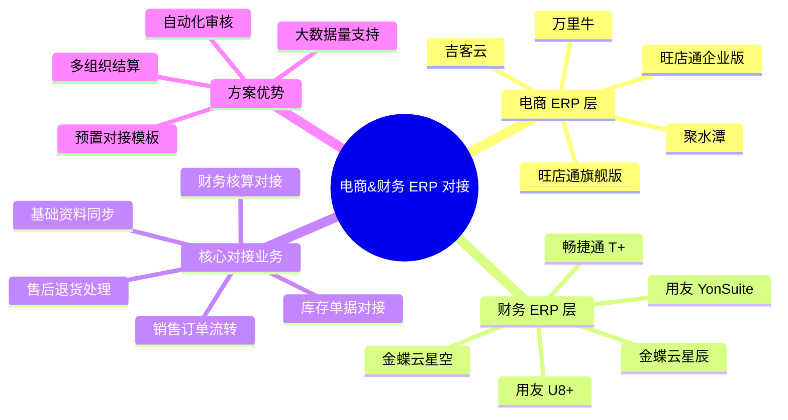
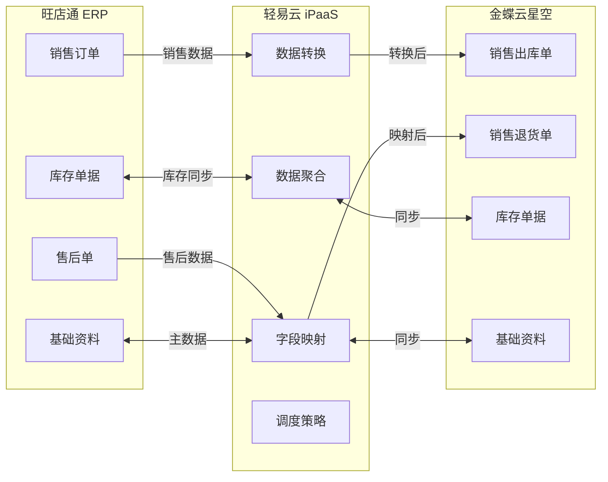
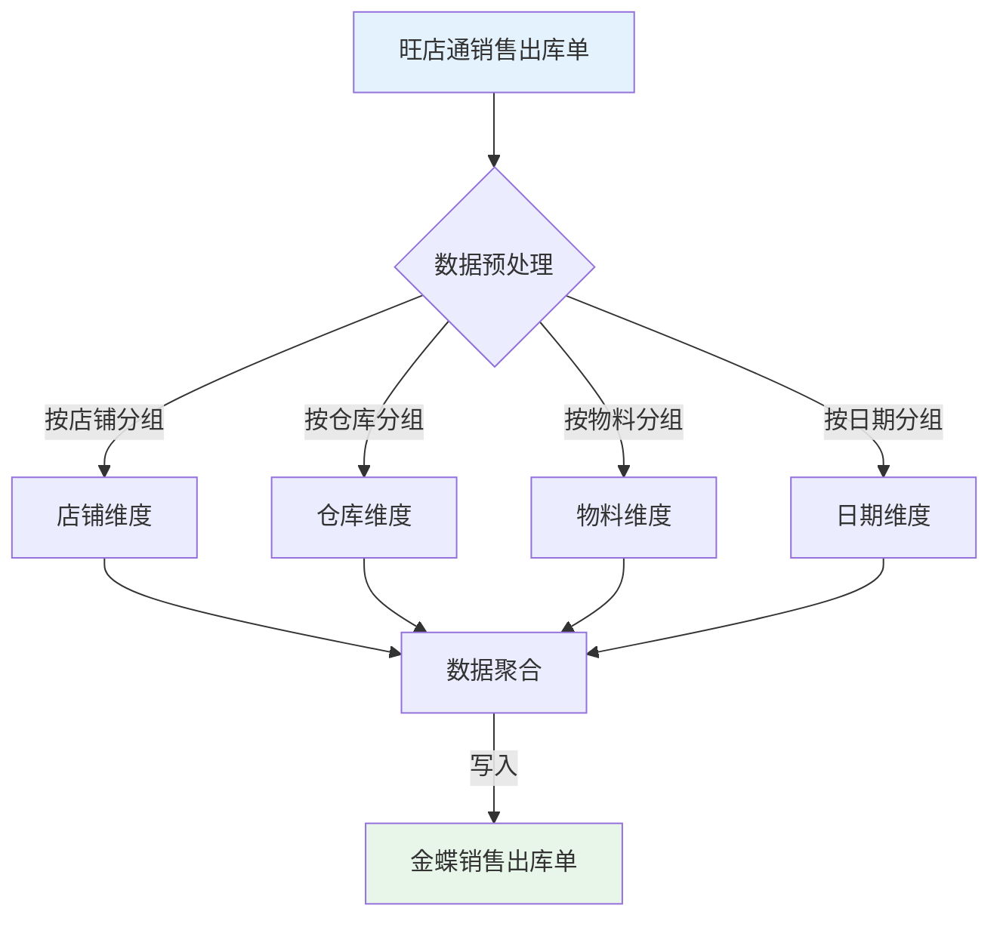

# 电商软件&财务 ERP 对接方案

本文档介绍轻易云 iPaaS 平台电商 ERP 与财务 ERP 系统的标准对接方案，重点涵盖旺店通与金蝶云星空的深度集成方案，帮助企业实现电商业务数据与财务系统的自动化、标准化对接，打通从订单到财务核算的完整业务链路。

## 方案概述

电商软件&财务 ERP 对接方案是轻易云针对电商企业业务特点设计的预置集成模板，解决电商订单管理系统（OMS）与企业资源计划系统（ERP）之间的数据孤岛问题，实现业务流、资金流、物流数据的实时同步。



### 方案适用场景

| 场景类型 | 业务描述 | 推荐方案 |
|---------|---------|---------|
| 电商代发业务 | 多组织间的采销结算 | 旺店通 & 金蝶云星空 |
| 自建仓发货 | 自有仓库库存管理 | 旺店通 & 金蝶云星空 |
| 多平台经营 | 多电商平台统一管理 | 聚水潭 & 金蝶云星辰 |
| 2B/2C 混合 | 批发零售一体 | 吉客云 & 用友 YonSuite |

## 前期准备

在实施对接方案前，需要完成以下准备工作：

### 系统授权与连接

1. **获取旺店通授权**
   - 联系旺店通服务商开通 API 接口权限
   - 获取 AppKey、AppSecret 等授权信息
   - 确认接口调用频次限制

2. **获取金蝶云星空授权**
   - 确认金蝶云星空版本（公有云/私有云）
   - 开通 WebAPI 接口权限
   - 获取账套 ID、应用 ID、应用密钥

3. **配置连接器**
   - 在轻易云控制台创建旺店通连接器
   - 创建金蝶云星空连接器
   - 测试连接确保连通性

> [!TIP]
> 连接器详细配置步骤请参考 [配置连接器](../guide/configure-connector) 文档。

### 基础资料梳理

| 资料类型 | 梳理要点 | 注意事项 |
|---------|---------|---------|
| 物料/商品 | 统一编码规则，确保两边一致 | 建议以 ERP 为准，同步到电商系统 |
| 仓库 | 明确仓库编码对应关系 | 区分实体仓与虚拟仓 |
| 店铺 | 店铺与客户档案的映射 | 电商平台店铺对应 ERP 客户 |
| 供应商 | 供应商档案统一 | 便于后续采购业务对接 |

## 旺店通&金蝶云星空对接方案

### 方案简介

旺店通与金蝶云星空对接方案是轻易云最成熟的电商财务一体化方案之一，已在化妆品、日用品、食品、3C 电子等多个行业成功落地，支持日处理 30 万+ 明细数据的大数据量场景。

**核心能力**：
- 支持多组织代发业务的自动化结算
- 大数据量场景下的数据聚合处理
- 单据自动审核与异常告警
- 库存线上线下双向同步

### 对接架构



### 基础资料同步

基础资料是系统对接的基石，确保数据一致性是项目成功的关键。

#### 物料（货品）同步

物料同步支持多种业务场景，根据企业实际需求选择合适的方案：

| 旺店通 | 同步方向 | 金蝶云星空 | 场景类型 | 说明 |
|-------|---------|-----------|---------|------|
| 货品档案 | 从金蝶同步 | 物料 | 推荐 | 无批号、无辅助单位 |
| 货品档案 | 从金蝶同步 | 物料 | 可选 | 无批号、有辅助单位 |
| 货品档案 | 从金蝶同步 | 物料 | 可选 | 有批号、无辅助单位 |
| 货品档案 | 从金蝶同步 | 物料 | 可选 | 有批号、有辅助单位 |
| 货品档案 | 同步到金蝶 | 物料 | 推荐 | 无批号、无辅助单位 |

> [!IMPORTANT]
> 建议采用单向同步策略，以 ERP 系统作为物料主数据的唯一源头，避免两边同时维护导致的数据不一致。

#### 其他基础资料

| 旺店通 | 金蝶云星空 | 同步方式 | 说明 |
|-------|-----------|---------|------|
| 仓库 | 仓库 | 定时同步 | 仓库编码需保持一致 |
| 店铺 | 客户 | 定时同步 | 店铺映射为客户档案 |
| 供应商 | 供应商 | 定时同步 | 供应商资料同步 |

### 销售业务对接

销售业务对接是电商财务一体化的核心，主要处理线上订单到线下财务核算的数据流转。

#### 销售出库对接



**对接方案对比**：

| 旺店通单据 | 金蝶云星空单据 | 方案类型 | 处理逻辑 |
|-----------|---------------|---------|---------|
| 销售出库 | 销售出库单 | 推荐 | 按店铺/仓库/日期合并 |
| 销售出库 | 销售订单+销售出库单 | 可选 | 按店铺/仓库/日期合并，关联订单 |

**数据聚合处理**：

针对电商大数据量场景，方案提供智能数据聚合能力：

| 原始数据 | 聚合后数据 | 压缩比 |
|---------|-----------|-------|
| 8,594,455 明细行 | 173,027 明细行 | 约 98% |
| 5,097 张单据 | 按维度汇总 | - |

**聚合维度**：

| 维度 | 处理方式 |
|-----|---------|
| 店铺 | 分组（GROUP BY） |
| 仓库 | 分组（GROUP BY） |
| 物料编码 | 分组（GROUP BY） |
| 日期 | 分组（GROUP BY） |
| 数量 | 求和（SUM） |
| 金额 | 求和（SUM） |

> [!TIP]
> 数据聚合可显著降低 ERP 系统负载，建议日单量超过 5,000 单的企业启用聚合功能。

### 库存单据对接

库存单据支持双向同步，确保线上线下库存数据一致。

#### 线下到线上（金蝶到旺店通）

| 金蝶云星空单据 | 旺店通单据 | 处理逻辑 |
|---------------|-----------|---------|
| 分步式调入单 | 其他入库单 | 按仓库类别区分接口 |
| 分步式调出单 | 其他出库单 | 按仓库类别区分接口 |
| 其他入库单 | 其他入库单 | 定时同步 |
| 其他出库单 | 其他出库单 | 定时同步 |
| 组装拆卸单 | 组装拆卸单 | 按类型和子品、成品明细拆分 |
| 采购入库单 | 采购入库单 | 聚合明细行数据 |
| 采购退料单 | 采购退货单 | 异常通知 |

#### 线上到线下（旺店通到金蝶）

| 旺店通单据 | 金蝶云星空单据 | 处理逻辑 |
|-----------|---------------|---------|
| 发货单 | 销售出库单 | 凌晨定时抓取，按店铺/仓库/物料聚合 |
| 退换单 | 销售退货单 | 标准化同步 |
| 其他入库单 | 其他入库单 | 定时同步 |
| 其他出库单 | 其他出库单 | 定时同步 |
| 委外入库单 | 委外入库单 | 定时同步 |
| 委外出库单 | 委外出库单 | 定时同步 |

### 多组织代发业务方案

对于多组织架构的电商企业，支持组织间结算的自动化处理。

#### 典型组织架构

```text
主公司（品牌方）
├── 分公司 A（销售公司）
├── 分公司 B（销售公司）
└── 其他子公司
```

#### 业务逻辑

- 组织间结算采用**一采一销**模式
- 调整为实际的组织内部客户、内部供应商进行采销业务
- 主公司统一处理对外销售业务

#### 单据流转逻辑

| 业务场景 | 销售方 | 采购方 | 生成单据 |
|---------|-------|-------|---------|
| 主公司直接销售 | 主公司到 B 端客户 | - | 销售出库单（主公司到客户）<br>采购入库单（主公司到供应商） |
| 子公司代发 | 子公司到 B 端客户 | 主公司到子公司（内部供应商） | 销售出库单（子公司到客户）<br>采购入库单（子公司到主公司）<br>销售出库单（主公司到子公司）<br>采购入库单（主公司到供应商） |

> [!IMPORTANT]
> 多组织代发方案需确保仓库标记为代发仓，系统通过仓库属性自动识别组织间结算单据。

## 实施周期参考

| 阶段 | 时间节点 | 工作内容 |
|-----|---------|---------|
| 需求调研 | D1 ~ D3 | 确定客户对接需求，拟定对接流程 |
| 蓝图确认 | D4 ~ D5 | 确定对接蓝图，作为项目指导性文件 |
| 方案配置 | D6 ~ D10 | 完成方案配置与联调 |
| 方案上线 | D11 ~ D15 | 完成方案公测，启动自动运行 |
| 平稳运行 | D16 ~ D30 | 平稳运行两周，无改动需求 |
| 项目验收 | D31 ~ D35 | 完成验收，转入运维阶段 |

## 常见问题与解决方案

### 大数据量同步超时

> [!WARNING]
> **问题描述**：日单量超过 10 万单时，数据同步可能出现超时。
>
> **解决方案**：
> - 启用数据聚合功能，减少单据明细行数
> - 分批处理，控制每批数据量
> - 调整同步时间窗口，避开业务高峰期

### 基础资料不一致

> [!WARNING]
> **问题描述**：两边系统物料编码不一致，导致数据无法匹配。
>
> **解决方案**：
> - 建立基础资料同步规范
> - 统一编码规则
> - 禁止在下游系统直接新增主数据

### 单据重复或漏单

> [!WARNING]
> **问题描述**：出现重复同步或漏同步的情况。
>
> **解决方案**：
> - 配置幂等性检查机制
> - 设置合理的时间窗口查询
> - 增加异常告警机制

### 多组织结算异常

> [!WARNING]
> **问题描述**：组织间结算单据生成异常。
>
> **解决方案**：
> - 检查仓库代发属性配置
> - 确认内部客户/供应商映射关系
> - 核对组织间结算价格表

## 最佳实践

### 数据同步时机建议

| 数据类型 | 同步频率 | 建议时机 |
|---------|---------|---------|
| 基础资料 | 每小时 | 业务低峰期 |
| 销售订单 | 实时/5 分钟 | 全天候 |
| 库存单据 | 每 15 分钟 | 避开盘点时间 |
| 财务凭证 | 每日凌晨 | 02:00 ~ 05:00 |

### 监控告警配置

建议配置以下监控指标：

| 监控项 | 告警阈值 | 处理建议 |
|-------|---------|---------|
| 同步延迟 | 大于 30 分钟 | 检查数据源连接 |
| 失败率 | 大于 5% | 排查异常原因 |
| 数据量波动 | 同比大于 50% | 确认是否为正常业务波动 |
| 接口调用 | 接近频次上限 | 申请提高限额 |

## 相关文档

- [旺店通连接器](../connectors/ecommerce/wangdian) - 旺店通连接器详细配置
- [金蝶云星空连接器](../connectors/erp/kingdee-cloud-galaxy) - 金蝶云星空连接器配置
- [国内电商方案](./domestic-ecommerce) - 更多国内电商对接方案
- [数据聚合功能](../advanced/data-aggregation) - 大数据量处理方案
- [多组织集成方案](../solutions/kingdee-wangdian) - 金蝶旺店通集成案例
