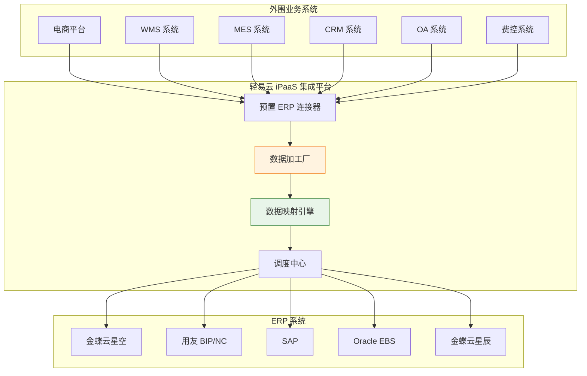
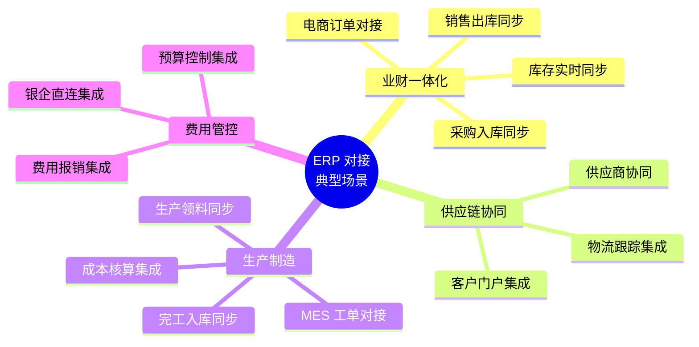
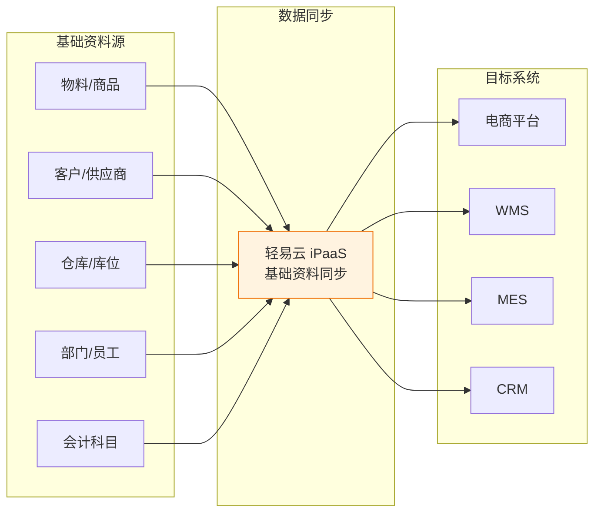
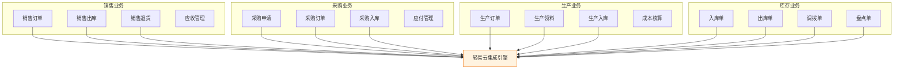
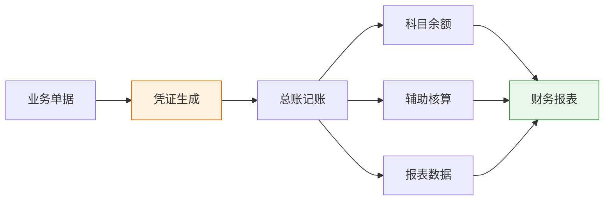
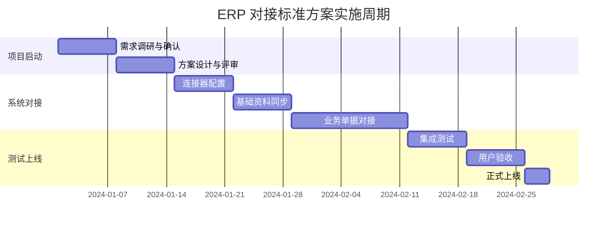

# ERP 对接标准方案

ERP（Enterprise Resource Planning，企业资源计划）系统是企业信息化的核心，承担着财务、供应链、生产制造、人力资源等核心业务的管理职能。轻易云 iPaaS 针对主流 ERP 系统（金蝶、用友、SAP、Oracle 等）提供标准化的集成方案，帮助企业快速实现 ERP 与外围业务系统的数据互通。

> [!TIP]
> 本方案适用于使用金蝶、用友、SAP、Oracle 等主流 ERP 系统的企业，支持云 ERP 和本地部署 ERP 的混合集成场景。

## 方案概述

### 方案定位

ERP 对接标准方案是轻易云 iPaaS 针对企业 ERP 系统集成需求打造的标准化解决方案。方案基于轻易云丰富的 ERP 集成实践经验，提供预置的连接器、标准化的数据映射模板和最佳实践配置，帮助企业快速实现 ERP 与电商平台、WMS、MES、CRM 等外围系统的无缝对接。

### 方案架构

### 支持的 ERP 系统

| ERP 厂商 | 产品系列 | 部署方式 | 对接方式 |
|---------|---------|---------|---------|
| **金蝶** | 云星空、云星辰、K3、EAS | 云/本地 | API/WebService |
| **用友** | BIP、NC Cloud、U8、U9 | 云/本地 | API/OpenAPI |
| **SAP** | S/4HANA、ECC、Business One | 云/本地 | RFC/OData/API |
| **Oracle** | EBS、Fusion、NetSuite | 云/本地 | API/WebService |
| **浪潮** | GS Cloud、PS Cloud | 云/本地 | API |
| **鼎捷** | T100、E10、易助 | 本地 | API/数据库 |

## 适用场景

### 典型集成场景

### 场景详细说明

| 场景类别 | 具体场景 | 数据流向 | 业务价值 |
|---------|---------|---------|---------|
| **业财一体化** | 电商订单自动入账 | 电商平台 → ERP | 消除手工录入，实时财务核算 |
| **业财一体化** | 销售出库自动扣减库存 | OMS → ERP | 库存实时准确 |
| **供应链协同** | 采购订单协同 | ERP → 供应商门户 | 供应链透明化 |
| **生产制造** | MES 完工入库同步 | MES → ERP | 实时成本核算 |
| **费用管控** | 费用报销自动入账 | 费控系统 → ERP | 财务自动化 |

## 包含的集成点

### 基础资料集成

基础资料是 ERP 系统的数据基石，确保基础资料的一致性是所有业务集成的前提：

**基础资料同步清单**：

| 资料类型 | ERP 来源 | 同步方向 | 同步频率 |
|---------|---------|---------|---------|
| **物料/商品** | ERP → 外围系统 | 单向 | 实时/定时 |
| **客户档案** | 双向同步 | 双向 | 准实时 |
| **供应商** | ERP → 外围系统 | 单向 | 定时 |
| **仓库库位** | ERP → WMS | 单向 | 定时 |
| **组织架构** | ERP → 外围系统 | 单向 | 定时 |

### 业务单据集成

**标准单据集成清单**：

| 单据类型 | 集成场景 | 数据流向 | 标准方案 |
|---------|---------|---------|---------|
| **销售订单** | 电商订单 → ERP | 电商平台 → ERP | 支持 |
| **销售出库** | WMS 出库 → ERP | WMS → ERP | 支持 |
| **采购订单** | ERP → 供应商 | ERP → 外部 | 支持 |
| **采购入库** | WMS 入库 → ERP | WMS → ERP | 支持 |
| **生产订单** | MES 工单 → ERP | MES → ERP | 支持 |
| **生产入库** | MES 完工 → ERP | MES → ERP | 支持 |
| **费用报销** | 费控 → ERP | 费控系统 → ERP | 支持 |

### 财务集成

**财务集成要点**：

| 集成内容 | 说明 | 注意事项 |
|---------|------|---------|
| **凭证生成** | 业务单据自动生成凭证 | 科目映射规则配置 |
| **辅助核算** | 部门、项目、客户等维度 | 确保维度值一致 |
| **期末处理** | 汇兑损益、费用分摊 | 按会计期间处理 |
| **报表数据** | 财务报表数据汇总 | 数据准确性校验 |

## 实施周期

### 标准实施周期

### 实施周期估算

| 实施内容 | 标准周期 | 复杂场景周期 | 说明 |
|---------|---------|-------------|------|
| **基础资料同步** | 3~5 天 | 5~7 天 | 含数据清洗 |
| **销售业务对接** | 5~7 天 | 7~10 天 | 含退货场景 |
| **采购业务对接** | 5~7 天 | 7~10 天 | 含供应商协同 |
| **库存业务对接** | 5~7 天 | 7~10 天 | 含多仓场景 |
| **生产业务对接** | 7~10 天 | 10~14 天 | 含成本核算 |
| **财务集成** | 5~7 天 | 7~10 天 | 含凭证模板 |

> [!NOTE]
> 实施周期受 ERP 版本、数据量、定制化需求等因素影响。以上为参考周期，具体以实际评估为准。

### 影响实施周期的因素

| 因素 | 影响说明 | 优化建议 |
|-----|---------|---------|
| **ERP 版本** | 不同版本接口差异 | 提前确认接口文档 |
| **数据量** | 历史数据迁移耗时 | 分批次迁移 |
| **定制化需求** | 非标准业务逻辑 | 提前梳理需求 |
| **系统环境** | 网络、权限等问题 | 提前准备环境 |
| **多方协作** | 多方系统对接协调 | 明确责任分工 |

## 实施配置步骤

### 步骤一：连接器配置

1. **创建 ERP 连接器**
   - 登录轻易云 iPaaS 平台
   - 进入**连接器管理** → **新建连接器**
   - 选择对应 ERP 类型（金蝶、用友、SAP 等）
   - 填写连接参数（服务器地址、账套、账号密码等）
   - 点击**测试连接**，验证配置正确

2. **配置外围系统连接器**
   - 根据对接系统类型创建对应连接器
   - 配置连接参数并测试连接

### 步骤二：基础资料同步配置

1. **创建基础资料同步方案**
   - 选择源系统（ERP）和目标系统
   - 选择同步的资料类型（物料、客户等）
   - 配置字段映射关系
   - 设置同步策略（全量/增量）

2. **配置数据清洗规则**
   - 设置编码规则转换
   - 配置数据过滤条件
   - 设置默认值和计算规则

### 步骤三：业务单据对接配置

1. **创建业务单据同步方案**
   - 选择单据类型和同步方向
   - 配置源系统查询接口和目标系统写入接口
   - 配置字段映射关系
   - 设置触发条件（定时/事件）

2. **配置异常处理**
   - 设置重试策略
   - 配置告警通知
   - 设置错误数据处理方式

### 步骤四：测试与上线

1. **单条数据测试**
   - 使用测试数据进行单条同步验证
   - 检查数据完整性和准确性

2. **批量数据测试**
   - 进行批量数据同步测试
   - 验证系统性能和稳定性

3. **上线切换**
   - 制定上线计划
   - 进行数据初始化
   - 启用自动同步

## 最佳实践

### 数据一致性保障

### 常见配置建议

| 配置项 | 建议值 | 说明 |
|-------|-------|------|
| **同步频率** | 5~15 分钟 | 平衡实时性和系统压力 |
| **批量大小** | 100~500 条 | 根据系统性能调整 |
| **重试次数** | 3~5 次 | 避免无限重试 |
| **重试间隔** | 5~30 分钟 | 指数退避策略 |
| **日志保留** | 30~90 天 | 满足审计需求 |

> [!TIP]
> 建议在生产环境上线前，先在测试环境完成充分的集成测试，包括正常场景和异常场景的测试。

## 常见问题

### Q1：ERP 接口调用频率限制如何处理？

A：轻易云提供智能的 API 调用调度机制，支持请求队列、频率控制、批量合并等策略，确保在 ERP 接口限制下稳定运行。

### Q2：历史数据如何迁移？

A：轻易云支持历史数据的批量导入和迁移。建议采用"存量数据批量迁移 + 增量数据实时同步"的策略，确保数据平滑过渡。

### Q3：如何处理 ERP 与外围系统的编码不一致？

A：轻易云数据加工厂支持编码映射和转换。可以建立编码对照表，或通过规则自动转换（如添加前缀/后缀）。

### Q4：如何保证集成数据的安全性？

A：轻易云提供传输加密（TLS）、数据脱敏、访问控制、审计日志等安全机制，确保数据在传输和存储过程中的安全。

## 方案价值

| 价值维度 | 量化收益 |
|---------|---------|
| **效率提升** | 数据录入效率提升 80%+ |
| **准确性** | 数据差错率降低 95%+ |
| **实时性** | 数据获取时效从天级到分钟级 |
| **成本节约** | 人工处理成本降低 60%+ |
| **决策支持** | 业务数据实时可视 |

---

## 相关资源

- [金蝶连接器](../connectors/erp/kingdee-cloud-galaxy) - 金蝶云星空连接器配置
- [用友连接器](../connectors/erp/yonyou-bip) - 用友 BIP 连接器配置
- [SAP 集成指南](../developer/sap-integration) - SAP 系统集成指南
- [制造业解决方案](../solutions/manufacturing) - 制造业 ERP 集成场景
