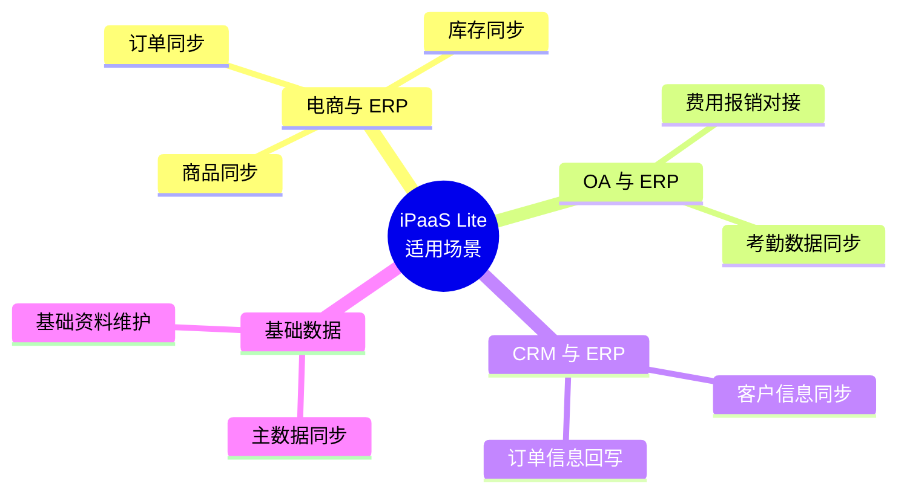
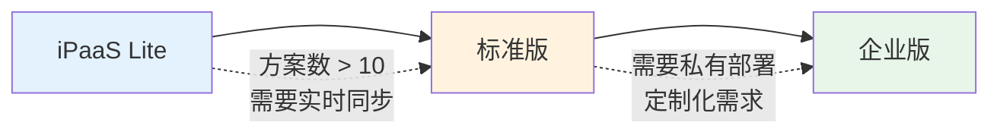

# iPaaS Lite 方案

iPaaS Lite 是轻易云为中小企业量身打造的轻量级集成方案，以更低的成本和更简单的配置实现核心业务系统的数据对接，帮助企业快速跨出数字化集成第一步。

> [!TIP]
> iPaaS Lite 方案适合集成需求较为简单、预算有限的中小企业用户。如需更丰富的功能和更高的性能配置，请了解标准版和企业版方案。

## 方案概述

### 方案定位

iPaaS Lite 方案专注于解决中小企业最核心的数据集成需求，提供精简的功能集合和灵活的付费方式。相比标准版，Lite 方案具有以下特点：

| 特性 | iPaaS Lite | 标准版 |
|------|-----------|--------|
| 集成方案数量 | 最多 10 个 | 不限 |
| 连接器数量 | 最多 5 个 | 不限 |
| 数据同步量 | 每月 10 万条 | 按需配置 |
| 调度频率 | 最快 15 分钟/次 | 最快 1 分钟/次 |
| 技术支持 | 在线工单 | 专属技术顾问 |
| 自定义脚本 | — | ✅ |
| CDC 实时同步 | — | ✅ |

### 适用场景

## 包含功能

### 核心功能

- **可视化配置**：零代码拖拽式集成方案配置
- **预置连接器**：覆盖主流 ERP、电商、OA 系统
- **数据映射**：可视化字段映射与转换
- **定时调度**：支持 15 分钟~24 小时的定时执行
- **异常告警**：邮件和站内信通知
- **执行日志**：完整的同步日志与数据追溯

### 支持的连接器

| 分类 | 连接器 |
|------|--------|
| ERP | 金蝶云星空、用友 BIP/U8、畅捷通 T+ |
| 电商 | 旺店通、聚水潭、网店管家 |
| OA | 钉钉、飞书、企业微信 |
| 数据库 | MySQL、PostgreSQL、SQL Server |

## 开通方式

1. 登录 [轻易云官网](https://www.qeasy.cloud)
2. 进入**产品定价**页面，选择 **iPaaS Lite** 方案
3. 选择订阅周期（月付/年付）
4. 完成支付后即可开通使用

> [!NOTE]
> iPaaS Lite 方案支持 7 天免费试用。试用期间可使用全部 Lite 功能，试用到期后需正式订阅方可继续使用。

## 升级路径

当业务增长需要更强大的集成能力时，可平滑升级至标准版或企业版：

## 常见问题

### Q: Lite 方案的数据量超限怎么办？

超出月度数据量限额后，同步任务将暂停执行。你可以升级方案或等待下月额度刷新。

### Q: 可以从 Lite 升级到标准版吗？

可以随时升级。升级后已有的集成方案和配置会完整保留，无需重新配置。

### Q: Lite 方案支持自定义脚本吗？

Lite 方案不支持自定义脚本功能。如需使用自定义脚本进行复杂数据转换，请升级至标准版。

---

## 相关资源

- [方案概览](./README) — 查看所有标准集成方案
- [Lite 集成方案包](./lite-plans) — Lite 方案详细包内容
- [试用与购买](../overview/pricing-and-trial) — 产品定价与试用说明
