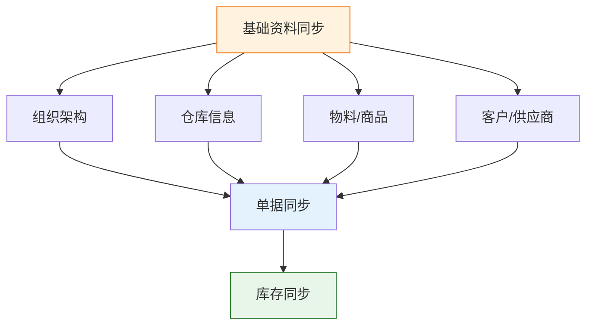

# Lite 集成方案包

轻易云 iPaaS Lite 集成方案包是针对小微企业、初创公司以及单一业务场景设计的轻量级数据集成解决方案。方案包聚焦于最常见的业务系统对接需求，提供低成本、快速部署的标准化集成能力，帮助企业在无需复杂配置的情况下实现系统间的数据互通。

## 方案概述

### 什么是 Lite 方案

Lite 方案是轻易云标准集成方案的轻量版本，针对数据量较小、业务逻辑相对简单的场景进行优化设计。相比完整版标准方案，Lite 方案具有以下特点：

| 特点 | 说明 |
| ---- | ---- |
| **轻量配置** | 预置最常用字段映射，减少配置工作量 |
| **快速部署** | 平均 30 分钟内完成方案部署与测试 |
| **成本优化** | 适用于数据量较小的场景，降低使用成本 |
| **场景聚焦** | 专注解决单一业务痛点，避免过度设计 |

### 适用场景

- 日订单量 < 5,000 单的电商企业
- 基础资料单向同步（物料、客户、供应商）
- 简单单据推送（销售出库单、费用报销单）
- 单一方向的库存结果同步
- 费用报销与费控管理

### 技术特征

Lite 方案基于以下技术假设设计：

- 无批次管理需求
- 无保质期追踪需求
- 无库位/仓位管理需求
- 无多规格（SKU 变体）管理需求
- 无多单位换算需求
- 未启用库存精细化管理

> [!IMPORTANT]
> 如果您的业务涉及以上任一复杂场景，建议使用[标准集成方案](./README)或联系顾问进行方案定制。

## 方案清单

Lite 方案包涵盖电商 ERP 与财务系统、OA 协同与费控两大核心场景，具体包括以下 12 个标准方案：

### 电商 ERP 与财务集成

| 方案名称 | 源系统 | 目标系统 | 核心能力 |
|---------|-------|---------|---------|
| 吉客云-星辰业财一体化 | 吉客云 | 金蝶云星辰 | 销售、采购、库存、基础资料全面对接 |
| 旺店通-星辰业财一体化 | 旺店通 | 金蝶云星辰 | 销售、采购、库存、基础资料全面对接 |
| 旺店通企业版-星辰采销关联 | 旺店通企业版 | 金蝶云星辰 | 销售出库与采购入库关联集成 |
| 百胜 E3-星辰销售库存集成 | 百胜 E3 | 金蝶云星辰 | 销售单据同步、库存结果回写 |
| 百胜 ME3-星辰销售库存集成 | 百胜 ME3 | 金蝶云星辰 | 销售单据同步、库存结果回写 |
| 聚水潭-星辰全流程集成 | 聚水潭 | 金蝶云星辰 | 销售、采购、库存、基础资料全面对接 |
| 聚水潭-星辰销售库存集成 | 聚水潭 | 金蝶云星辰 | 销售单据同步、库存结果回写（单向） |
| 聚水潭-星空销售库存集成 | 聚水潭 | 金蝶云星空 | 销售单据同步、库存结果回写 |
| 吉客云-星辰销售库存集成 | 吉客云 | 金蝶云星辰 | 销售单据同步、库存结果回写（单向） |

### OA 协同与费控集成

| 方案名称 | 源系统 | 目标系统 | 核心能力 |
|---------|-------|---------|---------|
| 企业微信-星辰费用报销 | 企业微信 | 金蝶云星辰 | 费用报销、费用借支、备用金管理 |
| 钉钉-星辰费用报销 | 钉钉 | 金蝶云星辰 | 费用报销、费用借支、备用金管理 |

## 电商 ERP 集成方案详解

### 吉客云与金蝶云星辰业财一体化

实现吉客云电商平台与金蝶云星辰财务系统的全流程数据对接，涵盖销售、采购、库存及基础资料同步。

#### 数据同步范围

| 同步方向 | 单据类型 | 源系统状态 | 同步策略 |
|---------|---------|-----------|---------|
| 吉客云 → 星辰 | 销售出库单 | 待发货已递交、发货在途、已完成 | 按最后修改时间增量同步 |
| 吉客云 → 星辰 | 销售退货单 | 退换管理已完成 | 按最后修改时间增量同步 |
| 吉客云 → 星辰 | 采购入库单 | 入库类型为采购入库 | 按最后修改时间增量同步 |
| 吉客云 → 星辰 | 采购退货单 | 入库类型为退料入库 | 按最后修改时间增量同步 |
| 吉客云 → 星辰 | 其他入库单 | 入库类型为其他入库 | 按最后修改时间增量同步 |
| 吉客云 → 星辰 | 其他出库单 | 出库类型为其他出库 | 按最后修改时间增量同步 |
| 吉客云 → 星辰 | 调拨入库/出库 | 调拨入/调拨出 | 分别同步至星辰其他入/出库单 |
| 吉客云 → 星辰 | 盘盈入库/盘亏出库 | 盘盈入库/盘亏出库 | 盘点数据同步 |
| 吉客云 → 星辰 | 商品档案 | — | 按最后修改时间增量同步 |
| 吉客云 → 星辰 | 销售渠道（客户） | — | 同步至星辰客户档案 |
| 吉客云 → 星辰 | 仓库 | — | 同步至星辰仓库档案 |

> [!TIP]
> 此方案支持吉客云的全流程业务场景，适合同时使用吉客云进行电商订单处理和金蝶云星辰进行财务核算的企业。

---

### 旺店通与金蝶云星辰业财一体化

实现旺店通电商平台与金蝶云星辰财务系统的全流程数据对接。

#### 数据同步范围

| 同步方向 | 单据类型 | 源系统状态 | 同步策略 |
|---------|---------|-----------|---------|
| 旺店通 → 星辰 | 销售出库单 | 已发货、部分打款、已完成、异常发货 | 按最后修改时间增量同步 |
| 旺店通 → 星辰 | 销售退货单 | 退换管理已完成 | 按最后修改时间增量同步 |
| 旺店通 → 星辰 | 采购入库单 | 已入库 | 按最后入库时间增量同步 |
| 旺店通 → 星辰 | 采购退货单 | 已审核 | 按最后修改时间增量同步 |
| 旺店通 → 星辰 | 其他入库单 | 入库类型为其他入库 | 按最后修改时间增量同步 |
| 旺店通 → 星辰 | 其他出库单 | 出库类型为其他出库 | 按最后修改时间增量同步 |
| 旺店通 → 星辰 | 调拨单 | 调拨完成 | 按最后修改时间增量同步 |
| 旺店通 → 星辰 | 盘点单 | — | 按最后修改时间增量同步 |
| 旺店通 → 星辰 | 物料 | 已审核 | 同步至星辰货品档案 |
| 旺店通 → 星辰 | 店铺 | 已审核 | 同步至星辰客户信息 |

---

### 旺店通企业版与金蝶云星辰采销关联集成

在基础销售库存同步的基础上，增加采购入库与销售订单的关联关系同步，实现更完整的业财追溯。

#### 数据同步范围

| 同步方向 | 单据类型 | 源系统状态 | 同步策略 |
|---------|---------|-----------|---------|
| 旺店通 → 星辰 | 销售出库单 | 已发货、部分打款、已完成、异常发货 | 按最后修改时间增量同步 |
| 旺店通 → 星辰 | 销售退货单 | 退换管理已完成 | 按最后修改时间增量同步 |
| 旺店通 → 星辰 | 采购入库单 | 已入库 | 按最后入库时间增量同步，关联源销售订单 |
| 旺店通 → 星辰 | 采购退货单 | 已审核 | 按最后修改时间增量同步 |
| 旺店通 → 星辰 | 其他入库单 | 入库类型为其他入库 | 按最后修改时间增量同步 |
| 旺店通 → 星辰 | 其他出库单 | 出库类型为其他出库 | 按最后修改时间增量同步 |
| 旺店通 → 星辰 | 调拨单 | 调拨完成 | 按最后修改时间增量同步 |
| 旺店通 → 星辰 | 盘点单 | — | 按最后修改时间增量同步 |
| 旺店通 → 星辰 | 物料 | 已审核 | 同步至星辰货品档案 |
| 旺店通 → 星辰 | 店铺 | 已审核 | 同步至星辰客户信息 |

> [!NOTE]
> 采销关联方案在采购入库单同步时会保留与销售订单的关联关系，便于后续成本核算和业务追溯。

---

### 百胜 E3 与金蝶云星辰销售库存集成

实现百胜 E3 零售管理系统与金蝶云星辰的轻量化对接，专注销售业务与库存结果同步。

#### 数据同步范围

| 同步方向 | 单据类型 | 源系统状态 | 同步策略 |
|---------|---------|-----------|---------|
| 百胜 E3 → 星辰 | 销售出库单 | 待发货已递交、发货在途、已完成 | 按最后修改时间增量同步 |
| 百胜 E3 → 星辰 | 销售退货单 | 退换管理已完成 | 按最后修改时间增量同步 |
| 星辰 → 百胜 E3 | 商品库存 | 库存发生变化 | 库存结果回写调整百胜库存 |
| 金蝶 → 百胜 E3 | 物料 | 已审核 | 同步至百胜货品档案 |
| 百胜 E3 → 星辰 | 客户 | — | 同步至星辰客户档案 |

> [!NOTE]
> 仓库信息由于新增频率较低，建议两边系统手工维护。

---

### 百胜 ME3 与金蝶云星辰销售库存集成

百胜 ME3 版本的轻量化对接方案，与 E3 版本能力基本一致。

#### 数据同步范围

| 同步方向 | 单据类型 | 源系统状态 | 同步策略 |
|---------|---------|-----------|---------|
| 百胜 ME3 → 星辰 | 销售出库单 | — | 按发货时间增量同步 |
| 百胜 ME3 → 星辰 | 销售退货单 | 退换管理已完成 | 按退货入库时间增量同步 |
| 星辰 → 百胜 ME3 | 商品库存 | 库存发生变化 | 库存结果回写调整百胜库存 |
| 金蝶 → 百胜 ME3 | 物料 | 已审核 | 同步至百胜货品档案 |

---

### 聚水潭与金蝶云星辰全流程集成

实现聚水潭电商平台与金蝶云星辰的全流程业财一体化对接。

#### 数据同步范围

| 同步方向 | 单据类型 | 源系统状态 | 同步策略 |
|---------|---------|-----------|---------|
| 聚水潭 → 星辰 | 销售出库单 | 已出库 | 按最后修改时间增量同步 |
| 聚水潭 → 星辰 | 销售退货单 | 退换管理已完成 | 按最后修改时间增量同步 |
| 聚水潭 → 星辰 | 采购入库单 | 已入库 | 与源订单关联，按最后修改时间同步 |
| 聚水潭 → 星辰 | 采购退货单 | 生效 | 按最后修改时间增量同步 |
| 聚水潭 → 星辰 | 其他入库单 | 其他入库、生效 | 按最后修改时间增量同步 |
| 聚水潭 → 星辰 | 其他出库单 | 其他出库、生效 | 按最后修改时间增量同步 |
| 聚水潭 → 星辰 | 调拨入库/出库 | 调拨入、生效 | 分别同步至星辰其他入/出库单 |
| 聚水潭 → 星辰 | 盘盈入库/盘亏出库 | 生效 | 盘点数据同步 |
| 聚水潭 → 星辰 | 物料 | — | 同步至星辰货品档案 |
| 聚水潭 → 星辰 | 客户（店铺） | — | 同步至星辰店铺管理 |
| 聚水潭 → 星辰 | 仓库 | — | 同步至星辰仓库档案 |

---

### 聚水潭与金蝶云星辰销售库存集成（单向）

轻量版聚水潭对接方案，仅同步销售单据和库存结果，适合业务相对简单的场景。

#### 数据同步范围

| 同步方向 | 单据类型 | 源系统状态 | 同步策略 |
|---------|---------|-----------|---------|
| 聚水潭 → 星辰 | 销售出库单 | 已发货、部分打款、已完成、异常发货 | 按最后修改时间增量同步 |
| 聚水潭 → 星辰 | 销售退货单 | 退换管理已完成 | 按最后修改时间增量同步 |
| 星辰 → 聚水潭 | 商品库存 | 库存发生变化 | 库存结果回写调整聚水潭库存 |
| 金蝶 → 聚水潭 | 物料 | 已审核 | 同步至聚水潭商品档案 |
| 聚水潭 → 星辰 | 店铺 | — | 同步至星辰客户档案 |
| 聚水潭 → 星辰 | 仓库 | — | 同步至星辰仓库档案 |

---

### 聚水潭与金蝶云星空销售库存集成

针对使用金蝶云星空（企业版 ERP）客户的聚水潭对接方案。

#### 数据同步范围

| 同步方向 | 单据类型 | 源系统状态 | 同步策略 |
|---------|---------|-----------|---------|
| 聚水潭 → 星空 | 销售出库单 | 已发货、部分打款、已完成、异常发货 | 按最后修改时间增量同步 |
| 聚水潭 → 星空 | 销售退货单 | 退换管理已完成 | 按最后修改时间增量同步 |
| 星空 → 聚水潭 | 商品库存 | 库存发生变化 | 库存结果回写调整聚水潭库存 |
| 金蝶 → 聚水潭 | 物料 | 已审核 | 同步至聚水潭商品档案 |

> [!IMPORTANT]
> 此方案适用于金蝶云星空企业版，特征为：无批次、无保质期、无库位、无多规格、无多单位、未启用库存精细化管理。

---

### 吉客云与金蝶云星辰销售库存集成（单向）

轻量版吉客云对接方案，支持金蝶云星辰和云星空企业版两个目标系统。

#### 数据同步范围

| 同步方向 | 单据类型 | 源系统状态 | 同步策略 |
|---------|---------|-----------|---------|
| 吉客云 → 星辰/星空 | 销售出库单 | 待发货已递交、发货在途、已完成 | 按最后修改时间增量同步 |
| 吉客云 → 星辰/星空 | 销售退货单 | 退换管理已完成 | 按最后修改时间增量同步 |
| 星辰/星空 → 吉客云 | 商品库存 | 库存发生变化 | 库存结果回写调整吉客云库存 |
| 金蝶 → 吉客云 | 物料 | 已审核 | 同步至吉客云货品档案 |
| 吉客云 → 星辰/星空 | 销售渠道（客户） | — | 同步至金蝶客户档案 |
| 吉客云 → 星辰/星空 | 仓库 | — | 同步至金蝶仓库档案 |

## OA 费控集成方案详解

### 企业微信与金蝶云星辰费用报销

实现企业微信审批表单与金蝶云星辰费用单据的自动化对接，支持移动端审批与财务系统联动。

#### 核心特征

- 支持自定义表单设计
- 实报实销模式
- 移动录单与移动审批
- 审批通过后自动同步至星辰

#### 数据同步范围

| 同步类型 | 企业微信表单 | 星辰目标单据 | 同步条件 |
|---------|-------------|-------------|---------|
| 费用报销 | 费用报销单 | 其他支出单 | 审批状态为已审核 |
| 费用借支 | 费用借支单 | 其他支出单 | 审批状态为已审核 |
| 备用金 | 备用金申请 | 其他支出单 | 审批状态为已审核 |

#### 表单设计建议

费用报销表单应包含以下核心字段：

| 字段类别 | 建议字段 | 映射说明 |
|---------|---------|---------|
| 基础信息 | 报销人、所属部门、申请日期 | 关联星辰员工、部门档案 |
| 费用信息 | 费用类型、金额、发生日期 | 映射星辰费用项目 |
| 支付信息 | 收款账户、开户行 | 用于星辰付款单 |
| 发票信息 | 发票类型、发票号码、税额 | 支持进项税核算 |
| 关联单据 | 借款单号（如有冲抵） | 实现费用冲借款 |

> [!TIP]
> 企业微信表单支持灵活自定义，建议根据企业实际费用管理制度设计审批流程和表单字段。

---

### 钉钉与金蝶云星辰费用报销

实现钉钉审批表单与金蝶云星辰费用单据的自动化对接，功能与企业微信方案基本一致。

#### 核心特征

- 支持钉钉自定义表单设计
- 实报实销模式
- 移动录单与移动审批
- 审批通过后自动同步至星辰

#### 数据同步范围

| 同步类型 | 钉钉表单 | 星辰目标单据 | 同步条件 |
|---------|---------|-------------|---------|
| 费用报销 | 费用报销单 | 其他支出单 | 审批状态为已审核 |
| 费用借支 | 费用借支单 | 其他支出单 | 审批状态为已审核 |
| 备用金 | 备用金申请 | 其他支出单 | 审批状态为已审核 |

#### 表单设计建议

钉钉费用表单应包含以下核心字段：

| 字段类别 | 建议字段 | 映射说明 |
|---------|---------|---------|
| 基础信息 | 报销人、所属部门、申请日期 | 关联星辰员工、部门档案 |
| 费用信息 | 费用类型、金额、发生日期 | 映射星辰费用项目 |
| 支付信息 | 收款账户、开户行 | 用于星辰付款单 |
| 发票信息 | 发票类型、发票号码、税额 | 支持进项税核算 |
| 关联单据 | 借款单号（如有冲抵） | 实现费用冲借款 |

## 实施部署指南

### 前置条件

部署 Lite 方案前，请确保满足以下条件：

| 检查项 | 要求 | 说明 |
|-------|------|------|
| 源系统授权 | 已获取 API 访问权限 | 包括 AppKey、AppSecret 等 |
| 目标系统授权 | 已获取 API 访问权限 | 金蝶云星辰/星空需开通开放接口 |
| 基础资料 | 已完成数据清洗 | 物料编码、客户编码等已对齐 |
| 组织架构 | 已建立映射关系 | 部门、员工信息已对应 |

### 部署流程

**详细步骤**：

1. **需求确认**
   - 明确需要同步的单据类型
   - 确认同步方向和频率
   - 了解特殊业务规则

2. **账号开通**
   - 注册轻易云 iPaaS 平台账号
   - 开通 Lite 方案使用权限
   - 获取源系统和目标系统的 API 授权

3. **连接器配置**
   - 在平台中创建源系统连接器（如旺店通、聚水潭）
   - 配置目标系统连接器（金蝶云星辰/星空）
   - 测试连接确保连通性

4. **方案导入**
   - 进入方案市场选择对应的 Lite 方案
   - 导入方案到工作空间

5. **映射调整**
   - 根据实际字段对照表调整映射关系
   - 配置基础资料编码对照
   - 设置数据过滤条件（如需要）

6. **测试验证**
   - 执行单条数据测试
   - 验证字段映射准确性
   - 检查目标系统数据完整性

7. **正式启用**
   - 配置定时任务（建议每 5~10 分钟）
   - 启用自动同步
   - 配置告警通知

### 常见问题

#### 同步数据缺失

| 可能原因 | 排查方法 | 解决方案 |
|---------|---------|---------|
| 单据状态不符合条件 | 检查源系统单据状态 | 确认单据已到达指定状态 |
| 时间范围设置错误 | 检查增量时间条件 | 调整起始同步时间 |
| 基础资料未映射 | 检查物料/客户是否存在 | 完善基础资料映射 |

#### 数据重复同步

| 可能原因 | 排查方法 | 解决方案 |
|---------|---------|---------|
| 缺少唯一标识 | 检查主键策略配置 | 配置正确的业务主键 |
| 时间精度问题 | 检查时间戳精度 | 使用时间戳加序列号组合 |
| 并发冲突 | 检查同步频率 | 适当延长同步间隔 |

#### 库存同步不准确

| 可能原因 | 排查方法 | 解决方案 |
|---------|---------|---------|
| 多系统同时修改库存 | 检查库存变动来源 | 确定唯一库存主控系统 |
| 单位换算错误 | 检查计量单位映射 | 统一基础计量单位 |
| 仓库映射错误 | 检查仓库对应关系 | 完善仓库编码映射 |

## 最佳实践

### 基础资料先行

> [!IMPORTANT]
> 所有单据类同步必须在基础资料同步完成后进行，否则会导致单据写入失败。

基础资料同步的优先级：

### 分阶段上线建议

| 阶段 | 同步内容 | 预期时间 | 验证要点 |
|-----|---------|---------|---------|
| 第一阶段 | 基础资料（物料、客户、仓库） | 1~2 天 | 编码对应准确 |
| 第二阶段 | 库存结果同步 | 2~3 天 | 数量准确、单位一致 |
| 第三阶段 | 销售出库单 | 3~5 天 | 字段完整、金额准确 |
| 第四阶段 | 采购入库单 | 3~5 天 | 供应商映射正确 |
| 第五阶段 | 其他业务单据 | 2~3 天 | 根据实际需求 |

### 监控与运维

建议配置以下监控项：

| 监控项 | 告警条件 | 处理方式 |
|-------|---------|---------|
| 同步任务失败 | 连续 3 次失败 | 检查连接器状态，联系技术支持 |
| 数据量异常 | 单日数据量超过阈值 200% | 排查是否有大量补单或重复 |
| 同步延迟 | 最近一次同步距现在 > 30 分钟 | 检查调度服务状态 |
| 错误日志 | 新增 ERROR 级别日志 | 分析错误原因，修复后重试 |

## 获取支持

在使用 Lite 方案过程中遇到问题，可通过以下方式获取帮助：

| 支持渠道 | 联系方式 | 响应时效 |
|---------|---------|---------|
| 在线客服 | 控制台右下角客服窗口 | 工作日 9:00~18:00 |
| 技术热线 | 19301379948 | 工作日 9:00~21:00 |
| 工单系统 | 控制台「帮助与支持」-「提交工单」 | 2 小时内响应 |
| 方案咨询 | 访问 [www.qeasy.cloud](https://www.qeasy.cloud) | 24 小时内 |

## 相关资源

- [标准集成方案概览](./README) - 了解完整版标准方案
- [快速开始](../quick-start/first-integration) - 5 分钟上手轻易云 iPaaS
- [连接器配置指南](../guide/configure-connector) - 详细连接器配置说明
- [金蝶云星辰连接器](../connectors/erp/kingdee-cloud-star) - 金蝶云星辰连接器文档
- [金蝶云星空连接器](../connectors/erp/kingdee-cloud-galaxy) - 金蝶云星空连接器文档
- [常见问题](../faq) - 使用过程中的常见问题解答
