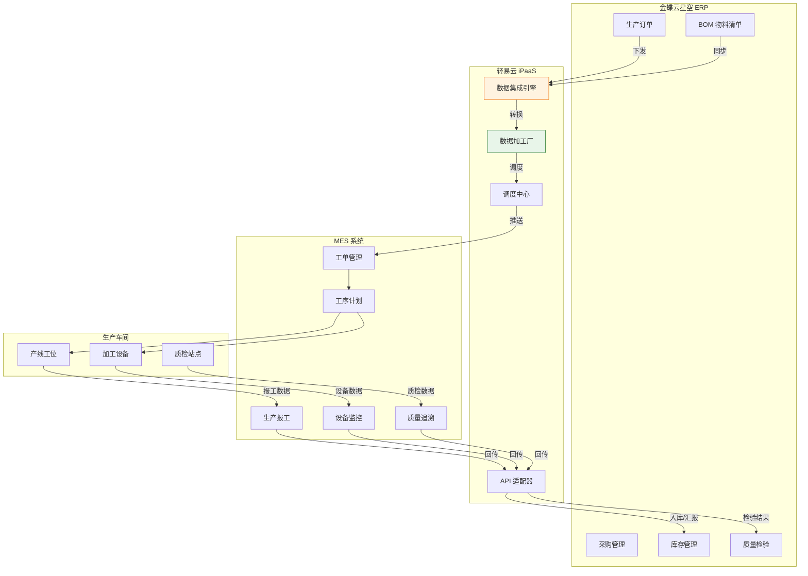
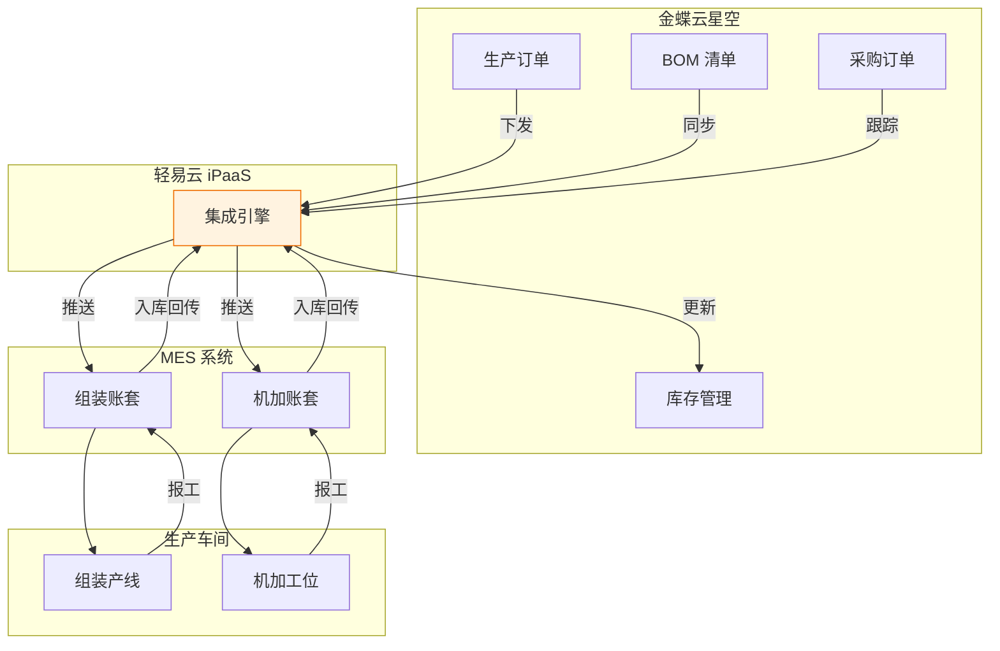
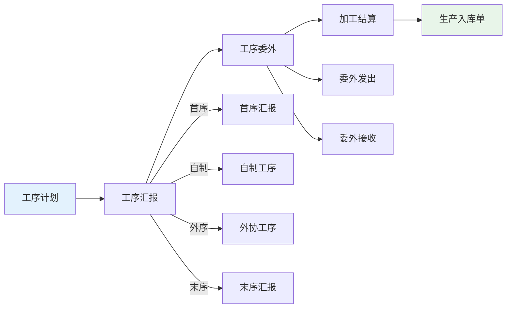
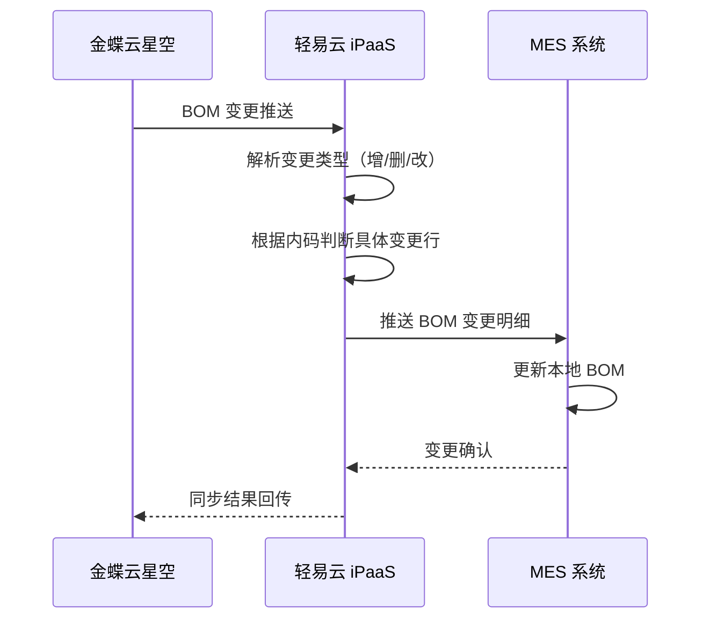
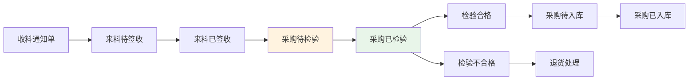
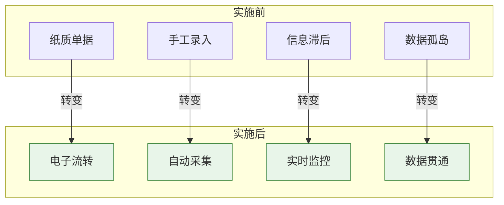
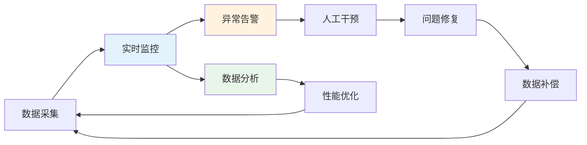

# MES 集成标准方案

MES 集成标准方案是轻易云 iPaaS 针对制造业生产车间打造的 comprehensive 集成解决方案，实现 MES（Manufacturing Execution System，制造执行系统）与 ERP 系统的数据无缝对接。本方案以世宗自动化 MES 与金蝶云星空集成项目为蓝本，经过生产环境验证，涵盖生产订单、工艺路线、物料消耗、质量检验等核心业务流程，帮助企业实现生产数据的实时采集与业务协同。

---

## 方案概述

### 适用场景

本方案主要适用于以下 MES 集成业务场景：

- **金蝶云星空与 MES 系统的生产订单下发与回报**
- **多账套 MES 系统（组装 + 机加）与 ERP 集成**
- **离散制造业小批量多品种生产模式的数据采集**
- **工序级生产过程管理与 ERP 协同**
- **质量检验数据双向同步**
- **采购、领料、入库等生产相关单据自动化流转**

### 方案架构



### 核心能力

| 能力 | 说明 |
| ---- | ---- |
| **多账套支持** | 支持组装账套、机加账套等多种生产模式并行 |
| **全业务覆盖** | 基础资料、生产订单、工序管理、采购入库全流程对接 |
| **实时数据采集** | 设备数据、工时报工、质量检验实时同步 |
| **工艺路线管理** | 支持多工序、委外工序、合并工序等复杂工艺 |
| **质量追溯** | 来料检验、过程检验、完工检验数据闭环 |
| **库存联动** | 生产领料、完工入库与仓储系统实时联动 |

---

## 业务场景方案

### 场景一：世宗自动化 MES + 金蝶云星空

#### 方案背景

深圳市世宗自动化设备有限公司成立于 2006 年，是一家专注于自动化点胶机生产和销售的高科技企业。企业拥有两个生产加工厂，采用典型的离散制造模式，面临小批量多品种、数据采集量大、生产排程复杂等挑战。

**业务痛点**：

- 制造模式复杂：零件品类多，数据采集量大且复杂
- 排程效率低：生产排程调度工作量大，插单频繁
- 生产不透明：原材料无法准确领用，进度无法实时监控
- 纸质作业低效：传统纸单作业统计模式，低效易错

#### 双账套架构



#### 账套类型说明

| 账套类型 | 业务特点 | 管理重点 |
| -------- | -------- | -------- |
| **组装账套** | 多个零件或组件组合在一起，形成最终产品 | 订单管理、生产计划排程、生产进度跟踪、最终产品的质量管理 |
| **机加账套** | 对原材料进行加工（如切割、铣削等），制造零件或组件 | 设备监控、工艺路线管理、设备维护、生产效率优化 |

#### 基础资料同步

**同步内容**：

| 资料类型 | 同步方式 | 触发条件 |
| -------- | -------- | -------- |
| 物料 | 定时对接 | 新增、修改 |
| 库位 | 定时对接 | 新增、修改 |
| 物料清单（BOM） | 定时对接 | 新增、修改 |
| 物料类别 | 定时对接 | 新增、修改 |
| 供应商 | 定时对接 | 新增、修改 |
| 仓库信息 | 定时对接 | 新增、修改 |
| 员工/人员信息 | 定时对接 | 新增、修改 |

#### 工单管理流程


**支持操作**：新增、结案、作废

#### 工序管理流程



**工序类型**：

- 工序 10、工序 20、工序 30...（按工艺顺序编号）
- 支持合并工序处理

#### 采购管理集成

**单据流程**：

```text
采购订单 → 收料通知单 → 检验单 → 采购入库单
```

**操作类型**：

| 操作 | 说明 |
| ---- | ---- |
| 新增 | 创建新单据 |
| 修改 | 修改已有单据 |
| 累计收料数量 | 更新订单已收料数量 |
| 累计入库数量 | 更新订单已入库数量 |
| 入库日期 | 记录实际入库时间 |
| 冻结 | 临时冻结订单 |
| 作废 | 作废错误单据 |
| 关闭 | 正常关闭订单 |
| 终止 | 强制终止订单 |

**状态流转**：

```text
来料待签收 → 来料已签收 → 采购待检验 → 采购已检验 → 采购待入库 → 采购已入库
```

**统计报表**：项目进度表、交付达成表、采购员周报、采购员达成率

---

### 场景二：工艺路线与 BOM 管理

#### 方案背景

针对复杂产品多工序加工场景，实现 ERP 工艺路线与 MES 工序执行的精确匹配，支持 BOM 变更的实时同步。

#### 技术挑战与解决方案

| 问题 | 详情 | 解决方案 |
| ---- | ---- | -------- |
| **BOM 集成** | ERP 接口无法定位具体删除行内码；BOM 多次变更 | MES 提供接口，根据内码进行判断新增、修改、删除 |
| **工艺路线集成** | MES 明细工序，ERP 体现总工序 | MES 根据相邻的内部工序进行合并提供接口，接口进行更新 ERP 的工艺路线 |
| **一单同物料多行领料** | 一单存在相同的物料、相同数量、相同选型书，分别领料，导致关联有问题 | 写加工厂按照物料、选型书维度进行逐行递减领料 |

#### BOM 变更同步流程



---

### 场景三：质量检验集成

#### 来料检验流程



#### 检验数据同步

| 检验类型 | 同步方向 | 数据内容 |
| -------- | -------- | -------- |
| 来料检验 | MES → ERP | 检验结果、不良原因、检验人员 |
| 过程检验 | MES → ERP | 工序检验数据、SPC 数据 |
| 完工检验 | MES → ERP | 成品检验报告、合格数量 |

---

## 实施关键要点

### 项目管理挑战

| 挑战类型 | 具体问题 | 应对建议 |
| -------- | -------- | -------- |
| **单据复杂度高** | 对接账套为机加跟组装，整个生产模块进行集成，并进行强关联，集成单据复杂度高 | 分阶段实施，先单账套后多账套 |
| **沟通缺失** | 整个项目调研到实施上线，未能实时与客户沟通需求，沟通成本高，效率低下 | 建立周例会机制，定期同步进展 |
| **部门跨越** | 客户公司规模庞大，各部门独立运作，职责界限明确，跨部门协作面临挑战 | 成立跨部门项目组，明确责任人 |
| **风险管理不足** | 未能充分识别和评估项目中的潜在风险，缺少有效的风险应对策略 | 制定风险评估表，提前识别风险点 |

### 技术实施难点

| 问题 | 详情 | 预防措施 |
| ---- | ---- | -------- |
| **BOM 反复调整** | 调整次数多，排错成本高 | 上线前进行充分的 BOM 数据梳理 |
| **对接流程变动** | 单量庞大，SKU 庞大，排查耗时多 | 建立标准数据字典，规范编码规则 |
| **客户操作不规范** | 两边系统手工做单，操作不一致 | 制定操作规范文档，进行培训 |
| **联调不充分** | 上线问题复杂，客户满意度受影响 | 安排充足的联调时间，模拟真实场景 |
| **MES 系统开发** | MES 开发阶段接口不完善 | 提前介入 MES 开发，明确接口规范 |

> [!TIP]
> **项目规划建议**：从项目启动到实施，进行彻底的需求分析和方案评审，避免频繁变更。建议采用敏捷迭代方式，分阶段交付，每个阶段都有明确的交付物和验收标准。

---

## 方案价值与成果

### 整体效率提升

通过 MES 与 ERP 集成，企业管理效率整体显著提升：

| 维度 | 提升效果 |
| ---- | -------- |
| **提质** | 25% 不良品减少 |
| **增效** | 90% 手工录单时间减少 |
| **减存** | 30% 在制品减少 |
| **监控** | 90% 实时监控生产进度 |

### 项目核心成果

1. **自动化数据录入**
   - 减少人工操作，提高数据准确性
   - 消除纸质单据，实现电子化流转

2. **生产现场监控**
   - 实时掌握生产状态
   - 设备运行状态可视化管理

3. **流程协调和优化**
   - 打通 MES 与 ERP 流程壁垒
   - 实现业务数据无缝流转

4. **实时生产数据**
   - 及时获取生产现场数据
   - 支持管理决策



---

## 数据映射规范

### 生产订单映射

| MES 字段 | 金蝶字段 | 说明 |
| -------- | -------- | ---- |
| `work_order_no` | `FBillNo` | 工单编号 |
| `product_code` | `FMaterialID` | 产品编码 |
| `plan_qty` | `FQty` | 计划数量 |
| `plan_start_date` | `FPlanStartDate` | 计划开工日期 |
| `plan_finish_date` | `FPlanFinishDate` | 计划完工日期 |
| `workshop` | `FWorkShopID` | 生产车间 |
| `bom_version` | `FBomId` | BOM 版本 |

### 工序汇报映射

| MES 字段 | 金蝶字段 | 说明 |
| -------- | -------- | ---- |
| `operation_no` | `FOperNumber` | 工序编号 |
| `operation_name` | `FOperName` | 工序名称 |
| `report_qty` | `FReportQty` | 汇报数量 |
| `qualified_qty` | `FQualifiedQty` | 合格数量 |
| `unqualified_qty` | `FUnqualifiedQty` | 不合格数量 |
| `report_time` | `FReportTime` | 汇报时间 |
| `operator` | `FWorkerID` | 操作人员 |

### 生产入库映射

| MES 字段 | 金蝶字段 | 说明 |
| -------- | -------- | ---- |
| `entry_no` | `FBillNo` | 入库单号 |
| `source_order` | `FSrcEntryId` | 源单编号 |
| `product_code` | `FMaterialID` | 产品编码 |
| `instore_qty` | `FRealQty` | 实收数量 |
| `warehouse` | `FStockID` | 仓库 |
| `location` | `FStockLocId` | 仓位 |

---

## 实施 Checklist

实施本方案前，请确认以下准备工作已完成：

### 系统准备

- [ ] 已确定 MES 系统版本和接口规范
- [ ] 已完成金蝶云星空连接器配置
- [ ] 已完成基础数据整理（物料、BOM、工艺路线）
- [ ] 已明确生产组织架构和账套划分
- [ ] 已制定数据编码规范

### 数据准备

- [ ] 物料主数据清理完成
- [ ] BOM 数据准确性校验通过
- [ ] 工艺路线数据整理完成
- [ ] 员工/人员信息同步完成
- [ ] 仓库、库位信息配置完成

### 配置检查

- [ ] 已配置定时调度策略和补漏机制
- [ ] 已配置数据映射规则和字段转换
- [ ] 已设置主键策略和关联规则
- [ ] 已配置异常告警通知
- [ ] 已配置工序合并规则

### 测试验证

- [ ] 已完成基础资料同步测试
- [ ] 已完成生产订单下发测试
- [ ] 已完成工序汇报回传测试
- [ ] 已完成生产入库测试
- [ ] 已完成采购流程集成测试
- [ ] 已完成业务流程端到端测试

---

## 常见问题

### Q: 如何处理多账套数据隔离？

A: 建议在轻易云数据加工厂中配置账套标识字段，通过数据过滤条件实现不同账套数据的隔离处理。同时可以为每个账套配置独立的集成方案实例。

### Q: 工艺路线变更如何同步？

A: 工艺路线变更需要通过 BOM 变更流程触发，MES 系统应根据相邻内部工序进行合并后提供接口，轻易云负责将合并后的工艺路线更新至 ERP。

### Q: 一单多行相同物料如何领料？

A: 在数据加工厂中编写自定义处理逻辑，按照物料编码 + 选型书维度进行逐行递减领料，确保领料数量与订单明细准确匹配。

### Q: 如何保证报工数据的实时性？

A: 建议采用事件驱动 + 定时补偿的双重机制。关键工序报工使用实时触发，一般工序使用定时轮询，同时配置数据比对机制确保不遗漏。

### Q: 采购关单状态如何同步？

A: 采购订单的冻结、作废、关闭、终止等关单操作需要分方案进行集成，建议在轻易云中配置状态映射表，将 MES 操作类型转换为 ERP 对应状态。

---

## 最佳实践

### 数据治理建议

1. **建立主数据标准**
   - 统一物料编码规则
   - 规范 BOM 版本管理
   - 制定工艺路线命名规范

2. **设计异常处理机制**
   - 配置数据校验规则
   - 设置异常数据预警
   - 建立数据修复流程

3. **实施分阶段上线**
   - 第一阶段：基础资料同步
   - 第二阶段：生产订单对接
   - 第三阶段：工序管理对接
   - 第四阶段：质量检验集成

### 性能优化建议

| 场景 | 优化方案 |
| ---- | -------- |
| 大数据量同步 | 配置分页查询和批量写入 |
| 高频实时同步 | 使用事件驱动代替定时轮询 |
| 多账套并发 | 配置合理的调度间隔和重试策略 |
| 复杂工艺路线 | 启用工序合并和缓存机制 |

### 运维监控建议



---

## 相关资源

- [金蝶云星空连接器配置](../connectors/erp/kingdee-cloud-galaxy)
- [数据加工厂配置](../advanced/data-transformation)
- [连接器配置指南](../guide/configure-connector)
- [数据映射配置](../guide/data-mapping)
- [MES 与 ERP 集成方案](../solutions/mes-erp)
