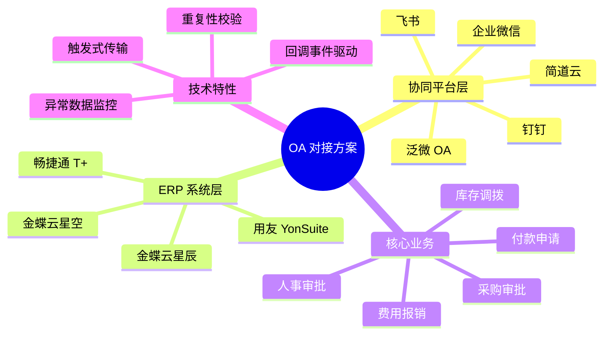
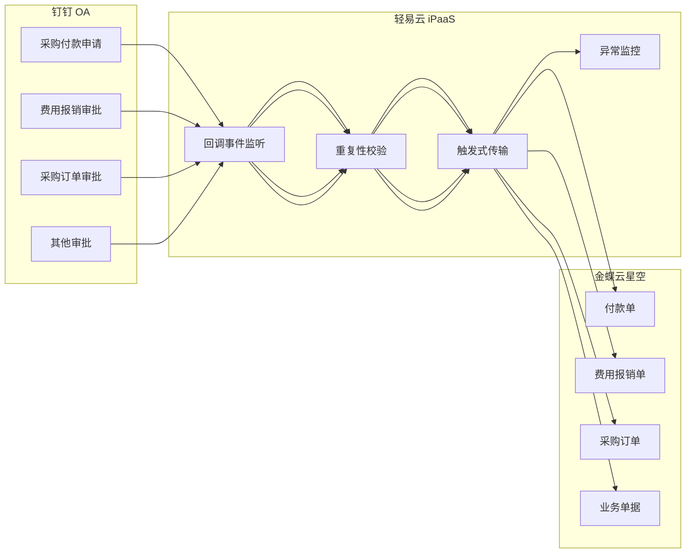
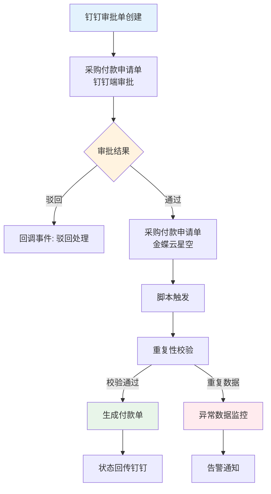
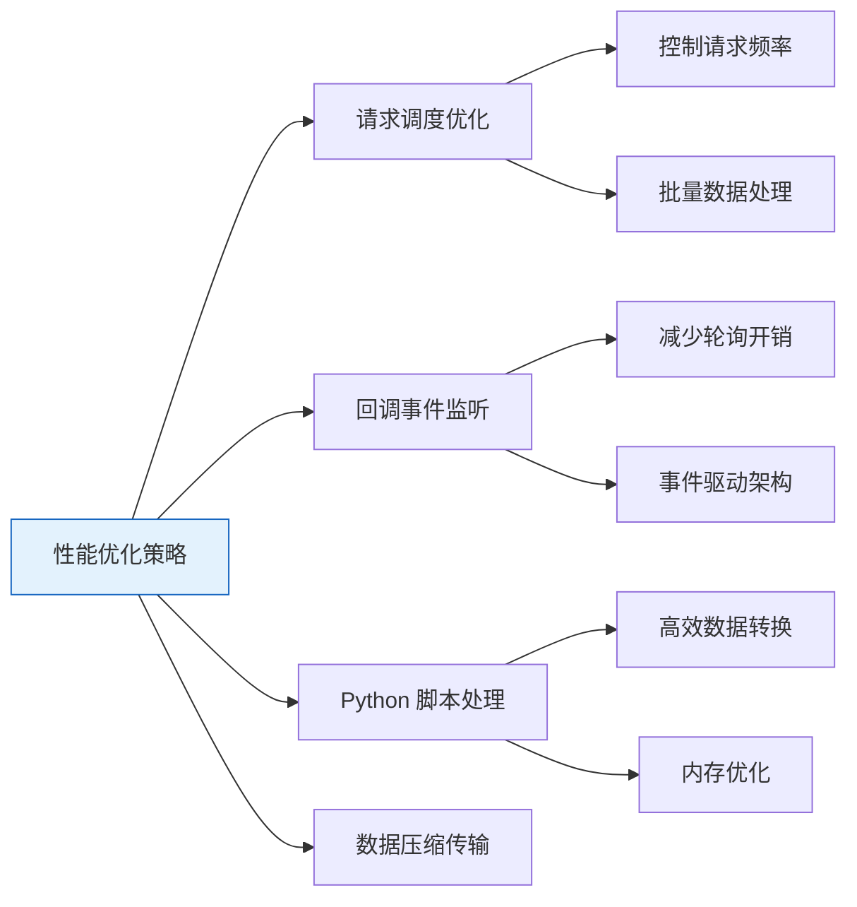
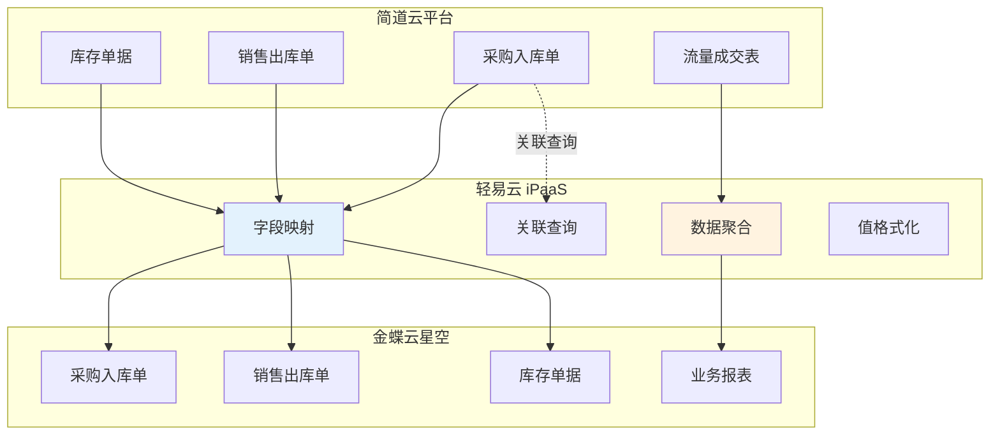
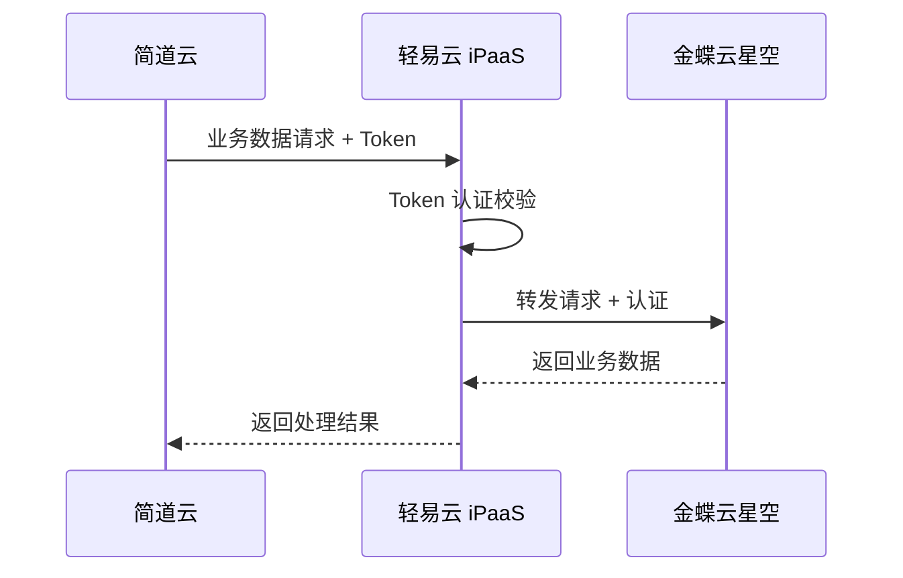
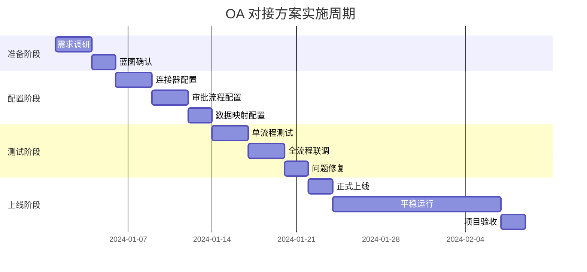

# OA 对接标准方案

本文档介绍轻易云 iPaaS 平台 OA 对接标准方案包，涵盖钉钉、简道云等主流 OA 协同平台与金蝶云星空等 ERP 系统的审批流程集成方案，帮助企业实现跨系统审批自动化、数据实时同步，提升业务协同效率。

## 方案概述

OA 对接标准方案包是轻易云针对企业数字化办公场景设计的预置集成模板，解决传统 OA 审批与 ERP 业务系统数据割裂、人工录入效率低、信息传递滞后等核心痛点。

### 方案清单

| 方案名称 | 源系统 | 目标系统 | 适用行业 | 复杂程度 |
|---------|--------|---------|---------|---------|
| 钉钉 & 金蝶云星空 | 钉钉 OA | 金蝶云星空 | 制造业、电子 | 中 |
| 简道云 & 金蝶云星空 | 简道云 | 金蝶云星空 | 医疗器械、贸易 | 中 |
| 飞书 & 金蝶云星空 | 飞书审批 | 金蝶云星空 | 互联网、科技 | 中 |
| 企业微信 & ERP | 企业微信 | 金蝶/用友 | 零售、服务 | 低 |

## 钉钉 & 金蝶云星空对接方案

### 方案简介

本方案适用于使用钉钉进行 OA 审批、金蝶云星空进行财务/业务管理的企业，实现审批流程自动化与 ERP 业务单据的无缝衔接。以深圳创盈芯科技有限公司为例，该方案已在电子设备制造业成功落地，支持多账套、多审批流程的复杂场景。

> [!TIP]
> 该方案支持**回调事件监听**机制，审批状态实时同步，传输周期控制在 **2 分钟以内**。

### 对接范围

### 采购付款申请单对接流程

**审批流程架构**：

**关键技术机制**：

| 机制 | 说明 | 作用 |
|-----|------|------|
| **回调事件监听** | 监听钉钉审批状态变更 | 实时获取审批结果，减少轮询开销 |
| **重复性校验** | 基于单据编号、业务数据校验 | 防止重复录入，确保数据一致性 |
| **触发式传输** | 审批通过后自动触发 | 实现准实时数据同步 |
| **异常数据监控** | 异常单据标记与告警 | 及时发现并处理同步失败数据 |

### 多账套支持

针对集团型企业多账套管理需求，方案支持：

- **两个及以上账套**的并行对接
- 总计 **15+ 个审批方案**的灵活配置
- 账套间数据隔离与权限控制

### 实施难点与解决方案

#### 难点一：服务器资源与传输效率的冲突

**冲突点**：有限的服务器资源 vs 高效的数据传输需求

**客户实际配置**：

| 配置项 | 规格 |
|-------|------|
| CPU | 4 核 |
| 内存 | 16 GB |
| 磁盘 | 50 GB |

**性能要求**：所有数据传输周期控制在 **2 分钟以内**

**优化方案**：

#### 难点二：资金投入与对接需求的冲突

**冲突点**：有限的资金投入 vs 大量的对接方案需求

**解决方案**：

| 措施 | 说明 |
|-----|------|
| **示例方案** | 提供标准化配置模板，降低实施难度 |
| **使用培训** | 提升客户自助能力，减少依赖 |
| **操作手册** | 详细文档降低沟通成本 |
| **上线跟踪** | 确保方案平稳过渡 |
| **售后支持** | 持续运维保障 |

> [!TIP]
> 通过标准化方案模板和培训赋能，帮助客户实现方案的持续稳定使用。

## 简道云 & 金蝶云星空对接方案

### 方案简介

本方案适用于使用简道云进行业务表单管理、金蝶云星空进行财务核算的企业，特别适合医疗器械、贸易流通等行业。以惠州市奥听医疗科技有限公司为例，该方案实现了采购、销售、库存等全业务流程的数据自动化同步。

### 对接映射关系

| 简道云（源系统） | 金蝶云星空（目标系统） | 同步方式 | 处理逻辑 |
|-----------------|---------------------|---------|---------|
| 采购入库单 | 采购入库单 | 双向 ↔ | 字段映射/关联查询 |
| 采购退料单 | 采购退料单 | 双向 ↔ | 关联上游采购入库单 |
| 其他入库单 | 其他入库单 | 单向 → | 数据聚合处理 |
| 其他出库单 | 其他出库单 | 单向 → | 数据聚合处理 |
| 销售出库单 | 销售出库单 | 单向 → | 字段映射转换 |
| 销售退货单 | 销售退货单 | 单向 → | 字段映射转换 |
| 盘点单 | 盘点单 | 单向 → | 字段映射转换 |
| 库存调拨单 | 库存调拨单 | 单向 → | 字段映射转换 |
| 流量成交表 | 业务数据 | 单向 → | 数据聚合汇总 |

### 数据同步架构

**核心技术说明**：

- **映射**：字段级别的数据转换与映射配置
- **联查**：关联查询上游单据（如采购退料单关联采购入库单）
- **聚合**：数据汇总处理（流量成交表、出入库数据按维度聚合）

### 安全认证机制

**安全保障措施**：

| 措施 | 说明 |
|-----|------|
| **Token 认证** | 全链路身份认证，未授权无法访问 |
| **云服务器中转** | 业务数据通过轻易云服务器安全中转 |
| **定期请求机制** | 定时心跳检测，确保连接稳定性 |
| **数据加密传输** | 全程 HTTPS 加密，防止数据泄露 |

### 数据规范性处理

**数据传输流程**：

1. **业务数据请求**：简道云发起数据同步请求
2. **定期请求调度**：按预设频率拉取增量数据
3. **接收响应数据**：获取原始业务数据
4. **数据格式规范化**：统一数据格式与编码规范
5. **异常数据处理**：标记异常并提供修复建议

> [!IMPORTANT]
> 数据规范性是项目成功的关键。建议建立统一的数据编码规范，确保简道云与金蝶云星空的物料编码、仓库编码、客户编码保持一致。

## 方案选型建议

### 按 OA 平台选型

| 现有 OA 平台 | 推荐对接 ERP | 适用场景 |
|-------------|-------------|---------|
| 钉钉 | 金蝶云星空、金蝶云星辰 | 审批流自动化、组织架构同步 |
| 简道云 | 金蝶云星空 | 业务流程表单、数据收集 |
| 飞书 | 金蝶云星空、用友 YonSuite | 协同办公、审批集成 |
| 企业微信 | 金蝶/用友系列 | 移动审批、消息通知 |
| 泛微 OA | 金蝶云星空、EAS | 专业 OA 流程、复杂审批 |

### 按业务场景选型

| 业务场景 | 推荐方案 | 核心功能 |
|---------|---------|---------|
| 采购审批 | 钉钉/飞书 + 金蝶云星空 | 采购申请、采购订单、付款申请 |
| 费用报销 | 钉钉/简道云 + 金蝶云星空 | 费用申请、报销审批、凭证生成 |
| 库存调拨 | 简道云 + 金蝶云星空 | 调拨申请、出入库审批 |
| 人事审批 | 钉钉/飞书 + HR 系统 | 入职、离职、调岗审批 |
| 合同审批 | 泛微/钉钉 + ERP | 合同申请、付款计划 |

### 按企业规模选型

| 企业规模 | 员工数 | 推荐方案 | 特点 |
|---------|-------|---------|------|
| 小微企业 | < 50 人 | 简道云 + 金蝶云星辰 | 轻量级、快速实施 |
| 中型企业 | 50~500 人 | 钉钉 + 金蝶云星空 | 功能完善、扩展性强 |
| 大型企业 | > 500 人 | 钉钉/泛微 + 金蝶云星空 | 多组织、复杂流程支持 |

## 实施建议

### 前置准备

1. **系统授权确认**
   - 确保钉钉/简道云已开通 API 调用权限
   - 确认金蝶云星空 WebAPI 已启用
   - 获取双方系统的应用凭证（AppKey、AppSecret）

2. **基础资料梳理**
   - 统一组织架构编码（部门、员工）
   - 统一业务基础资料编码（物料、客户、供应商、仓库）
   - 建立编码映射对照表

3. **审批流程梳理**
   - 明确各审批流程的节点与条件
   - 确定审批通过后的业务处理规则
   - 定义异常情况的回退机制

### 实施阶段

### 常见问题处理

> [!WARNING]
> **审批状态不同步**
> - 检查回调 URL 配置是否正确
> - 确认钉钉/简道云的事件订阅已启用
> - 查看轻易云日志排查接收异常

> [!WARNING]
> **单据重复生成**
> - 启用重复性校验机制
> - 配置唯一标识字段（如审批单号）
> - 设置幂等性处理策略

> [!WARNING]
> **数据格式不匹配**
> - 检查字段映射配置
> - 配置值格式化规则
> - 使用自定义脚本处理特殊格式

> [!TIP]
> **审批回退处理**
> - 配置审批驳回后的数据回退逻辑
> - 设置已生成单据的作废或删除规则

## 成功案例

### 创盈芯科技：钉钉 & 金蝶云星空

**企业背景**：深圳创盈芯科技有限公司，电子设备制造业研发、生产、销售高新技术企业。

**项目成果**：
- 实现钉钉与金蝶云星空的深度集成
- 解决审批流程自动化、数据同步实时性问题
- 支持 2 个账套、15 个审批方案的并行运行
- 数据传输周期控制在 2 分钟以内

### 奥听医疗：简道云 & 金蝶云星空

**企业背景**：惠州市奥听医疗科技有限公司，医疗器械销售企业。

**项目成果**：
- 实现简道云与金蝶云星空的系统对接
- 覆盖采购、销售、库存等业务流程
- 数据安全性通过轻易云服务器中转保障
- 解决数据规范性、授权认证等核心痛点

## 相关文档

- [钉钉连接器](../connectors/oa/dingtalk)
- [简道云连接器](../connectors/oa/jiandaoyun)
- [飞书连接器](../connectors/oa/feishu)
- [企业微信连接器](../connectors/oa/wecom)
- [金蝶云星空连接器](../connectors/erp/kingdee-cloud-galaxy)
- [金蝶云星辰连接器](../connectors/erp/kingdee-cloud-star)
- [回调事件配置](../developer/event-driven)
- [数据映射指南](../guide/data-mapping)
