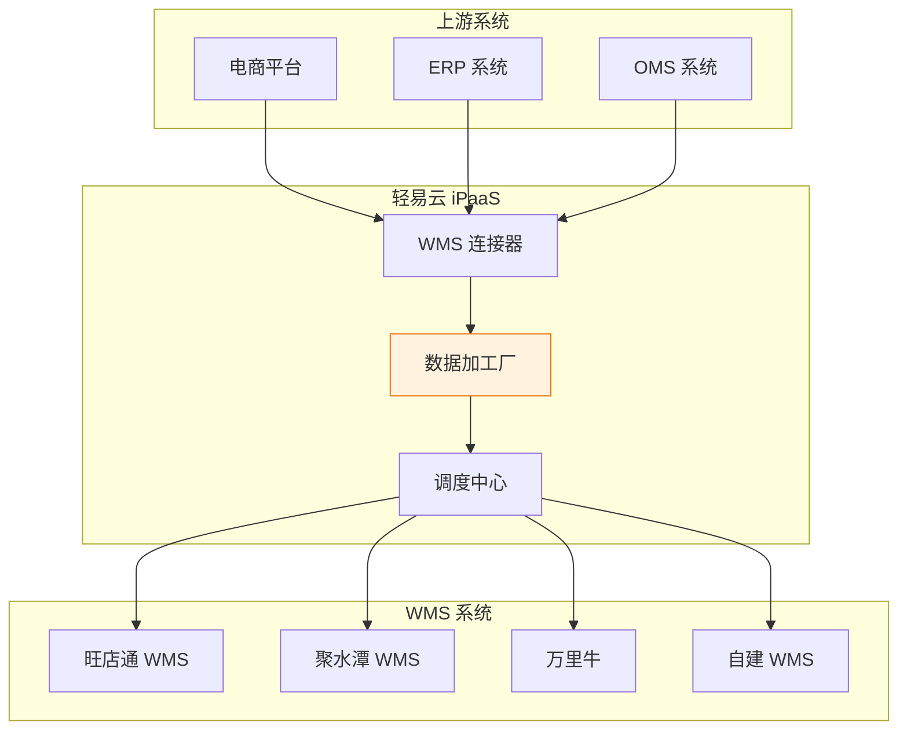
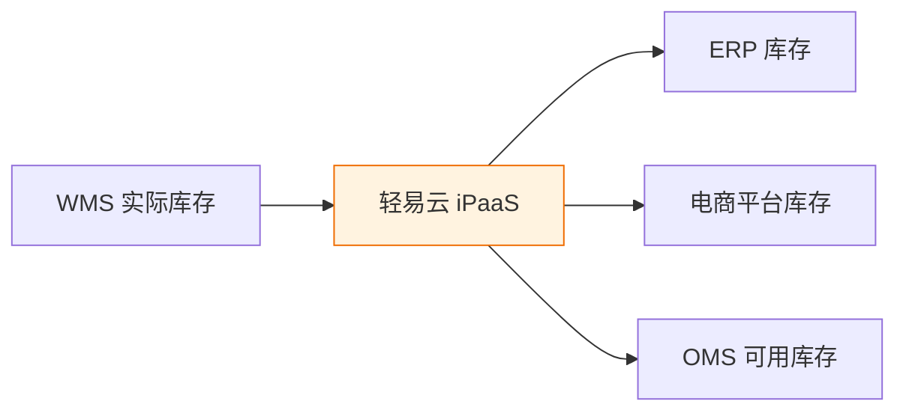

# WMS 集成方案

WMS（Warehouse Management System，仓库管理系统）集成方案帮助企业实现仓储系统与 ERP、电商平台等业务系统的数据互通，打通入库、出库、库存同步、物流跟踪等核心业务链路。

> [!TIP]
> 本方案适用于使用旺店通、聚水潭、万里牛、富勒、巨沃等主流 WMS 系统的企业。

## 方案概述

### 方案定位

WMS 集成方案是轻易云 iPaaS 针对仓储管理场景打造的标准化解决方案。方案提供预置的 WMS 连接器和标准数据映射模板，帮助企业快速实现仓储系统与上下游业务系统的无缝对接。

### 方案架构

## 核心集成场景

### 入库管理

| 场景 | 数据流向 | 说明 |
|------|----------|------|
| 采购入库 | ERP → WMS | 采购订单推送至 WMS，WMS 完成收货后回传入库信息 |
| 生产入库 | MES → WMS | 生产完工单推送至 WMS 执行入库 |
| 退货入库 | 电商平台 → WMS | 退货单推送至 WMS 执行退货收货 |

### 出库管理

| 场景 | 数据流向 | 说明 |
|------|----------|------|
| 销售出库 | 电商平台 → WMS | 订单下推至 WMS 执行拣货发货 |
| 调拨出库 | ERP → WMS | 调拨单推送至 WMS 执行调拨出库 |
| 领料出库 | MES → WMS | 生产领料单推送至 WMS 执行出库 |

### 库存同步

## 实施配置步骤

1. **创建 WMS 连接器** — 在轻易云 iPaaS 平台配置 WMS 系统连接
2. **配置基础资料同步** — 同步仓库、商品、供应商等基础数据
3. **配置入库流程** — 建立采购入库、退货入库等集成方案
4. **配置出库流程** — 建立销售出库、调拨出库等集成方案
5. **配置库存同步** — 建立实时或定时库存同步方案
6. **测试验证** — 全流程测试并上线

## 最佳实践

| 配置项 | 建议值 | 说明 |
|--------|--------|------|
| 库存同步频率 | 5~15 分钟 | 平衡实时性与系统负载 |
| 订单推送 | 准实时 | 确保及时拣货 |
| 重试次数 | 3 次 | 异常时自动重试 |
| 数据对账 | 每日 | 定时核对库存差异 |

> [!WARNING]
> 库存数据涉及多系统交互，建议配置数据对账机制，定期核对各系统库存一致性。

## 常见问题

### Q: 如何处理多仓库库存同步？

轻易云支持按仓库维度配置独立的同步方案，支持多仓库的独立管理和统一查看。

### Q: WMS 接口调用频率有限制吗？

不同 WMS 系统的接口限制不同。轻易云内置智能限流机制，自动适配各系统的调用频率要求。

---

## 相关资源

- [方案概览](./README) — 查看所有标准集成方案
- [WMS 对接标准方案](./wms-standard) — WMS 标准化对接方案
- [电商数据中台集成](../solutions/ecommerce-data-hub) — 电商场景综合方案
- [物流仓储解决方案](../solutions/logistics) — 物流仓储行业方案
