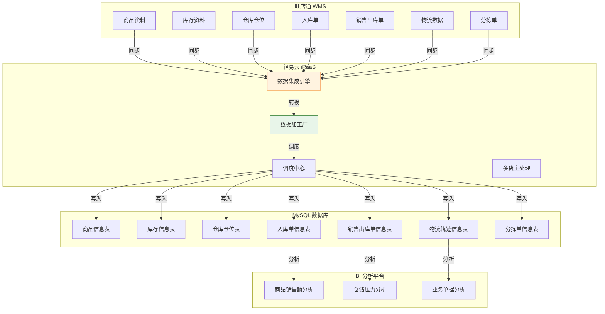
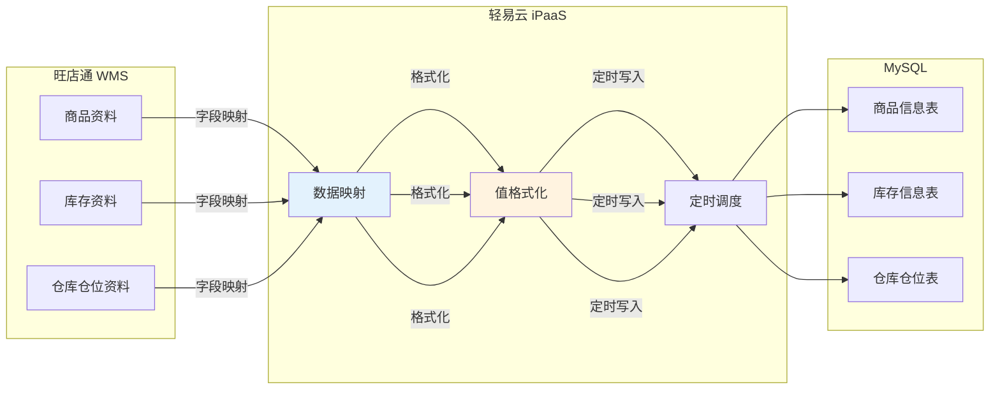
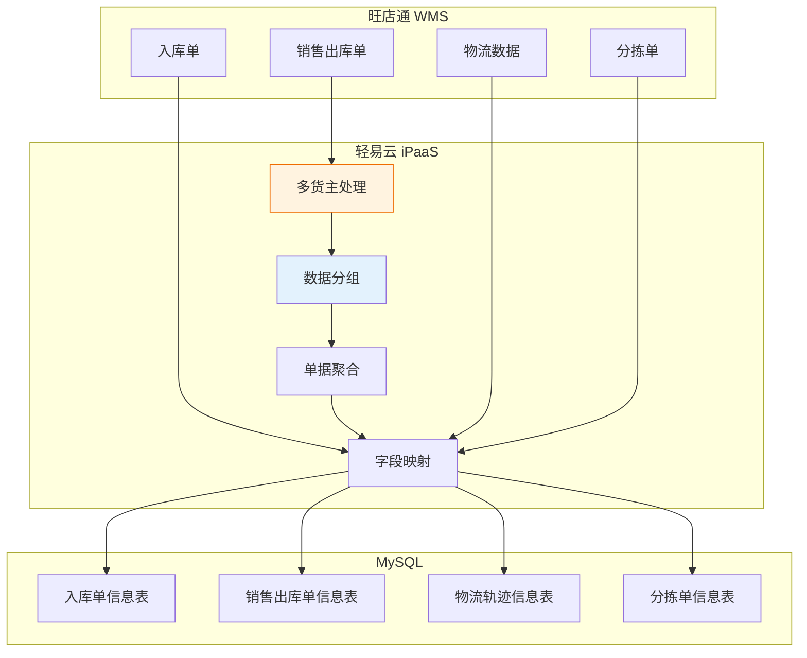
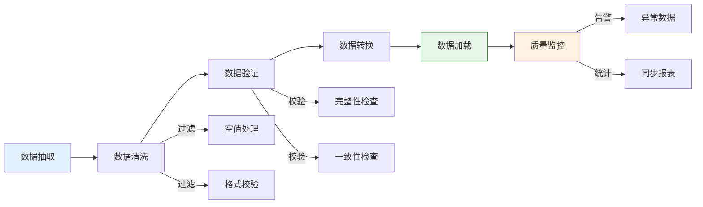
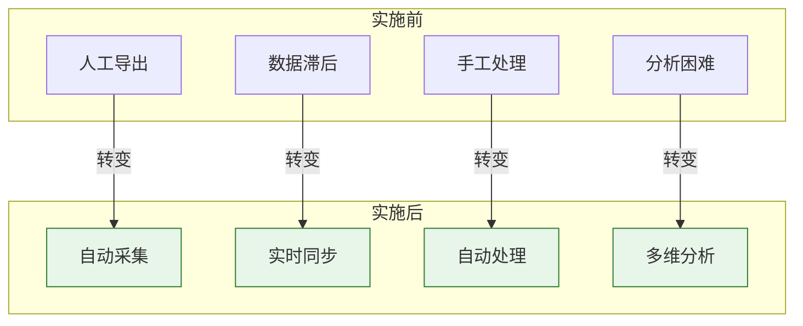
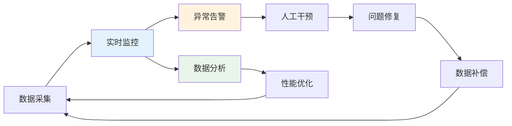

# WMS 对接标准方案

WMS 对接标准方案是轻易云 iPaaS 针对仓储物流场景设计的 comprehensive 集成解决方案，实现仓储管理系统（WMS）与 ERP 系统、数据库之间的数据无缝对接。本方案以义乌鑫宁供应链管理有限公司旺店通 WMS 与 MySQL 数据库集成项目为蓝本，经过生产环境验证，涵盖基础资料同步、业务单据流转、物流信息追踪、BI 数据分析等核心业务流程，帮助云仓企业实现数据自动化采集与业务协同。

---

## 方案概述

### 适用场景

本方案主要适用于以下 WMS 集成业务场景：

- **第三方云仓企业与 ERP 系统的库存数据同步**
- **旺店通 WMS 与 MySQL 数据库的自动化数据对接**
- **多货主、多渠道的复杂仓储业务数据处理**
- **仓储压力分析、业务单据分析的 BI 数据支撑**
- **物流节点监控与物流轨迹信息同步**

### 方案架构



### 核心能力

| 能力 | 说明 |
| ---- | ---- |
| **基础资料同步** | 商品资料、库存资料、仓库仓位资料的自动同步 |
| **业务单据流转** | 入库单、销售出库单、分拣单的实时同步 |
| **物流信息追踪** | 物流节点信息、物流轨迹信息的完整记录 |
| **多货主支持** | 支持多货主、多队列的复杂业务场景处理 |
| **数据聚合处理** | 按货主分组、批量处理的数据加工能力 |
| **BI 数据支撑** | 为仓储压力分析、业务决策提供数据基础 |

---

## 业务场景方案

### 场景一：义乌鑫宁云仓旺店通 WMS 集成

#### 方案背景

义乌鑫宁供应链管理有限公司是一家专注于为中小卖家提供定制仓储服务的第三方云仓企业。在使用轻易云 iPaaS 平台之前，面临以下业务痛点：

**业务痛点**：

- **人工导出数据不及时**：客服手工导出数据存在延迟，影响决策时效性
- **数据量大、导出费时**：单量庞大导致导出耗时严重，人工处理效率低
- **手工处理，人工成本高**：大量依赖人工处理，人力成本高且易出错

**业务需求**：

| 数据类型 | 具体内容 |
|---------|---------|
| **BI 分析** | 商品销售额分析、仓储压力分析、业务单据分析决策支持 |
| **基础资料** | 商品资料、库存资料、仓库仓位资料 |
| **业务单据** | 入库单、出库单、订单 |
| **物流信息** | 节点信息、物流轨迹信息 |
| **作业单据** | 分拣单 |

#### 数据同步架构

##### 基础资料同步

| 源数据 | 同步方式 | 目标表 | 触发条件 |
|--------|---------|--------|----------|
| 商品资料 | 同步新增/修改 | 商品信息表 | 定时对接 |
| 库存资料 | 同步新增/修改 | 库存信息表 | 定时对接 |
| 仓库仓位资料 | 同步新增/修改 | 仓库仓位表 | 定时对接 |



##### 业务单据同步

| 源单据 | 同步方式 | 目标表 | 处理逻辑 |
|--------|---------|--------|----------|
| 入库单 | 单据新增/更新 | 入库单信息表 | 字段映射/关联查询 |
| 销售出库单 | 新增/更新 | 销售出库单信息表 | 多货主分组处理 |
| 物流数据 | 一节点一记录 | 物流轨迹信息表 | 逐条写入 |
| 分拣单 | 新增/更新 | 分拣单信息表 | 字段映射转换 |



#### 多货主场景处理

**场景描述**：

在第三方云仓业务中，通常需要同时服务多个货主，每个货主有独立的订单队列和数据处理需求。

```text
原始请求结构：
├── 货主 1：销售出库单 1、销售出库单 3、销售出库单 5...
├── 货主 2：销售出库单 2、销售出库单 4、销售出库单 6...
├── 货主 3：销售出库单 7、销售出库单 9...
└── 货主 4：销售出库单 8、销售出库单 10...

典型规模：
- 货主数量：3~4 个
- 请求队列：5~6 个
- 日单量：约 200 单
```

**处理流程**：


**详细处理步骤**：

1. **按操作节点查询销售出库单号**
   - 获取待处理的销售出库单列表

2. **查询销售出库单详情**
   - 获取每个出库单的详细信息

3. **分组：按货主分组**
   - 将单据按货主进行分类聚合

4. **整理：20 单一个元素**
   - 将每个货主的单据按 20 单为一组进行拆分
   - 避免单次请求数据量过大

5. **拼接：单据字符串**
   - 将每组单据 ID 拼接为逗号分隔的字符串
   - 格式：`销售出库单 1,销售出库单 2,...`

6. **重新组装请求**
   - 生成最终的批量查询请求参数

#### 实施周期

| 周期 | 时间范围 | 实施内容 |
|------|---------|----------|
| **周期一** | 2024-06-01 至 2024-06-07 | 需求调研、方案设计、基础配置 |
| **周期二** | 2024-06-08 至 2024-06-15 | 数据映射配置、测试验证、上线部署 |

---

## 数据映射规范

### 基础资料映射

#### 商品资料映射

| 旺店通字段 | MySQL 字段 | 数据类型 | 说明 |
|-----------|-----------|---------|------|
| `goods_no` | `product_code` | VARCHAR(50) | 商品编码 |
| `goods_name` | `product_name` | VARCHAR(200) | 商品名称 |
| `spec_no` | `spec_code` | VARCHAR(50) | 规格编码 |
| `spec_name` | `spec_name` | VARCHAR(100) | 规格名称 |
| `brand_name` | `brand` | VARCHAR(50) | 品牌 |
| `goods_type` | `category` | VARCHAR(50) | 商品类别 |
| `unit_name` | `unit` | VARCHAR(20) | 计量单位 |
| `remark` | `remark` | TEXT | 备注 |

#### 库存资料映射

| 旺店通字段 | MySQL 字段 | 数据类型 | 说明 |
|-----------|-----------|---------|------|
| `warehouse_no` | `warehouse_code` | VARCHAR(50) | 仓库编码 |
| `goods_no` | `product_code` | VARCHAR(50) | 商品编码 |
| `spec_no` | `spec_code` | VARCHAR(50) | 规格编码 |
| `stock_num` | `stock_qty` | DECIMAL(18,4) | 库存数量 |
| `available_num` | `available_qty` | DECIMAL(18,4) | 可用数量 |
| `freeze_num` | `freeze_qty` | DECIMAL(18,4) | 冻结数量 |
| `update_time` | `update_time` | DATETIME | 更新时间 |

### 业务单据映射

#### 入库单映射

| 旺店通字段 | MySQL 字段 | 数据类型 | 说明 |
|-----------|-----------|---------|------|
| `stockin_no` | `stockin_no` | VARCHAR(50) | 入库单号 |
| `warehouse_no` | `warehouse_code` | VARCHAR(50) | 仓库编码 |
| `order_type` | `order_type` | VARCHAR(20) | 订单类型 |
| `status` | `status` | INT | 单据状态 |
| `goods_count` | `total_qty` | DECIMAL(18,4) | 总数量 |
| `total_price` | `total_amount` | DECIMAL(18,4) | 总金额 |
| `stockin_time` | `stockin_time` | DATETIME | 入库时间 |
| `remark` | `remark` | TEXT | 备注 |

#### 销售出库单映射

| 旺店通字段 | MySQL 字段 | 数据类型 | 说明 |
|-----------|-----------|---------|------|
| `stockout_no` | `stockout_no` | VARCHAR(50) | 出库单号 |
| `warehouse_no` | `warehouse_code` | VARCHAR(50) | 仓库编码 |
| `shop_no` | `shop_code` | VARCHAR(50) | 店铺编码 |
| `order_no` | `order_no` | VARCHAR(50) | 订单编号 |
| `consignee` | `consignee` | VARCHAR(100) | 收货人 |
| `telephone` | `telephone` | VARCHAR(20) | 联系电话 |
| `address` | `address` | VARCHAR(500) | 收货地址 |
| `goods_count` | `total_qty` | DECIMAL(18,4) | 总数量 |
| `total_price` | `total_amount` | DECIMAL(18,4) | 总金额 |
| `logistics_no` | `logistics_no` | VARCHAR(50) | 物流单号 |
| `logistics_company` | `logistics_company` | VARCHAR(50) | 物流公司 |
| `stockout_time` | `stockout_time` | DATETIME | 出库时间 |

#### 物流轨迹信息映射

| 旺店通字段 | MySQL 字段 | 数据类型 | 说明 |
|-----------|-----------|---------|------|
| `logistics_no` | `logistics_no` | VARCHAR(50) | 物流单号 |
| `logistics_company` | `logistics_company` | VARCHAR(50) | 物流公司 |
| `node_time` | `node_time` | DATETIME | 节点时间 |
| `node_desc` | `node_desc` | VARCHAR(500) | 节点描述 |
| `node_status` | `node_status` | VARCHAR(20) | 节点状态 |
| `operator` | `operator` | VARCHAR(50) | 操作人 |
| `telephone` | `telephone` | VARCHAR(20) | 联系电话 |
| `create_time` | `create_time` | DATETIME | 记录创建时间 |

---

## 实施关键要点

### 系统对接要点

| 要点 | 说明 | 建议 |
|------|------|------|
| **数据同步频率** | 基础资料和单据的同步周期 | 基础资料每小时同步，业务单据实时或每 5 分钟同步 |
| **数据量控制** | 单次请求的数据量限制 | 采用分页查询，每页不超过 100 条 |
| **并发控制** | 多货主场景下的并发处理 | 配置合理的线程池大小，避免系统过载 |
| **异常重试** | 失败请求的重试机制 | 配置指数退避重试策略，最大重试 3 次 |

### 数据质量保障



### 性能优化建议

| 场景 | 优化方案 |
| ---- | -------- |
| **大数据量同步** | 配置分页查询和批量写入，减少数据库压力 |
| **高频实时同步** | 使用增量同步代替全量同步，减少数据传输量 |
| **多货主并发** | 配置合理的调度间隔和队列大小，避免资源争抢 |
| **复杂数据处理** | 在数据加工厂中启用缓存机制，减少重复计算 |

---

## 方案价值与成果

### 业务价值

通过 WMS 与 MySQL 数据库的集成，企业数据管理效率显著提升：

| 维度 | 提升效果 |
| ---- | -------- |
| **数据及时性** | 数据同步延迟从小时级缩短至分钟级 |
| **人力成本** | 人工导出和处理工作量减少 80% 以上 |
| **数据准确性** | 消除人工操作导致的数据错误，准确率提升至 99%+ |
| **决策效率** | BI 分析数据实时可得，支持快速业务决策 |

### 核心成果

1. **自动化数据采集**
   - 实现旺店通 WMS 数据自动同步到 MySQL 数据库
   - 消除人工导出数据的不及时性和低效性

2. **多维度数据分析**
   - 支持商品销售额分析
   - 支持仓储压力实时监控
   - 支持业务单据多维度分析

3. **物流信息可视化**
   - 完整的物流轨迹信息记录
   - 物流节点实时监控

4. **多货主业务支撑**
   - 支持复杂的多货主业务场景
   - 数据按货主自动分组处理



---

## 实施 Checklist

实施本方案前，请确认以下准备工作已完成：

### 系统准备

- [ ] 已获取旺店通 WMS API 调用权限
- [ ] 已完成 MySQL 数据库连接配置
- [ ] 已创建目标数据库和数据表结构
- [ ] 已确认数据同步频率和调度策略
- [ ] 已评估数据量和并发处理需求

### 数据准备

- [ ] 已完成商品资料编码规范确认
- [ ] 已确认仓库、仓位编码规则
- [ ] 已明确货主信息和分组规则
- [ ] 已制定数据质量校验规则

### 配置检查

- [ ] 已配置旺店通连接器参数
- [ ] 已配置 MySQL 连接器参数
- [ ] 已配置数据映射规则
- [ ] 已配置多货主分组处理逻辑
- [ ] 已配置异常告警通知
- [ ] 已配置定时调度策略

### 测试验证

- [ ] 已完成连接器连通性测试
- [ ] 已完成基础资料同步测试
- [ ] 已完成业务单据同步测试
- [ ] 已完成多货主分组处理测试
- [ ] 已完成数据准确性校验

---

## 常见问题

### Q: 如何处理旺店通 API 的请求频率限制？

A: 建议在轻易云调度中心配置合理的请求间隔，使用频率控制功能限制每秒请求数。对于大量数据，采用分页查询和批量处理策略，避免触发 API 限流。

### Q: 多货主场景下单据分组逻辑如何配置？

A: 在数据加工厂中使用自定义脚本，先按货主编码进行分组，然后对每个货主的单据按 20 单为一组进行拆分，最后拼接成逗号分隔的单据字符串。

### Q: 如何保证物流轨迹数据的完整性？

A: 建议配置定时补偿机制，定期查询缺失的物流节点数据。同时设置数据校验规则，检查物流单号是否为空、节点时间是否连续等。

### Q: 数据同步过程中出现异常如何处理？

A: 配置异常重试机制，对于临时性错误（如网络超时）进行自动重试。对于业务逻辑错误（如数据格式不匹配），记录到异常数据表，发送告警通知人工处理。

### Q: 如何优化大数据量同步的性能？

A: 采用以下优化策略：
- 使用增量同步代替全量同步
- 配置合理的分页大小（建议 50~100 条/页）
- 启用批量写入功能
- 配置多线程并发处理（视服务器资源而定）

---

## 最佳实践

### 数据治理建议

1. **建立统一编码规范**
   - 统一商品编码规则
   - 规范仓库、仓位编码
   - 制定货主标识规则

2. **设计数据质量监控**
   - 配置数据完整性校验
   - 设置异常数据预警
   - 建立数据修复流程

3. **实施分阶段上线**
   - 第一阶段：基础资料同步
   - 第二阶段：业务单据同步
   - 第三阶段：物流信息同步
   - 第四阶段：BI 分析报表

### 运维监控建议



---

## 相关资源

- [旺店通连接器](../connectors/ecommerce/wangdian)
- [MySQL 连接器](../connectors/database/mysql)
- [数据加工厂配置](../advanced/data-transformation)
- [数据映射配置](../guide/data-mapping)
- [定时调度配置](../guide/schedule-and-launch)
